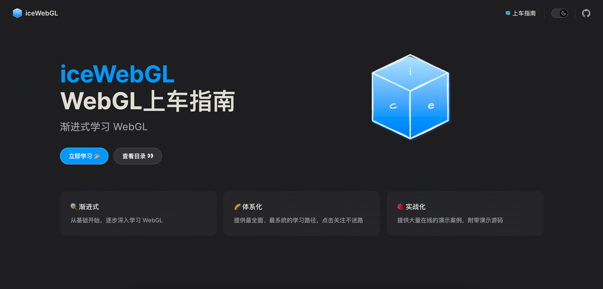

# iceWebGL

这里是 WebGL 零基础上车指南，专注 WebGL 领域，系统全面的学习 WebGL 知识。

👉这里是 [线上电子书](https://ice-webgl.netlify.app/) 地址，文章内容会同步掘金社区发布。

👉戳 [目录大纲](https://ice-webgl.netlify.app/content/%E4%B8%80%E3%80%81%E5%89%8D%E8%A8%80/0.%20%E7%9B%AE%E5%BD%95.html) 快速了解各章节内容！

## 一、前言
1. [导读](https://ice-webgl.netlify.app/content/%E4%B8%80%E3%80%81%E5%89%8D%E8%A8%80/1.%20%E5%AF%BC%E8%AF%BB.html)

## 二、WebGL基础
1. [初识WebGL](https://ice-webgl.netlify.app/content/%E4%BA%8C%E3%80%81WebGL%E5%9F%BA%E7%A1%80/1.%20%E5%88%9D%E8%AF%86WebGL.html)
2. [WebGL绘制点](https://ice-webgl.netlify.app/content/%E4%BA%8C%E3%80%81WebGL%E5%9F%BA%E7%A1%80/2.%20WebGL%E7%BB%98%E5%88%B6%E7%82%B9.html)
3. [WebGL绘制动态点](https://ice-webgl.netlify.app/content/%E4%BA%8C%E3%80%81WebGL%E5%9F%BA%E7%A1%80/3.%20WebGL%E7%BB%98%E5%88%B6%E5%8A%A8%E6%80%81%E7%82%B9.html)
4. [绘制动态颜色点](https://ice-webgl.netlify.app/content/%E4%BA%8C%E3%80%81WebGL%E5%9F%BA%E7%A1%80/4.%20%E7%BB%98%E5%88%B6%E5%8A%A8%E6%80%81%E9%A2%9C%E8%89%B2%E7%82%B9.html)
5. [WebGL绘制线和三角](https://ice-webgl.netlify.app/content/%E4%BA%8C%E3%80%81WebGL%E5%9F%BA%E7%A1%80/5.%20WebGL%E7%BB%98%E5%88%B6%E7%BA%BF%E5%92%8C%E4%B8%89%E8%A7%92.html)
6. [WebGL绘制基本图形](https://ice-webgl.netlify.app/content/%E4%BA%8C%E3%80%81WebGL%E5%9F%BA%E7%A1%80/6.%20WebGL%E7%BB%98%E5%88%B6%E5%9F%BA%E6%9C%AC%E5%9B%BE%E5%BD%A2.html)

## 三、WebGL颜色和纹理
1. [绘制彩色的三角](https://ice-webgl.netlify.app/content/%E4%B8%89%E3%80%81WebGL%E9%A2%9C%E8%89%B2%E5%92%8C%E7%BA%B9%E7%90%86/1.%20%E7%BB%98%E5%88%B6%E5%BD%A9%E8%89%B2%E7%9A%84%E4%B8%89%E8%A7%92.html)
2. [为什么会出现颜色渐变](https://ice-webgl.netlify.app/content/%E4%B8%89%E3%80%81WebGL%E9%A2%9C%E8%89%B2%E5%92%8C%E7%BA%B9%E7%90%86/2.%20%E4%B8%BA%E4%BB%80%E4%B9%88%E4%BC%9A%E5%87%BA%E7%8E%B0%E9%A2%9C%E8%89%B2%E6%B8%90%E5%8F%98.html)
3. [实战消除锯齿](https://ice-webgl.netlify.app/content/%E4%B8%89%E3%80%81WebGL%E9%A2%9C%E8%89%B2%E5%92%8C%E7%BA%B9%E7%90%86/3.%20%E5%AE%9E%E6%88%98%E6%B6%88%E9%99%A4%E9%94%AF%E9%BD%BF.html)
