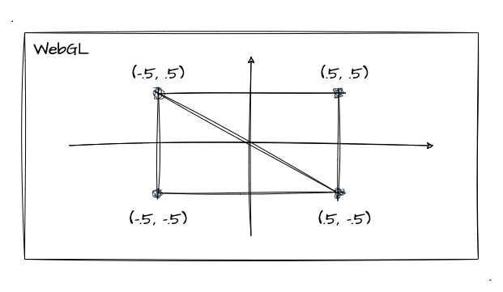

# 4. 纹理图像

经过之前章节的学习，相信大家已经掌握了基本的二维几何图形绘制和着色器的基本工作原理，对 WebGL 已经有点熟悉了。那么这一节开始，我们开始学习 WegGL 中的纹理映射，let's go！

可能大家跟我一样，在还没学习到这一节的时候心里可能都会有个疑问，那就是虽然我们学 WebGL 的各种基础图形绘制、各种颜色控制，但如果我们要显示真实场景的图片，那我们应该怎样做呢？难道要自己把模型绘制出来，再上个色？比如说下面这张猫猫：


其实真的有心去画，慢慢绘制各种基本图形加线段，控制好每个像素点的颜色...emmm...好像也不是不行，只是工作量巨大，并且可能没有什么意义。那遇到这样的问题，我们应该如何解决呢？这个时候，纹理图像就登场了！

## 什么是纹理图像

**纹理图像**是通过**纹理映射**的技术，将一张图贴到我们绘制的几何图形的表面上，这样我们就能在 WebGL 中使用真实的图片了，而这样的图形就是纹理图像。

其实纹理映射就是将图像的每一个像素点的颜色映射到我们绘制好的图形上。回顾前两小节的内容，在顶点着色器执行完后，还有图形装配和光栅化的步骤，而光栅化后我们得到的是一个充满片元的图形，最后片元着色器再进行逐片元操作对每个像素点涂上颜色。而这里，无非就是给光栅化后的每个片元涂上对应照片中的颜色。


如上图所示，纹理映射的基本工作方式就是这样，根据图片将光栅化后的**对应位置**的每个片元涂上对应的颜色。 所以，组成纹理图像的基本单位就是一个个像素，这里称之为——**纹素**，纹素的颜色值使用 `RGB` 或者 `RGBA` 的格式。

## 纹理坐标

上文提到了纹理映射要将像素点的颜色涂到**对应位置**的纹素上，那我们就需要对"位置"有个明确的认识，这就需要用到——**纹理坐标**。没错，又双叒叕是坐标～我们想一下，我们既然要贴图，那是贴半张、还是一张呢？贴到目标载体的左上角还是右下角呢？

纹理坐标就是图像上的坐标，我们通过它可以拿到纹素的颜色，它的坐标系统如图所示：


这一看，还是我们比较熟悉的坐标系呢，**左下角为原点**。大家可能注意到了，笔者在图片的顶点都标了坐标（尽管图片是个长方形的），不管长宽，范围都是 `0` 到 `1`。所以，这一点上我们的纹理坐标跟 WebGL 的坐标系统类似，范围就在 `0-1` 之间，并不依赖图片自身尺寸。（为了跟 `x` 、 `y` 坐标系统区分开，**纹理坐标命名采用 `s` 和 `t` 来命名**）

那有了纹理坐标后，我们就只需要将对应的纹理坐标贴到我们的 WebGL 系统的顶点坐标中就可以实现纹理图像了。我们可以通过下图来加深理解：


看到这里，相信你也知道了纹理映射的基本原理了，那接下来我们就进入实战，把文章开头的"猫猫"图贴到我们的 WebGL 图形的表面去！

## 第一张纹理图片

额，我觉得实战纹理图片这个部分跟之前学习 WebGL 缓冲区对象的时候有点像，也可以将整体实现拆分成几个步骤，然后也会用到一些新的 `api`。所以这里，我们跟之前一样，先以实战一张纹理图片为主，本文不用过度关注每个 `api` 的用法、参数，主要掌握好主流程才是关键。

然后我们在下一节的文章中再详细了解相关的 `api` 一些具体的用法，还有不同参数带来的不同效果。那我们本文就专注于如何实现第一张纹理图像吧！

### 1. 着色器代码实现

首先看看顶点着色器的代码实现。通过上文的了解我们知道目前我们需要两种类型的坐标，其中一个是顶点坐标，另外一个就是纹理坐标，所以我们顶点着色器的代码实现如下：
```js
const vertexCode = `
  // 顶点坐标
  attribute vec4 a_Position;
  // 接收纹理坐标
  attribute vec2 a_TexCoord;
  // 向片元着色器传递纹理坐标
  varying vec2 v_TexCoord;

  void main () {
    gl_Position = a_Position;
    v_TexCoord = a_TexCoord;
  }
`
```
上述代码其实我们都相对比较熟悉了，通过两个 `attribute` 变量分别接收 顶点、纹理 坐标，再通过 `varying` 变量 将纹理坐标传递给片元着色器（经过上一小节的学习，我们知道这里的纹理坐标其实是**经过 WebGL 系统内插后**的坐标值，它并不完全等于传入顶点着色器时候的纹理坐标）。

那么接下来，就该轮到片元着色器了。这里，它需要根据每个片元的的纹理坐标，到图像对应的纹素上提取颜色值，再绘制到当前片元中。

```js
const fragmentCode = `
  precision mediump float;
  // 接收纹理坐标
  varying vec2 v_TexCoord;
  // 取样器，代表纹素的数据
  uniform sampler2D u_Sampler;

  void main () {
    // texture2D 用于抽取纹理图片中纹素的颜色
    gl_FragColor = texture2D(u_Sampler, v_TexCoord);
  }
`
```

在片元着色器的代码实现中，我们看到了两个相对比较陌生的东西，一个是 `sampler2D` 的变量类型，一个 `texture2D` 的内置函数。那么在这里，我们简单了解一下他们的作用：
1. `sampler2D`。sampler 就是取样器（提取纹理图像的颜色），我们简单理解它就是纹素的颜色值
2. `texture2D`。内置函数，可抽取纹素颜色。传入单元编号、纹理坐标两个参数使用。

### 2. WebGL 基础代码

这里，我们快速带过一下基础的 WebGL 长方形的绘制代码实现。（基本都是之前章节提过的，不会所有都深入）

因为我们的纹理图像是需要"贴"到一个长方形的模型上，所以我们还是需要跟之前章节一样绘制一个模型。回顾 [WebGL绘制基本图形](/content/二、WebGL基础/6.%20WebGL绘制基本图形.html) 中，我们可以通过两个三角形来实现一个长方形，坐标如下：



这里不再详细演示了，我们注意一下 buffer 数据即可，它跟之前的有一点不一样，我们这次存放的是顶点坐标和纹理坐标：
```js
// 前两个是顶点坐标，后两个是纹理坐标（图像取的是整张图，所以是0-1）
const verticesTexCoords = new Float32Array([
  -.5, .5,   0., 1., 
  -.5, -.5,   0., 0.,
  .5, .5,   1., 1.,
  .5,-.5,   1., 0.
])
```

然后我们再注意下**步进参数**和**偏移参数**的设置即可：
```js
// 设置顶点坐标
const a_Position = gl.getAttribLocation(program, 'a_Position')
// 注意步进参数设置
gl.vertexAttribPointer(a_Position, 2, gl.FLOAT, false, FSIZE * 4, 0)
gl.enableVertexAttribArray(a_Position)

// 设置纹理坐标
const a_TexCoord = gl.getAttribLocation(program, 'a_TexCoord')
// 注意步进参数、偏移参数设置
gl.vertexAttribPointer(a_TexCoord, 2, gl.FLOAT, false, FSIZE * 4, FSIZE * 2)
gl.enableVertexAttribArray(a_TexCoord)
```

我们直接来看一下效果（点击"绘制长方形"即为上述代码效果）：

:::demo
third/4_1
:::

我们要贴图的模板（长方形）已经造出来了，那接下来就让我们将图片贴到这个黑色的长方形上面吧。

### 3. 实战纹理映射

首先第一步的准备工作，我们当然是要搞个图片了！这里我们直接通过 `Image` 对象来创建一个图片实例，并进行加载：
```js
const img = new Image()
// 图片地址（注意不允许跨域）
img.src = '/public/images/third/4.1.jpeg'
img.onload = function () {
  // 一系列实现纹理映射的相关代码
}
```

这里我们要注意一个小点就是 WebGL 中**不可以使用跨域的图片**，这一点跟我们平时对 `` 标签、或者 `Image` 对象的理解会有些差异～如果我们在 WebGL 中使用了跨域的图片资源，浏览器将会出现如下的报错信息：
::: danger Uncaught DOMException
Failed to execute 'texImage2D' on 'WebGLRenderingContext': The image element contains cross-origin data, and may not be loaded.
:::

---

接下来，我们就**分步骤**具体看看图片加载完成后（`onload`回调）我们具体需要怎么做：

> 注意！如果有对某个 `api` 想详细了解的，大家可以点击外链到 MDN 中详细查看，本文以实现功能为主，不会详细展开！

**1. 创建纹理对象**

回顾缓冲区对象的使用，第一步其实跟这里是一样的，都是先要创建对象！这里我们通过 [gl.createTexture](https://developer.mozilla.org/en-US/docs/Web/API/WebGLRenderingContext/createTexture) 这个 `api` 来创建纹理对象：

```js
const texture = gl.createTexture()
```

上述代码中，我们创建了一个纹理对象，用它来管理 WebGL 中的纹理图像。

**2. 激活纹理单元**

所谓**纹理单元就是用来"管理"纹理图像**的。我们每用一张图片，都要给他指定一个纹理单元。一般情况下，WebGL 中默认有 `8` 个纹理单元，从 `gl.TEXTURE0` - `gl.TEXTURE7`。

我们在使用纹理单元之前，首先要激活它，就是通过 [gl.activeTexture](https://developer.mozilla.org/en-US/docs/Web/API/WebGLRenderingContext/activeTexture) 这个 `api` ：
```js
// 参数就是待激活的纹理单元
gl.activeTexture(gl.TEXTURE0)
```

**3. 绑定纹理对象**

绑定...纹理对象？好像学缓冲区的时候也有绑定缓冲区对象这玩意...没错，就是这么相似，在使用纹理对象之前，我们也需要对其进行绑定。这一步我们依然可以跟缓冲区对象一样地理解：需要绑定纹理对象才能对其进行操作。

这一步，我们通过 [gl.bindTexture](https://developer.mozilla.org/en-US/docs/Web/API/WebGLRenderingContext/bindTexture) 这个 `api` 来绑定纹理对象：

```js
// 绑定纹理对象
gl.bindTexture(gl.TEXTURE_2D, texture)
```

`gl.bindTexture` 的第一个参数 `target` ，它可以传递好些值如：`gl.TEXTURE_2D` 、`gl.TEXTURE_CUBE_MAP`、 `gl.TEXTURE_3D` 等等，这里我们只需要 `gl.TEXTURE_2D` 即可，因为我们的图像也是一张 2D 的猫猫照片而已。

**4. 配置纹理对象**

这一步比较关键，因为我们需要设置纹理图像以什么样的方式映射到我们的模型中，是放大还是缩小、是否要重复等等

这里我们通过 [gl.texParameteri](https://developer.mozilla.org/en-US/docs/Web/API/WebGLRenderingContext/texParameter) 这个 `api` 通过设置不同的参数来进行配置。


