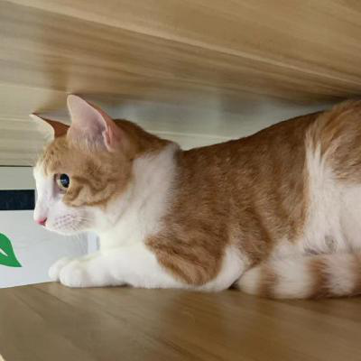

# 4. 纹理图像

经过之前章节的学习，相信大家已经掌握了基本的二维几何图形绘制和着色器的基本工作原理，对 WebGL 已经有点熟悉了。那么这一节开始，我们开始学习 WegGl 中的纹理映射，let's go！

## 纹理基础

可能大家跟我一样，在还没学习到这一节的时候心里可能都会有个疑问，那就是虽然我们学 WebGL 的各种基础图形绘制、各种颜色控制，但如果我们要显示真实场景的图片，比如我们的照片，那我们应该怎样做呢？难道要自己把模型绘制出来，再上个色？emmm...这样也不是不行，只是很繁杂且无意义...

这个时候，纹理图像就登场了！我们接着往下看。

### 1. 纹理图像

**纹理图像就是通过纹理映射，将一张图片贴到一个几何图形的表面**。其实纹理映射并不是什么高深的东西，它的作用就是把图像贴到我们绘制好的模型上。简单理解，我们通过顶点着色器画了一个"相框"（图形装配、光栅化），然后到片元着色器工作的时候把我们的照片的每一个像素点（**纹素**）贴到我们画好的"相框"内。

总结得直白点，我们通过 WebGL 绘制了一个正方形，然后将图片贴到正方形的表面上，此时图像就呈现到 WebGL 系统中了，这个图像也就是我们说的——纹理图像。

比如一张真实的照片（我家大哥）：

