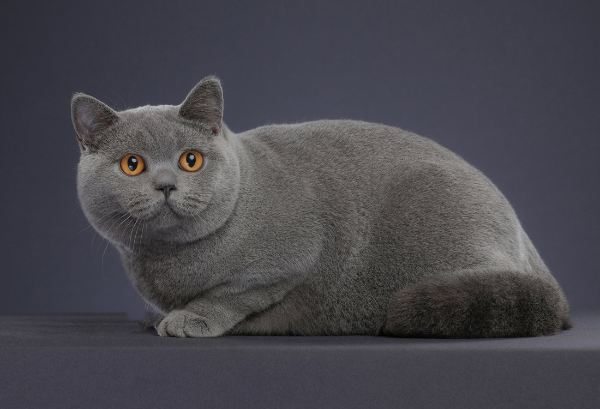
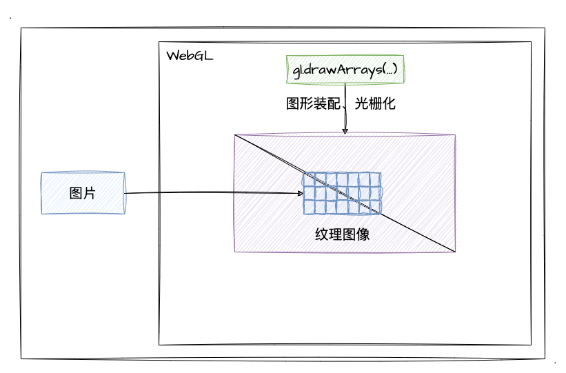
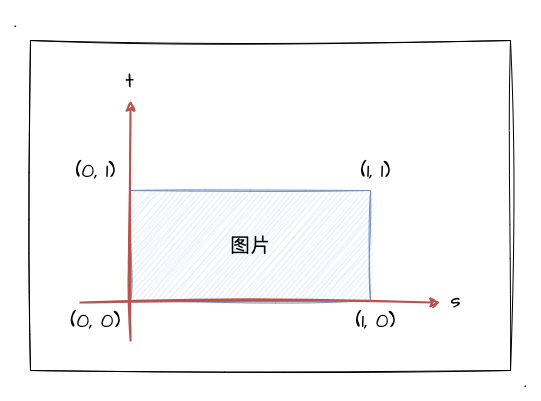
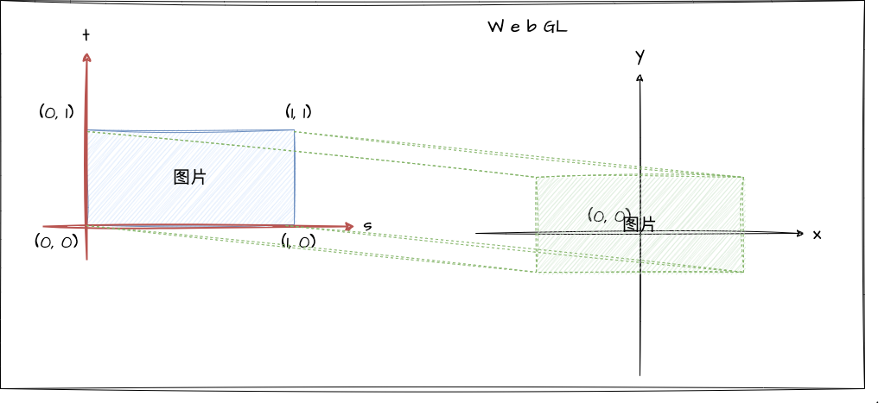

# 4. 纹理图像

经过之前章节的学习，相信大家已经掌握了基本的二维几何图形绘制和着色器的基本工作原理，对 WebGL 已经有点熟悉了。那么这一节开始，我们开始学习 WegGL 中的纹理映射，let's go！

可能大家跟我一样，在还没学习到这一节的时候心里可能都会有个疑问，那就是虽然我们学 WebGL 的各种基础图形绘制、各种颜色控制，但如果我们要显示真实场景的图片，那我们应该怎样做呢？难道要自己把模型绘制出来，再上个色？比如说下面这张猫猫：

其实真的有心去画，慢慢绘制各种基本图形加线段，控制好每个像素点的颜色...emmm...好像也不是不行，只是工作量巨大，并且可能没有什么意义。那遇到这样的问题，我们应该如何解决呢？这个时候，纹理图像就登场了！

## 什么是纹理图像

**纹理图像**是通过**纹理映射**的技术，将一张图贴到我们绘制的几何图形的表面上，这样我们就能在 WebGL 中使用真实的图片了，而这样的图形就是纹理图像。

其实纹理映射就是将图像的每一个像素点的颜色映射到我们绘制好的图形上。回顾前两小节的内容，在顶点着色器执行完后，还有图形装配和光栅化的步骤，而光栅化后我们得到的是一个充满片元的图形，最后片元着色器再进行逐片元操作对每个像素点涂上颜色。而这里，无非就是给光栅化后的每个片元涂上对应照片中的颜色。

如上图所示，纹理映射的基本工作方式就是这样，根据图片将光栅化后的**对应位置**的每个片元涂上对应的颜色。 所以，组成纹理图像的基本单位就是一个个像素，这里称之为——**纹素**，纹素的颜色值使用 `RGB` 或者 `RGBA` 的格式。

## 纹理坐标

上文提到了纹理映射要将像素点的颜色涂到**对应位置**的纹素上，那我们就需要对"位置"有个明确的认识，这就需要用到——**纹理坐标**。没错，又双叒叕是坐标～我们想一下，我们既然要贴图，那是贴半张、还是一张呢？贴到目标载体的左上角还是右下角呢？

纹理坐标就是图像上的坐标，我们通过它可以拿到纹素的颜色，它的坐标系统如图所示：

这一看，还是我们比较熟悉的坐标系呢，**左下角为原点**。大家可能注意到了，笔者在图片的顶点都标了坐标（尽管图片是个长方形的），不管长宽，范围都是 `0` 到 `1`。所以，这一点上我们的纹理坐标跟 WebGL 的坐标系统类似，范围就在 `0-1` 之间，并不依赖图片自身尺寸。（为了跟 `x` 、 `y` 坐标系统区分开，**纹理坐标命名采用 `s` 和 `t` 来命名**）

那有了纹理坐标后，我们就只需要将对应的纹理坐标贴到我们的 WebGL 系统的顶点坐标中就可以实现纹理图像了。我们可以通过下图来加深理解：

看到这里，相信你也知道了纹理映射的基本原理了，那接下来我们就进入实战，把文章开头的"猫猫"图贴到我们的 WebGL 图形的表面去！