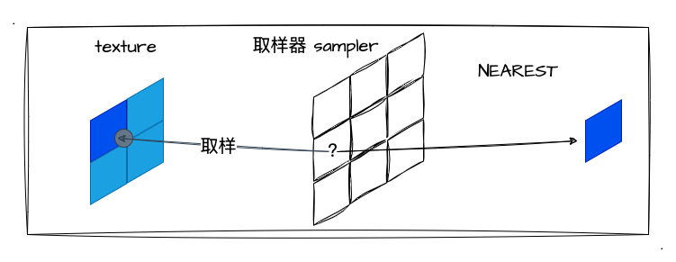
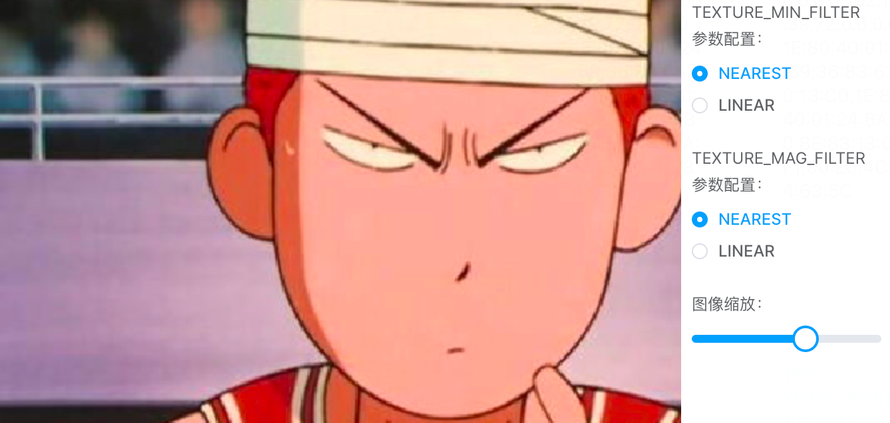

# 5. 深入纹理细节

经过上一小节的学习，我们已经成功的实现了第一张纹理图像！但相信大家都意犹未尽，毕竟我们只是初步的探索了纹理图像的实现，其中还有很多的 `api` 、 参数都没~~深入探讨~~使用过～那么，本文就把他通通都过一遍，深入了解关于纹理的细节。

在正文开始前，我们回顾下实现一张纹理图像的核心步骤吧：
1. 创建纹理对象 `createTexture`
2. 激活纹理单元 `activeTexture`
3. 绑定纹理对象 `bindTexture`
4. 配置纹理对象 `texParameteri`
5. 将图像分配给纹理对象 `texImage2D`
6. 纹理单元传递给取样器 `sampler`
7. 片元着色器根据坐标抽取纹素颜色，涂到对应的片元上 `texture2D`

## `FILTER`配置详解

上一小节，我们只是以绘制出第一张纹理图像为目的，很多参数都没深入，特别是配置纹理对象 `texParameteri` 相关的。那么在这一小节，我们将深入两个 `FILTER` 的填充方法的细节：
1. `gl.TEXTURE_MAG_FILTER` 放大的纹理参数。比如我们把 `4*4px` 的纹理图像映射到 `8*8px` 的模型时，由于映射的像素放大了，**WebGL 需要去填充由于图像尺寸放大产生的像素空隙**，填充的方式由我们配置或者用默认值。
2. `gl.TEXTURE_MIN_FILTER` 缩小的纹理参数。这里跟上述的原理是一样的，当图像缩小的时候会产生多余的像素，所以要"丢掉"这些多出来的像素。

回顾 [gl.texParameteri](https://developer.mozilla.org/en-US/docs/Web/API/WebGLRenderingContext/texParameter) 这个 `api` ，我们所需要深入的这两个参数正是这个 `api` 的第二个参数，通过 MDN 文档我们可以了解到它的配置值和默认值如下：

| 参数                  | 描述                         | 参数值                                                                                                                                             |
|-----------------------|------------------------------|----------------------------------------------------------------------------------------------------------------------------------------------------|
| gl.TEXTURE_MAG_FILTER | Texture magnification filter | **gl.LINEAR (default value)**,<br> gl.NEAREST.                                                                                                         |
| gl.TEXTURE_MIN_FILTER | Texture minification filter  | gl.LINEAR, gl.NEAREST, gl.NEAREST_MIPMAP_NEAREST, gl.LINEAR_MIPMAP_NEAREST, **gl.NEAREST_MIPMAP_LINEAR (default value)**, gl.LINEAR_MIPMAP_LINEAR. |

从这里我们了解到 `gl.TEXTURE_MAG_FILTER` 的默认值是 `gl.LINEAR`；而 `gl.TEXTURE_MIN_FILTER` 的默认值是 `gl.NEAREST_MIPMAP_LINEAR`。关于**缩小的默认值我们可以先留意一下**，因为后面自己实战的时候可能会踩到小坑。

在我们了解放大、缩小两个纹理参数后，我们就继续深入他们的配置值，看看都有什么区别。从表中我们很快就发现了放大、缩小两个纹理参数都**共有**两个配置值，他们也是本文的主要研究对象：
1. `gl.NEAREST`。取距离映射像素点**最近的纹素的颜色值**。

2. `gl.LINEAR`。取距离映射像素点**最近的四个纹素的颜色加权平均值**。（图像质量好，开销大）


其实，上述两个配置的区别，我们通过图文对比很容易就能看出区别了。简单总结来说，`NEAREST` 简单粗暴，距离最近的像素点颜色值是什么就取什么，因此图像可能会有**比较明显的锯齿感**；而 `LINEAR` 则取周围四个点的颜色的加权平均值作为新颜色值，所以相对**图像效果会比较"平滑"**，因此开销相对 `NEAREST` 来说也更大。

为了让大家更加直观地感受**两种配置在实际处理图像效果的区别**，我写了个示例程序，大家可以亲自切换两种参数配置亲自体验一下它们处理图像的区别吧。

首先我准备了一个跟图像一样尺寸的 `canvas`（500*463），然后将原图像 `1:1` 的绘制到 WebGL 的一个长方形表面。接着加上了一个**配置参数的单选控件** 和 **拖动滑块**，大家可以通过拖动滑块来放大图像（这里简单处理成以左下角为原点放大），通过切换单选控件来看两个参数配置下的图像质量变化。示例程序如下：

:::demo
third/5_1
:::

对于上述程序，大家可以清晰地感受到：
1. **不改变图像尺寸时切换参数无变化**。图像初始尺寸我们切换 `TEXTURE_MAG_FILTER` 并未观察到图像有什么变化。（这里我理解为，图像是原尺寸映射到**同尺寸**的模型中，像素点是可以 `1:1` 对应上的，所以不存在取色偏差，每个像素点可以完全正确地取色）
2. **`NEAREST` 锯齿感明显比 `LINEAR` 要明显很多**。图像放大后切换参数，可以明显发现两种配置参数下图像的锯齿感区别明显。

我也随手截了两张图，大家可以自行比对一下，看看区别是不是还挺大呢：



体验完示例程序中两种配置参数的效果区别后，我们再聊聊示例程序中的代码。我们集中看 `gl.texParameteri` 相关配置即可：
```js
// 缩小的配置是写死的 gl.LINEAR
gl.texParameteri(gl.TEXTURE_2D, gl.TEXTURE_MIN_FILTER, gl.LINEAR)
// 只有放大的配置是由单选控件的值控制的
gl.texParameteri(gl.TEXTURE_2D, gl.TEXTURE_MAG_FILTER, gl[filterType.value])
// WRAP 的值都设置成的 gl.CLAMP_TO_EDGE
gl.texParameteri(gl.TEXTURE_2D, gl.TEXTURE_WRAP_S, gl.CLAMP_TO_EDGE)
gl.texParameteri(gl.TEXTURE_2D, gl.TEXTURE_WRAP_T, gl.CLAMP_TO_EDGE)
```

看源码可以发现，对本次示例程序图像显示质量起到配置作用的只有 `gl.TEXTURE_MAG_FILTER` 这个的配置（这小节只看 `FILTER`，`WRAP` 的将在下一小节讲），它的配置值是 `LINEAR` 、`NEAREST` 之间动态变化的。

## 解惑`TEXTURE_MIN_FILTER` 

相信关于这两个 `TEXTURE_MIN_FILTER`、`TEXTURE_MAG_FILTER` 参数的配置尝试最容易让初学者产生困惑（因为我就是这样）。我是想通过差异化配置，单独看看他们带来的不同效果，**所以当我期望看看 `TEXTURE_MAG_FILTER` 的效果时我会不配置 `TEXTURE_MIN_FILTER`，但这个时候画布会突然变成一抹黑**...

也就是这个问题，一开始还挺困扰我的，所以我觉得有必要单独讲一讲，也算是给遇到这样问题的大家解解惑，节省一下代码问题排查的时间。然后我也在 [stack overflow](https://stackoverflow.com/questions/12363463/when-should-i-set-gl-texture-min-filter-and-gl-texture-mag-filter) 中找到一个比较靠谱的问答帖子，大家可以点进去看看。

回到这个问题上来，当我们想"单独"测试 `TEXTURE_MAG_FILTER` 效果时，我们应该仔细看看 [gl.texParameteri](https://developer.mozilla.org/en-US/docs/Web/API/WebGLRenderingContext/texParameter) 文档中对 `gl.TEXTURE_MIN_FILTER` 这个参数值的讲解（MDN 拷贝回来的）：

表中我们关注加粗的那一个值即可，就是 **default value** 的字眼！这就是让我们遇到本小节这个问题的原因...当我们想"单独"看 `TEXTURE_MAG_FILTER` 效果时，我们往往选择单独配置其而不配置缩小的滤镜——`TEXTURE_MIN_FILTER`，然后我们会很自然而然地以为这就是我们期望的结果，但其实这只是我们以为的没配置 `gl.TEXTURE_MIN_FILTER` 参数值...（其实是有值的，而且是默认值——`gl.NEAREST_MIPMAP_LINEAR`） 
