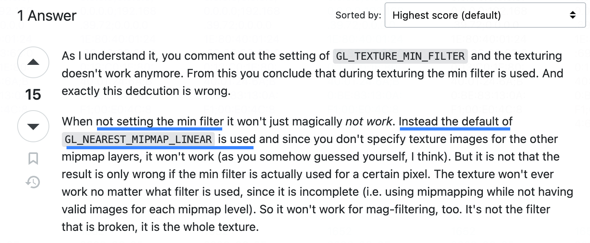
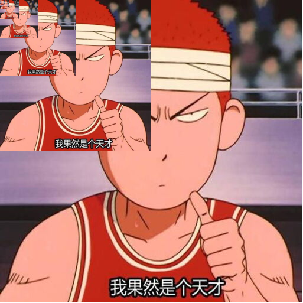

# 5. 深入纹理细节之FILTER

经过上一小节的学习，我们已经成功的实现了第一张纹理图像！但相信大家都意犹未尽，毕竟我们只是初步的探索了纹理图像的实现，其中还有很多的 `api` 、 参数都没~~深入探讨~~使用过～那么，本文就把他通通都过一遍，深入了解关于纹理的细节。

在正文开始前，我们回顾下实现一张纹理图像的核心步骤吧：
1. 创建纹理对象 `createTexture`
2. 激活纹理单元 `activeTexture`
3. 绑定纹理对象 `bindTexture`
4. 配置纹理对象 `texParameteri`
5. 将图像分配给纹理对象 `texImage2D`
6. 纹理单元传递给取样器 `sampler`
7. 片元着色器根据坐标抽取纹素颜色，涂到对应的片元上 `texture2D`

## `FILTER`配置详解

上一小节，我们只是以绘制出第一张纹理图像为目的，很多参数都没深入，特别是配置纹理对象 `texParameteri` 相关的。那么在这一小节，我们将深入两个 `FILTER` 的填充方法的细节：
1. `gl.TEXTURE_MAG_FILTER` 放大的纹理参数。比如我们把 `4*4px` 的纹理图像映射到 `8*8px` 的模型时，由于映射的像素放大了，**WebGL 需要去填充由于图像尺寸放大产生的像素空隙**，填充的方式由我们配置或者用默认值。
2. `gl.TEXTURE_MIN_FILTER` 缩小的纹理参数。这里跟上述的原理是一样的，当图像缩小的时候会产生多余的像素，所以要"丢掉"这些多出来的像素。

回顾 [gl.texParameteri](https://developer.mozilla.org/en-US/docs/Web/API/WebGLRenderingContext/texParameter) 这个 `api` ，我们所需要深入的这两个参数正是这个 `api` 的第二个参数，通过 MDN 文档我们可以了解到它的配置值和默认值如下：

| 参数                  | 描述                         | 参数值                                                                                                                                             |
|-----------------------|------------------------------|----------------------------------------------------------------------------------------------------------------------------------------------------|
| gl.TEXTURE_MAG_FILTER | Texture magnification filter | **gl.LINEAR (default value)**,<br> gl.NEAREST.                                                                                                         |
| gl.TEXTURE_MIN_FILTER | Texture minification filter  | gl.LINEAR, gl.NEAREST, gl.NEAREST_MIPMAP_NEAREST, gl.LINEAR_MIPMAP_NEAREST, **gl.NEAREST_MIPMAP_LINEAR (default value)**, gl.LINEAR_MIPMAP_LINEAR. |

从这里我们了解到 `gl.TEXTURE_MAG_FILTER` 的默认值是 `gl.LINEAR`；而 `gl.TEXTURE_MIN_FILTER` 的默认值是 `gl.NEAREST_MIPMAP_LINEAR`。关于**缩小的默认值我们可以先留意一下**，因为后面自己实战的时候可能会踩到小坑。

在我们了解放大、缩小两个纹理参数后，我们就继续深入他们的配置值，看看都有什么区别。从表中我们很快就发现了放大、缩小两个纹理参数都**共有**两个配置值，他们也是本文的主要研究对象：
1. `gl.NEAREST`。取距离映射像素点**最近的纹素的颜色值**。


2. `gl.LINEAR`。取距离映射像素点**最近的四个纹素的颜色加权平均值**。（图像质量好，开销大）


其实，上述两个配置的区别，我们通过图文对比很容易就能看出区别了。简单总结来说，`NEAREST` 简单粗暴，距离最近的像素点颜色值是什么就取什么，因此图像可能会有**比较明显的锯齿感**；而 `LINEAR` 则取周围四个点的颜色的加权平均值作为新颜色值，所以相对**图像效果会比较"平滑"**，因此开销相对 `NEAREST` 来说也更大。

为了让大家更加直观地感受**两种配置在实际处理图像效果的区别**，我写了个示例程序，大家可以亲自切换两种参数配置亲自体验一下它们处理图像的区别吧。

首先我准备了一个跟图像一样尺寸的 `canvas`（`512*512px`），然后将原图像 `1:1` 的绘制到 WebGL 的一个长方形表面。接着加上了一个**配置参数的单选控件** 和 **拖动滑块**，大家可以通过拖动滑块来缩放图像（这里简单处理成以左下角为原点放大），通过切换单选控件来看两个参数配置下的图像质量变化。示例程序如下：

:::demo
third/5_1
:::

对于上述程序，大家可以清晰地感受到：
1. **不改变图像尺寸时切换参数无变化**。图像初始尺寸时，我们切换 `FILTER` 的配置并未观察到图像有什么变化。（这里我理解为，图像是原尺寸映射到**同尺寸**的模型中，像素点是可以 `1:1` 对应上的，所以不存在取色偏差，每个像素点可以完全正确地取色）
2. **`NEAREST` 锯齿感明显比 `LINEAR` 要明显很多**。图像不管是放大还是缩小，选择对应场景下的 `NEAREST` 的图像总会比 `LINEAR` 的锯齿感要明显。

我也随手截了两张图（如下图），大家可以自行比对一下，看看区别是不是还挺大呢？`NEAREST` 会有明显的锯齿感！


体验完示例程序中两种配置参数的效果区别后，我们再聊聊示例程序中的代码。我们集中看 `gl.texParameteri` 相关配置即可：
```js
// FILTER 都是动态配置 NEAREST 和 LINEAR
gl.texParameteri(gl.TEXTURE_2D, gl.TEXTURE_MIN_FILTER, gl[minFilterType.value])
gl.texParameteri(gl.TEXTURE_2D, gl.TEXTURE_MAG_FILTER, gl[magFilterType.value])
// WRAP 的值都设置成的 gl.CLAMP_TO_EDGE
gl.texParameteri(gl.TEXTURE_2D, gl.TEXTURE_WRAP_S, gl.CLAMP_TO_EDGE)
gl.texParameteri(gl.TEXTURE_2D, gl.TEXTURE_WRAP_T, gl.CLAMP_TO_EDGE)
```

看源码可以发现，`TEXTURE_MIN_FILTER`、`TEXTURE_MAG_FILTER` 的配置参数是动态变化的（这节只看 `FILTER`，`WRAP` 的将在下一节讲），其中我们切换 `LINEAR` 、`NEAREST` 的值就是切换这两种方法的配置参数，然后他们的表现我们在示例程序中也是很直观的就能看到了。但，一切真的就这么简单吗？我们接着往下看！

## 解惑`TEXTURE_MIN_FILTER` 

相信 `TEXTURE_MIN_FILTER` 这个参数的配置尝试最容易让初学者产生困惑（因为我就是这样）。比如我们想通过差异化配置看看他们的不同效果，所以当我期望看 `TEXTURE_MAG_FILTER` 的效果时我会很自然的想到**不配置 `TEXTURE_MIN_FILTER`** 就行了，但这个时候**画布会突然变成一抹黑**...

:::demo
third/5_2
:::

如上示例程序，我想单独测试 `MAG_FILTER` 的效果然后天真地把 **`MIN_FILTER` 的配置去掉了**（示例程序中没通过 `gl.texParameteri` 配置 `MIN_FILTER`），结果画面突然就黑了！不过没事，我还留了一手！大家可以试着切换一下**开关控件**，打开调用 `gl.generateMipmap` 的配置发现图像又成功显示了。其实大家展开示例程序的源码看一看 `drawPicture` 函数，控制调用 `gl.generateMipmap` 的就一行代码：
```js
// 开关控制是否调用 gl.generateMipmap
isGenerateMipmap.value && gl.generateMipmap(gl.TEXTURE_2D)
```

这真是行神奇的代码。为什么当我们不配置 `TEXTURE_MAG_FILTER` 参数值时需要调用它呢，为什么不用就黑屏了呢？其实这一切的源头，**都是 `NEAREST_MIPMAP_LINEAR`**。可能到这里你发现了，它不就是 `gl.TEXTURE_MIN_FILTER` 的默认值吗？没错，**当我们天真的认为不配置 `TEXTURE_MIN_FILTER` 时 WebGL 就没有关于它的配置，它是无效的，但恰恰相反它是有效的（就是默认值`NEAREST_MIPMAP_LINEAR`）**。



关于上面截图，具体的回答大家可以点进去 [stack overflow](https://stackoverflow.com/questions/12363463/when-should-i-set-gl-texture-min-filter-and-gl-texture-mag-filter) 里看看。正是这个问题，在一开始困扰我挺久的（~~因为啥也不懂~~），所以特地在这里提一下，以免大家自己调试的时候遇到同样的问题，然后浪费大量时间去探究为什么。但其实，也正是因为这个问题，引发了我们对另一个知识点的了解、学习，那就是 `gl.TEXTURE_MIN_FILTER` 的另外几个配置参数， **金字塔纹理——`MIPMAP`**。

## 金字塔纹理`MIPMAP`

在介绍 `MIPMAP` 之前，我们先记住一个点：**2的整数次幂**。ok，首先我们先看看维基百科对 [MIPMAP](https://zh.wikipedia.org/wiki/Mipmap) 的描述：
> 在三维计算机图形的贴图渲染中有一个常用的技术被称为Mipmapping。为了加快渲染速度和减少图像锯齿，**贴图被处理成由一系列被预先计算和优化过的图片组成的文件**,这样的贴图被称为 MIP map 或者 mipmap。这个技术在三维游戏中被非常广泛的使用。“MIP”来自于拉丁语 multum in parvo 的首字母，意思是“放置很多东西的小空间”。Mipmap 需要占用一定的内存空间，同时也遵循小波压缩规则 （wavelet compression）

怎么理解呢？我以本文用到的樱木的图片为案例画了个"金字塔"给大家参考：



如上图中，我把一张 `512*512px` 的图片**按层级**不断的给它的尺寸进行降次。每新覆盖的一张图都是前一张图的一半尺寸，直到 `1*1px`（大家放大屏幕可以看到左上角有个很小很小的樱木）。所以这里我们很容易想到，金字塔纹理其实就是将一张图变成了多张图（占用的内存也更多了），也就是维基百科中所说的：**贴图被处理成由一系列被预先计算和优化过的图片组成的文件**。

那为什么会有金字塔纹理这种东西呢？它的作用是什么？这里，我不打算直接回答这个问题，我通过一个案例让大家自行思考一下。如下图：


如上图的案例，我需要把一个 `5*5` 的正方形（外圈蓝、内圈绿、中心红）的图片缩放到 `1*1` 的正方形中，不管我们配置 `NEAREST` 还是 `LINEAR` 我都会把外圈的蓝色给丢了是吧？基于此，我们本次缩放最理想的状态应该是取 `5*5` 中所有纹素的颜色值的加权平均值，但 `NEAREST` 只取一个点（红色），而 `LINEAR` 只取四个点（红色+绿色），它们都没办法满足我们的需求～所以，你应该想到了为什么需要金字塔纹理了吧？

那么，回顾上一小节提到的 `gl.generateMipmap` 开关，其实调用这个 `api` 就根据图像原纹理是来生成默认 MipMap 的（也可以自定义配置金字塔纹理，本文不作展开）。有 MipMap 之后，我们就可以使用相关的 MipMap 来配置 `TEXTURE_MIN_FILTER` 了。当渲染时显卡会根据当前的缩放粒度，选择最合适的其中一张 MipMap 来进行取色。

在使用金字塔纹理的时候，我们需要注意两个问题：
1. `gl.generateMipmap` 需要在 `gl.texImage2D` 之后调用！
2. 使用图像的尺寸需要是 **2的整数次幂** 。`1`、`2`、`4`、`8`、`16`、`32`、`64`、`128`......图像的宽、高可以不相等，比如 `2*4`，`512*256` 都是可以的。

好吧，说了很多干的内容，一点都不直观。我们继续通过操作以下示例程序来加深理解吧（由于这里我把 `canvas` 的尺寸缩小到 `420*420`，所以图片未缩放时调整 `MIN_FILTER` 的参数依然有效，实质上纹理从 `512` 缩小到 `420` 了）：

:::demo
third/5_3
:::

这个示例程序中，大家可以切换 `TEXTURE_MIN_FILTER` 的每个配置参数来看看效果，建议大家把浏览器适当放大一点看效果会比较明显！（每个配置下的图片都会有所差别）

所有的 `MIPMAP` 配置中，我们根据 `NEAREST` 和 `LINEAR` 的区别大致可以猜出 `NEAREST_MIPMAP_NEAREST` 性能最好但图片质量最低，而 `LINEAR_MIPMAP_LINEAR` 则反之，剩下的两个值的性能、图像质量就介于他们之间，我就不多说了。

再有就是当我们开启 `texImage2D` 前调用 `gl.generateMipmap` 时，画布会一片黑，这也是上文提到的**注意点的第一点**。示例程序的源码实现为：
```js
// 通过控制一个变量来控制 gl.generateMipmap 的执行位置，为 true 在这一行执行
isBeforeTexImage2D.value && gl.generateMipmap(gl.TEXTURE_2D)

gl.texImage2D(gl.TEXTURE_2D, 0, gl.RGB, gl.RGB, gl.UNSIGNED_BYTE, isPowOfTWo.value ? img512 : img500)
// 为 false 在这一行执行
!isBeforeTexImage2D.value && gl.generateMipmap(gl.TEXTURE_2D)
```

最后，我们把目光移到上文提到的第二个注意点：使用图像的尺寸需要是 **2的整数次幂**。通过操作示例程序，当我们关闭 `是否使用 2 整数次幂的源图片` 选项，画布也是一片漆黑...其中源码的处理也很简单，贴出来方便大家理解：
```js
// 开启 isPowOfTWo 时使用 512*512 的源图片，关闭时使用 500*463 的源图片 
gl.texImage2D(gl.TEXTURE_2D, 0, gl.RGB, gl.RGB, gl.UNSIGNED_BYTE, isPowOfTWo.value ? img512 : img500)
```

当然，感兴趣的同学可以详细地看示例程序的源代码，或者自己动手敲敲实现一个，这样印象会更加深刻。

## 总结

本文的最后，跟大家一起回顾本文的主要内容：
1. FILTER 中 `gl.LINEAR`、`gl.NEAREST` 两种参数配置的取色原理和实战，前者图像质量平滑，后者会有较明显的锯齿感
2. `TEXTURE_MIN_FILTER` 的默认值是 `NEAREST_MIPMAP_LINEAR`（小坑！不设置值时需要注意）如果不使用 `MIPMAP`，需要显示的配置 `LINEAR` 或者 `NEAREST`
3. 金字塔纹理的原理是提前将贴图处理成一系列被预先计算和优化过的图片组成的文件
4. 金字塔纹理的作用是为了解决图像缩小取色时纹素容易丢失过多而导致图像质量不佳的问题
5. 使用 `MIPMAP` 时的注意事项。首先图像的尺寸需要是 **2的整数次幂**，其次 `gl.generateMipmap` 的调用时机需要在 `gl.texImage2D` 之后
