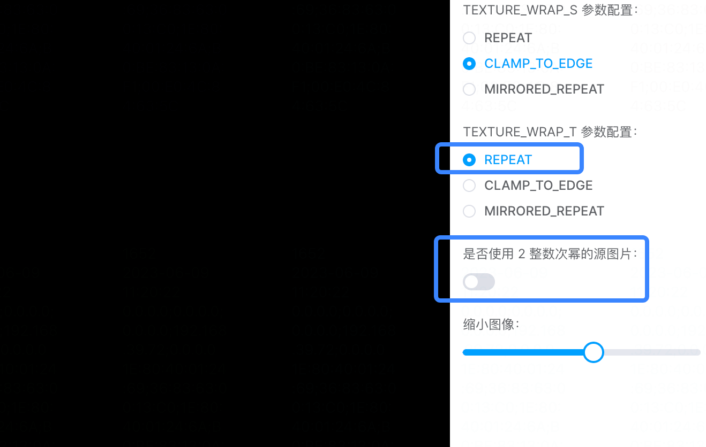

# 6. 深入WRAP和多纹理

经过上一小节的学习，我们探索了 `FILTER` 相关的参数配置，感受到了 `NEAREST` 和 `LINEAR` 的区别，了解了 `MIN_FILTER` 中的金字塔纹理参数配置，亲自感受过不同金字塔纹理的图像效果！那本节，我们接着探索纹理配置中的另外两种参数配置——`WRAP`和如何同时使用多幅纹理图像。

## `WRAP`参数详解

相信看完上一节的内容（并且缩小过示例程序樱木图片）的同学，一定会有一个大大的问号，那就是为什么我家樱木的头上长"草"了？还是如此烈焰的红色？比如...下面这张截图：


出现这个现象的根源就是我们这一节将要讲到的 `gl.TEXTURE_WRAP_S` 和 `gl.TEXTURE_WRAP_T` 的这两种配置参数了。首先，还是老样子，我们先看文档，也是看 [gl.texParameteri](https://developer.mozilla.org/en-US/docs/Web/API/WebGLRenderingContext/texParameter) 这个就够了，然后我把它的配置和默认值贴回来方便大家查阅：

| 参数              | 描述                                         | 参数值                                                                      |
|-------------------|----------------------------------------------|-----------------------------------------------------------------------------|
| gl.TEXTURE_WRAP_S | Wrapping function for texture coordinate `s` | **gl.REPEAT (default value)**,<br>gl.CLAMP_TO_EDGE,<br> gl.MIRRORED_REPEAT. |
| gl.TEXTURE_WRAP_T | Wrapping function for texture coordinate `t` | **gl.REPEAT (default value)**,<br>gl.CLAMP_TO_EDGE,<br> gl.MIRRORED_REPEAT. |

好家伙，就这么点参数（狗头.jpg）？相比 FILTER 岂不是洒洒水啦！根据描述我们可以得知这两个参数就是配置纹理水平、垂直方向是如何填充的（s、t代表的是纹理坐标系统）。我们来看看三个配置参数分别代表什么：
1. `gl.REPEAT` 重复纹理。当渲染的模型在水平、垂直方向超出源纹理图像时将重复纹理。
2. `gl.CLAMP_TO_EDGE` 切割纹理边缘。也是当渲染模型超出源纹理图像时，使用纹理图像的边缘值（也就是樱木头上长柱子了）。
3. `gl.MIRRORED_REPEAT` 镜像重复纹理。这个跟 `gl.REPEAT` 差不多，只是它是镜像的效果。

那么，什么场景会用到 `WRAP` 来配置 `S`、`T` 方向上的填充方式呢？我们来看下图：


如上所示，纹理图像的坐标范围都是 `[0, 1]`，现在我配置了一个超出 `[0, 1]` 范围的渲染坐标 `[0, 1.6]`，那么 `1.6` 自然会超出纹理坐标的 `1.0` 范围，那超出的范围的 `S`、`T` 方向就是需要通过 `WRAP` 去配置填充方式的空间了。

讲述完基础知识，我们接着上手实战一个示例程序，大家可以通过切换示例程序中的配置参数来感受一下每个参数的区别：

:::demo
third/6_1
:::

比如说我把示例程序中 垂直、水平 方向的填充都设置成镜像 `MIRRORED_REPEAT`，再把图像缩到最小就能出现如下效果：


此时出现了 4 个镜面对称的樱木～当然，如果我们把垂直方向（`T`）的填充设置成切割纹理边缘 `CLAMP_TO_EDGE` 那就回到了我们熟悉的头顶擎天柱的樱木了～好吧，其他效果大家自己操作示例程序体验一下吧，我就不一一演示、截图了。

在本小节的最后，我们再过一遍示例程序中的核心配置代码：

```js
// FLTER 都设置成了 LINEAR（注意，如果不设置 TEXTURE_MIN_FILTER 就需要提供 MIPMAP）
gl.texParameteri(gl.TEXTURE_2D, gl.TEXTURE_MIN_FILTER, gl.LINEAR)
gl.texParameteri(gl.TEXTURE_2D, gl.TEXTURE_MAG_FILTER, gl.LINEAR)
// WRAP 配置值都是动态根据表单空间的值来变化的
gl.texParameteri(gl.TEXTURE_2D, gl.TEXTURE_WRAP_S, gl[wrapSType.value])
gl.texParameteri(gl.TEXTURE_2D, gl.TEXTURE_WRAP_T, gl[wrapTType.value])
```

### 使用`REPEAT`模式的注意点

相信大家也发现了，在上面的示例程序中我还保留了上一节中使用过的"是否使用 `2` 整数次幂的源图片"这个操作项，既然留下来了，那肯定是有意而为之。 如果已经有同学自己操作过并发现了异常（黑屏），那么恭喜你，你已经 get 到了我保留这个操作项的用意了。

我们正常的切换示例程序中的各种参数来查看图像效果是没有问题的，但如果**关闭了"是否使用 `2` 整数次幂的源图片"这个开关**并且**将 `WRAP` 的配置参数切换到 `REPEAT` 模式**的时候，`canvas` 就黑了！大家可以返回上去操作一下：



如上图所示，只要我们**不用 `2` 整数次幂的源图片**，不管设置 `TEXTURE_WRAP_S` 还是 `TEXTURE_WRAP_T`，只要选择的参数配置跟 `REPEAT` （包括`MIRRORED_REPEAT`）相关显示都会出现异常（黑屏）。

所以这一点跟我们上节所提到的 **`MIPMAP` 的注意事项的其中一点是一样的**，那就是**使用的源图片的尺寸需要是 `2` 的整数次幂**。宽高之间可以不相等，但是各自尺寸的值都得是 `1`、`2`、`4`、`8`、`16`、`32`...

## 多幅纹理

经过一番学习，我们从第一张纹理图像到深入纹理，渐渐熟悉了单个纹理图像的创建、配置过程。不过，WebGL 允许我们同时使用多张纹理图像，也就是我们绘制的长方形模型中可以混合使用多个纹理图像。


趁着讲多幅纹理渲染，我们正好可以回顾一下单一纹理图像的绘制原理。关键点就是通过使用 GLSL 的内置函数 `texture2D` 对图像纹素进行颜色取值，并将颜色返回值给到内置变量 `gl_FragColor` 来对每个片元涂色，最终完整纹理图像的绘制。

以我的理解，其实不管我们用多少张图来做纹理映射将其贴到模型上，**最终落到每一个片元上的就是一个颜色值而已**。单图的话，毫无疑问就是原本纹素内插后的颜色值，那多张图，不就在每个片元上实现了多个颜色的整合吗？

接下来，我们就通过实战一个示例程序来探讨一下多纹理的奥秘吧。基于我们之前单纹理图像的实现，我们大概可以猜测出多纹理的实现方式：
1. 需要多张图，且需**多张图都 `onload` 后**才能操作
2. 需要多个纹理单元吧？因为需要通过纹理单元来对纹理对象进行取色，操作纹理对象
3. 需要一样的纹理映射方式。也就是 创建、激活、绑定、配置、分配纹理对象...等等一套流程
4. 赋值 gl_FragColor 的纹理取色需要结合多张纹理图像

### 等待所有图片加载
基于上面的分析，我们需要改造一下图片的 `onload` 实现。毕竟之前只有单张图可以直接在图片 `onload` 后进行纹理映射的调用。所以这里我打算通过 `Promise` 来处理图片都加载完后再进行绘制：

```js
const initImage = async () => {
  ...
  // 组装一个 Promise 数组
  const loadImageQueue = [
    new Promise((res) => {
      img1.onload = res
    }),
    new Promise((res) => {
      img2.onload = res
    })
  ]
  // 用 Promise.all 来等待全部图片加载完成
  await Promise.all(loadImageQueue)
  ...
}
```

如上述伪代码，我把图片的 `onload` 事件都包成 `Promise`，再通过 `Promise.all` 配合  `async await` 来等待所有图片加载完成。

### 多纹理单元和着色器改造

根据上面分析的 `2-4` 点，我们还需要改造的关键就是**片元着色器**的实现了。因为我们需要同时绘制多张纹理图像，所以需要多个纹理单元；并且最终还需要将多个从纹理图像中取出的颜色值做一个混合...

所以在 shader 中，我们需要多一个取样器 `u_Sampler2` 来取另外张纹理的颜色值，并且需要将两个取色器的结果混合。（因为示例中用的图像都是 `jpeg` 所以我就只取它们的 `rgb` 值）

那么具体的多幅纹理的着色器代码（案例是两张图）大概可以这样写：

```js
const fragmentMultipleCode = `
  precision mediump float;
  varying vec2 v_TexCoord;
  // 取样器1
  uniform sampler2D u_Sampler1;
  // 取样器2
  uniform sampler2D u_Sampler2;

  void main () {
    // 根据坐标取第一张纹理图像对应的纹素值
    vec4 color1 = texture2D(u_Sampler1, v_TexCoord);
    // 根据坐标取第二张纹理图像对应的纹素值
    vec4 color2 = texture2D(u_Sampler2, v_TexCoord);
    // 颜色矢量相乘
    gl_FragColor = vec4(color1.rgb * color2.rgb, 1.);
  }
`
```

其实仔细一看，代码跟之前的还是比较相似的，只是因为多纹理我们需要另外接收纹理单元来进行取色而且，最终我们把两张图像的取色结果相乘（`color1.rgb * color2.rgb`）后赋值给 `gl_FragColor`。这里补充一个小点，两个颜色矢量相乘，可以看作是每个分量的互相乘积，即：

```C
// 颜色值1： vec4(r1, g1, b1, 1.0)
// 颜色值2： vec4(r2, g2, b2, 1.0)
vec4(r1*r2, g1*g2, b1*b2, 1.0)
```

当然，**最终的颜色混合方式其实并不固定**，不管我们是乘法、还是加、减、除法都可以的，只是不同运算出来的图像效果会有所不同（毕竟我们通过不同的方式**改变每个片元的最终颜色值**）。讲这么多也不如亲自实战来得更直观，那接下来就通过一个示例程序来给大家自己操作体验一下吧：

:::demo
third/6_2
:::

因为我想把两张纹理图像不同的混合效果都展示给大家，所以在着色器中加了如下判断逻辑（其实就是简单的用 `if else` 来区分个加减乘除），详细的代码实现大家可以展开示例程序的源码来查看。

```C
if (u_DrawIndex >= 6.0) {
  gl_FragColor = vec4(color1.rgb - color2.rgb, 1.);
} else if (u_DrawIndex >= 5.0) {
  gl_FragColor = vec4(color1.rgb + color2.rgb, 1.);
} else if (u_DrawIndex >= 4.0) {
  gl_FragColor = vec4(color1.rgb / color2.rgb, 1.);
} else {
  gl_FragColor = vec4(color1.rgb * color2.rgb, 1.);
}
```

看到到这里你已经掌握了多纹理的基本用法了，相信你想要通过 WebGL 给一张图片加个边框、滤镜等都是随手就能干的事情了～那么到本文的结束，我们基本熟悉了 WebGL 的颜色和纹理了，接下来我们可以接着探索 WebGL 实现二维动画的奥秘了。

## 总结

本文的最后，跟大家一起回顾本文的主要内容：
1. 体验 WRAP 参数配置的区别（`CLAMP`和`REPEAT`），需要注意 **`REPEAT` 配置对图像尺寸有要求**，需要是 `2` 的整数次幂
2. 实战多纹理图像需要**激活多个纹理单元**，并且需要等待全部图片加载完成后才能进行绘制操作
3. 多纹理的颜色混合有多种方式，需在**片元着色器中对取色后的颜色值进行混合**。并且加减乘除等方式混合会出现不同的图像效果
