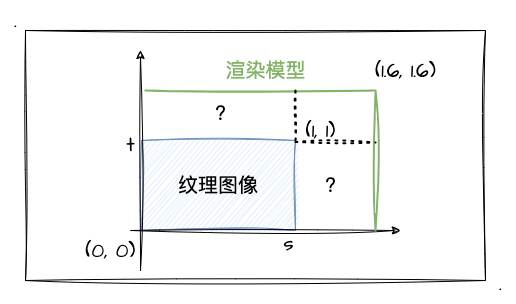
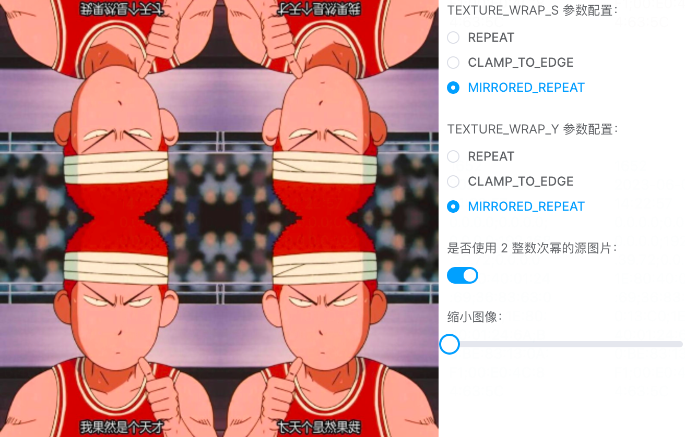

# 6. 深入纹理细节之WRAP

经过上一小节的学习，我们探索了 `FILTER` 相关的参数配置，感受到了 `NEAREST` 和 `LINEAR` 的区别，了解了 `MIN_FILTER` 中的金字塔纹理参数配置，亲自感受过不同金字塔纹理的图像效果！那本节，我们接着探索纹理配置中的另外两种参数配置——`WRAP`。

## `WRAP`参数详解

相信看完上一节的内容（并且缩小过示例程序樱木图片）的同学，一定会有一个大大的问号，那就是为什么我家樱木的头上长草了？还是如此烈焰的红色？比如...下面这张截图：

出现这个现象的根源就是我们这一节将要讲到的 `gl.TEXTURE_WRAP_S` 和 `gl.TEXTURE_WRAP_T` 的这两种配置参数了。首先，还是老样子，我们先看文档，也是看 [gl.texParameteri](https://developer.mozilla.org/en-US/docs/Web/API/WebGLRenderingContext/texParameter) 这个就够了，然后我把它的配置和默认值贴回来方便大家查阅：

| 参数              | 描述                                         | 参数值                                                                      |
|-------------------|----------------------------------------------|-----------------------------------------------------------------------------|
| gl.TEXTURE_WRAP_S | Wrapping function for texture coordinate `s` | **gl.REPEAT (default value)**, gl.CLAMP_TO_EDGE,  gl.MIRRORED_REPEAT. |
| gl.TEXTURE_WRAP_T | Wrapping function for texture coordinate `t` | **gl.REPEAT (default value)**, gl.CLAMP_TO_EDGE,  gl.MIRRORED_REPEAT. |

好家伙，就这么点参数（狗头.jpg）？相比 FILTER 岂不是洒洒水啦！根据描述我们可以得知这两个参数就是配置纹理水平、垂直方向是如何填充的（s、t代表的是纹理坐标系统）。我们来看看三个配置参数分别代表什么：
1. `gl.REPEAT` 重复纹理。当渲染的模型在水平、垂直方向超出源纹理图像时将重复纹理。
2. `gl.CLAMP_TO_EDGE` 切割纹理边缘。也是当渲染模型超出源纹理图像时，使用纹理图像的边缘值（也就是樱木头上长柱子了）。
3. `gl.MIRRORED_REPEAT` 镜像重复纹理。这个跟 `gl.REPEAT` 差不多，只是它是镜像的效果。

那么，什么场景会用到 `WRAP` 来配置 `S`、`T` 方向上的填充方式呢？我们来看下图：

如上所示，纹理图像的坐标范围都是 `[0, 1]`，现在我配置了一个超出 `[0, 1]` 范围的渲染坐标 `[0, 1.6]`，那么 `1.6` 自然会超出纹理坐标的 `1.0` 范围，那超出的范围的 `S`、`T` 方向就是需要通过 `WRAP` 去配置填充方式的空间了。

讲述完基础知识，我们接着上手实战一个示例程序，大家可以通过切换示例程序中的配置参数来感受一下每个参数的区别：

:::demo
third/6_1
:::

比如说我把示例程序中 垂直、水平 方向的填充都设置成镜像 `MIRRORED_REPEAT`，再把图像缩到最小就能出现如下效果：

此时出现了 4 个镜面对称的樱木～当然，如果我们把垂直方向（`T`）的填充设置成切割纹理边缘 `CLAMP_TO_EDGE` 那就回到了我们熟悉的头顶擎天柱的樱木了～好吧，其他效果大家自己操作示例程序体验一下吧，我就不一一演示、截图了。
