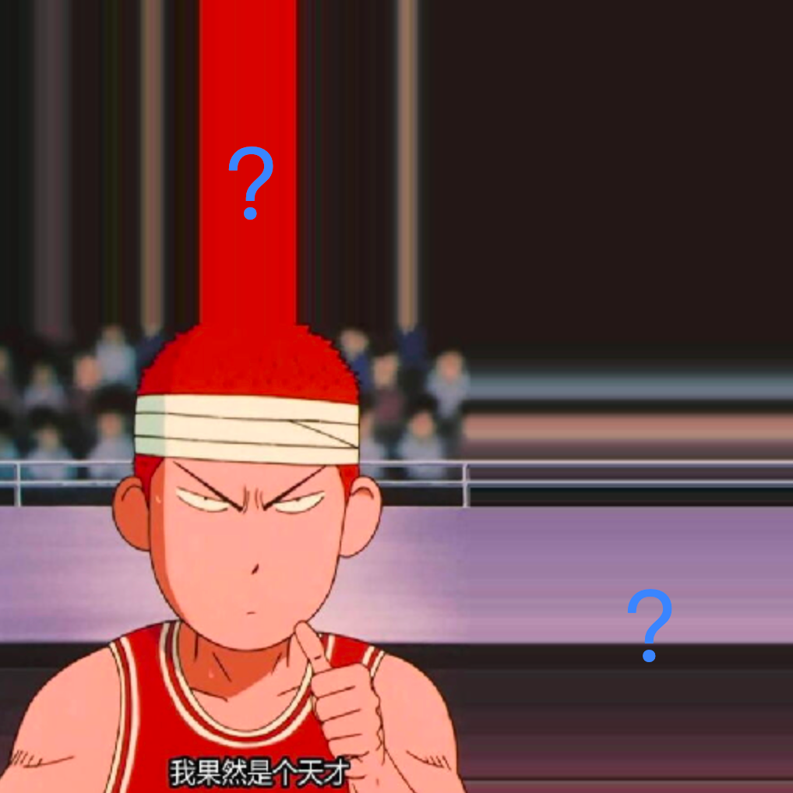

# 6. 深入纹理细节之WRAP

经过上一小节的学习，我们探索了 `FILTER` 相关的参数配置，感受到了 `NEAREST` 和 `LINEAR` 的区别，了解了 `MIN_FILTER` 中的金字塔纹理参数配置，亲自感受过不同金字塔纹理的图像效果！那本节，我们接着探索纹理配置中的另外两种参数配置——`WRAP`。

## `WRAP`参数详解

相信看完上一节的内容（并且缩小过示例程序樱木图片）的同学，一定会有一个大大的问号，那就是为什么我家樱木的头上长草了？还是如此烈焰的红色？比如...下面这张截图：

出现这个现象的根源就是我们这一节将要讲到的 `gl.TEXTURE_WRAP_S` 和 `gl.TEXTURE_WRAP_T` 的这两种配置参数了。首先，还是老样子，我们先看文档，也是看 [gl.texParameteri](https://developer.mozilla.org/en-US/docs/Web/API/WebGLRenderingContext/texParameter) 这个就够了，然后我把它的配置和默认值贴回来方便大家查阅：

| 参数              | 描述                                         | 参数值                                                                  |
|-------------------|----------------------------------------------|-------------------------------------------------------------------------|
| gl.TEXTURE_WRAP_S | Wrapping function for texture coordinate `s` | **gl.REPEAT (default value)**, gl.CLAMP_TO_EDGE,  gl.MIRRORED_REPEAT. |
| gl.TEXTURE_WRAP_T | Wrapping function for texture coordinate `t` | **gl.REPEAT (default value)**, gl.CLAMP_TO_EDGE,  gl.MIRRORED_REPEAT.     |

好家伙，就这么点参数（狗头.jpg）？相比 FILTER 岂不是洒洒水啦！根据描述我们可以得知这两个参数就是配置纹理水平、垂直方向的（s、t代表的是纹理坐标系统）。
