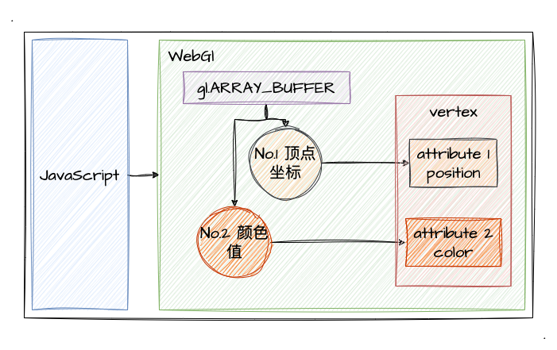

# 1. 渐变色的图形

回顾上个章节的学习，我们了解如何用 GLSL 写基本的着色器，并且了解了如何绘制一些基础的 2D 图形了。那在上一章的最后一节，我在演示 `TRIANGLE` 绘制效果的时候采用了混色的三角形去实现一些基础图形的绘制。所以！这一节我们将沿着这个方向，探索如何绘制出一个渐变色的基础图形。

:::demo
second/6_3
:::

## 多个缓冲区对象

很明显，上文的示例程序中，我们需要动态传递给着色器的数据不仅仅是顶点坐标，还有颜色值。而之前我们学习缓冲区对象的时候，只有一种数据类型（顶点坐标），那显然是不足以满足我们现在的需求的，所以我们可以通过创建多个缓冲区对象来实现这样的需求。

首先分析一下着色器的代码：
```js
const vertexCode = `
  // 顶点坐标数据
  attribute vec4 a_Position;
  // 颜色数据
  attribute vec4 a_Color;
  // varying 变量传递到片元着色器
  varying vec4 v_Color;

  void main () {
    gl_Position = a_Position;
    v_Color= a_Color;
  }
`

const fragmentCode = `
  precision mediump float;
  // 颜色值变量
  varying vec4 v_Color;

  void main () {
    gl_FragColor = v_Color;
  }
`
```
简单来说，顶点着色器中不仅动态接收**坐标数据**，并且接收了**颜色数据**，再通过 `varying` 变量将颜色值传递到片元着色器。（有需要回顾 [`varying` 变量](/content/二、WebGl基础/4.%20绘制动态颜色点.html#varying-变量)的内容可以先回顾一下再接着看本文）

那既然知道我们现在需要传递**两种类型的顶点数据**给到着色器，那我们需要怎么做呢？第二章我们学习缓冲区对象的时候只给顶点着色器分配了一个缓冲区对象（顶点坐标），那现在我们尝试给它分配第二个缓冲区对象！

示例我们简单一点，就画个三角形就好了，沿用第二章第5小节的坐标，如下图：


首先这是本次绘制的顶点坐标数据：
```js
const vertices = new Float32Array([
  -.6, -.6,
  0., .8,
  .6, -.6,
])
```

接着，我们给颜色值也指定一个缓冲区数据，本次绘制我们就按照 `rgb` 的顺序给颜色值就好了，这是颜色值的数据：
```js
const colors = new Float32Array([
  1., 0., 0., 1., // 红色
  0., 1., 0., 1., // 绿色
  0., 0., 1., 1., // 蓝色
])
```

在定义好坐标、颜色的数据后，我们就可以着手缓冲区对象了，那我们简单回顾一下使用缓冲区对象的五步骤：
1. 创建缓冲区对象
2. 绑定缓冲区对象到 `target`
3. 分配缓冲区数据
4. 将缓冲区分配到 `attribute` 变量
5. 开启 `attribute` 变量

其实多个缓冲区对象，也就是按照上述步骤，多次执行而已。简单来说，我们可以把上述步骤进行一个封装，比如封装成一个 `createBuffer` 的函数，分多次调用。下面是实现的伪代码：
```js
// 创建缓冲区封装
const createBuffer = () => {
  const buffer = gl.createBuffer() // 创建缓冲区对象
  gl.bindBuffer(target, buffer) // 绑定缓冲区对象到 target
  gl.bufferData(target, bufferData, gl.STATIC_DRAW) // 分配缓冲区数据
  gl.vertexAttribPointer(attribute, size, gl.FLOAT, false, 0, 0) // 将缓冲区分配到 attribute 变量
  gl.enableVertexAttribArray(attribute) // 开启 attribute 变量
}

// 创建顶点坐标数据的缓冲区
createBuffer(vertex)
// 创建颜色数据的缓冲区
createBuffer(color)
// 创建 xxx 的缓冲区
createBuffer(xxx)
```

由此一来，我们通过多种缓冲区对象实现了不同种类数据的传递。每当我们执行 `gl.drawArrays` 进行绘制时，各种数据将**按照其在缓冲区中的顺序一一传递到对应顺序的顶点着色器的 `attribute` 变量**中。我们可以通过下图将其表示出来：



那么接下来，我们直接通过示例程序来看看绘制的效果把：

:::demo
third/1_1
:::
