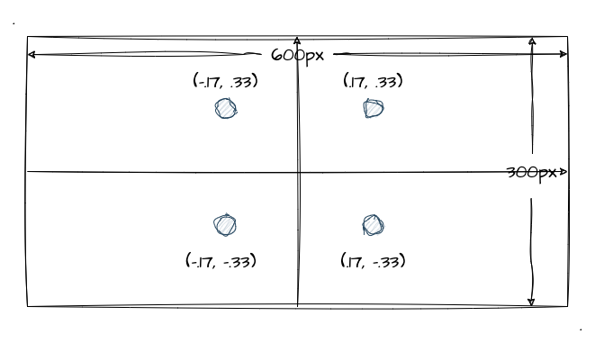
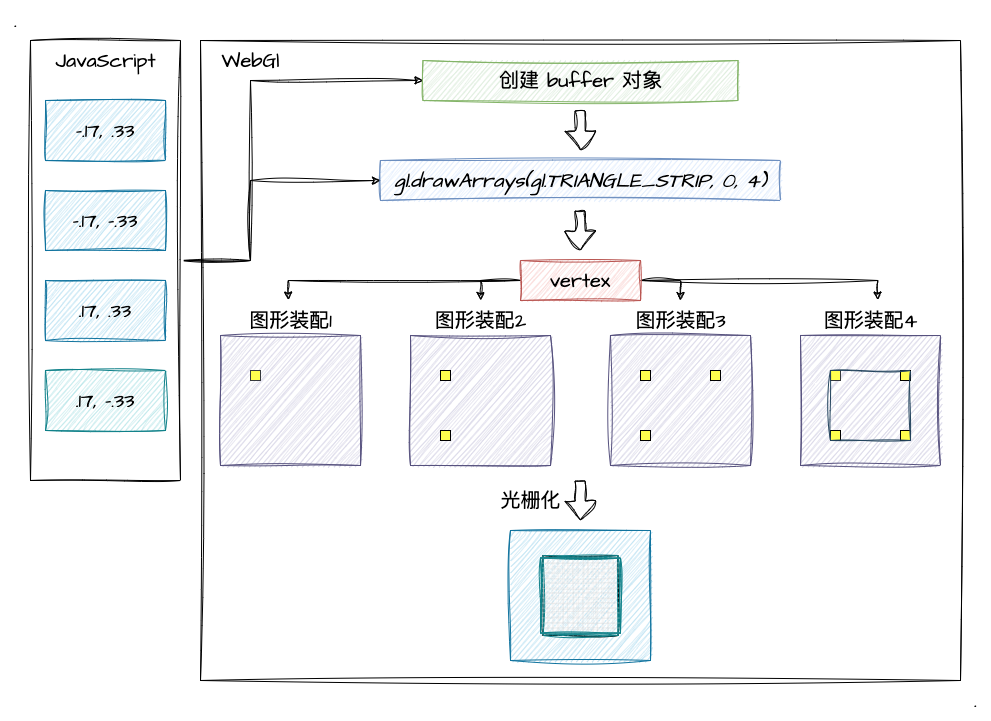
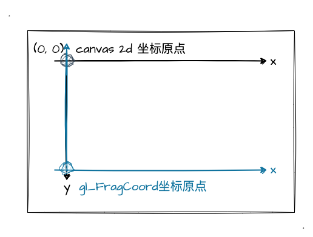
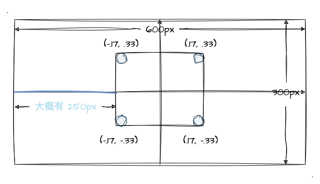

# 2. 为什么会出现颜色渐变

经过上一小节的学习，我们掌握了同时给顶点着色器传入多种类型的顶点数据以实现了彩色三角形的绘制。那么，相信代码实现大家是都没问题了，不过不知道大家是否会有个疑问？

为什么我们给三个顶点各传入一个颜色值，却出现了一个**渐变色的三角形**？

## 图形装配和光栅化

对于图形装配和光栅化可能在之前的章节中并没有太多提及，但其实我在第二章第2节讲绘制点的时候有画过这么一张图：


虽然我们之前的内容主要都是集中在顶点着色器和片元着色器之间，中间图形装配和光栅化并没有怎么提及，但其实他们之间是有这么两个步骤的。

为了让大家理解这两个步骤存在的意义，我举一个具体的案例。比如我们现在需要画一个 `100px * 100px` 的纯色正方形，我们需要提供 4 个顶点坐标，并通过 `gl.TRIANGLE_STRIP` 的绘制 mode 就可以绘制出来了。所以，我们先通过一张图来讲坐标确定下来（坐标点不是特别精确，大概画出 100 * 100 的效果）：



那么根据这 4 个坐标点，我们画出一个纯黄色的正方形看看效果：

:::demo
third/2_1
:::

ok，我们提供了4个顶点坐标，并将 `gl_FragColor` 设置成黄色，就可以绘制出一个**黄色的正方形**！那就是说，我们的片元着色器将 4 个坐标点**区间范围内的全部像素点都绘制成黄色**了。这里，我们不难想象到，绘制一个 `100px * 100px` 的纯色正方形，需要对区间内的每个像素点进行着色！

基于这一点，图形装配和光栅化的步骤存在的意义就很明显了。他们需要将顶点坐标**装配成几何图形**，再将装配好的几何图形**转化成一个一个真实的像素**，再给到片元着色器对其进行逐片元操作（对每个像素着色）！所以说，绘制一个 `100 * 100` 的正方形，片元着色器需要执行 `10000` 次！

那我们就以这个案例作为我们的分析对象，看看顶点着色器、片元着色器具体是怎么工作的！
1. 首先，我们通过 `gl.drawArrays(gl.TRIANGLE_STRIP, 0, 4)` 进行图形的绘制。这里的 `count` 参数为 `4`，那就意味着顶点着色器将会执行 `4` 次
2. 执行第一个顶点着色器，第一个坐标点的数据 `(-.17, .33)` 分配给到 `attribute` 变量 —— `a_Position`。然后这个变量会赋值给到 WebGl 内置变量 —— `gl_Position`，然后进入了图形装配阶段，数据被缓存起来了
3. 执行第二个顶点着色器，同样流程，`(-.17, -.33)` 坐标数据被缓存在图形装配阶段。（这里注意，我们的坐标是 `vec4` 类型，我们没传后两位，所以它们使用的是默认值，整个 `gl_Position` 其实是 `(x, y, 0.0, 1.0)`）
4. 执行第三、第四个顶点着色器，同样流程，`(.17, .33,)` 、`(.17, -.33)` 传入并缓存在图形装配区
5. 开始**图形装配**。执行完 `4` 次顶点着色器，开始根据**传入的顶点坐标** 和 **`mode`本例是(`gl.TRIANGLE_STRIP`)** 进行图元装配过程。因此这里会装配出一个 **正方形** 
6. 最后一步是**光栅化**。光栅化的作用是将我们装配好的图形转化成片元（像素）来显示在显示器上，因此光栅化步骤后我们就得到了组成整个正方形的片元（像素）

以下，我画了个图来表示整个图形装配到光栅化的过程：



上图中可以看到，光栅化后我们得到了一个由 `10000`个 像素点组成的 `100px * 100px` 的正方形。最后只需要再通过片元着色器进行一个"逐片元"操作，就会出现我们示例程序中的黄色正方形了！

这里我们应该能想到，我们 `gl.drawArrays` 传入不同的 `mode` 和 `count`，图形装配的结果是不一样的。就比如我们传的 `mode` 不是 `TRIANGLE`类 而是 `LINE`类型的，那装配出来的图形就是一个空心的图形，中间并不会填满像素点。

## 片元着色器是如何工作的？

上一小节的图形装配、光栅化流程后，就到调用片元着色器进行"逐片元"操作了！在本文的案例中，片元着色器会被调用 `10000` 次！

其实对于每一个片元，片元着色器都会计算出它的颜色值，然后将结果写到颜色缓冲区中。（这个颜色缓冲区就是绘制结果，最终呈现到屏幕当中的，或者我们可以回忆以下清除背景色的时候，不正是清除掉颜色缓冲区吗？）

那在这个案例中，因为是个纯色（黄）的正方形，所以每个片元（像素）的颜色都是黄色，如此一来，最后呈现到我们面前的就是一个 `100px * 100px` 的黄色正方形！不过到现在为止，我们对 **片元着色器** 的工作过程只是在纸面意义上的了解，那有没有办法来印证一下 **片元着色器** 的工作过程呢，也就是印证这 `10000` 次执行的过程呢？

### 内置变量—— `gl_FragCoord`

简单认识一下 [gl_FragCoord](https://registry.khronos.org/OpenGL-Refpages/gl4/html/gl_FragCoord.xhtml) 这个内置变量， 它是**片元着色器中的一个内置变量**，是一个 **`vec4` 类型**的变量，并且它的前两个分量（数值）代表 `x` 、 `y` 坐标值。

其中在文档的 **description** 中有一句这样的描述：

> By default, gl_FragCoord assumes a lower-left origin for window coordinates and assumes pixel centers are located at half-pixel centers.

它告诉我们 `gl_FragCoord` 中所用到的坐标系统**默认左下角为坐标原点**！所以这样我们就需要注意他的 `x`，`y` 的取值了。这里我们通过两幅图来对比，方便大家更好记忆 `gl_FragCoord` 的坐标原点。首先是之前讲 `canvas 2d` 坐标的一张图：


接下来是 `gl_FragCoord` 的坐标图：



ok，那相信大家对 `gl_FragCoord` 的坐标有一定了解了，我们接下来就去使用它。接着前文提到的，我们要印证 片元着色器 执行了 `100 * 100` 次，所以我们可以让**每个像素点的颜色都有所不同来印证这一点**！

那现在我们知道可以通过 `gl_FragCoord.x` 、 `gl_FragCoord.y` 来获取当前每个像素点的 `x` 、 `y` 值，所以我们只需要根据每个像素点的 `x` 、 `y` 值的不同来稍微改变一下当前像素点的颜色即可。

为了更加清晰坐标点的计算，我们还是直接通过图片来看！（记得中学时期，老师告诉我涉及坐标点的计算一定要画坐标系！）



由图示很清楚的就能看出来，我们示例程序画的居中正方形，以`canvas`左下角为原点的时候，正方形最左边的 `x` 值大概是 `250px` （计算公式：`(600px - 100px) / 2`）的样子。所以我们现在这样改造之前的片元着色器代码：

```js
// 这是原本的着色程序代码
const fragmentCode = `
  void main () {
    gl_FragColor = vec4(1., 1., 0., .9); // 纯黄色
  }
`

// 现在我们对 r 、 g 两个值通过 gl_FragCoord 来进行修改
const fragmentCode = `
  void main () {
    // 将 r 的位置换成坐标 x 动态计算
    gl_FragColor = vec4((gl_FragCoord.x - 250.) / 100., 1., 0., .9);
  }
`
```

根据这个片元着色器的 `gl_FragColor` 赋值，我们大概猜测一下绘制出来的图形是什么样子的？首先，`r` 的位置一开始应该是 `0`。因为 `(gl_FragCoord.x - 250.) / 100.` 这个计算公式，当在处于正方形最左边的时候， `gl_FragCoord.x` 为 `250`，相减后值为 `0`。

所以，一开始正方形的最左侧的所有片元应该是 `r` 为 `0`， `g` 为 `1` 的 `rgb` 值，那颜色应该是**绿色**！从左往右，随着 `gl_FragCoord.x` 的不断增加，`r` 值也逐渐增加，正方形应该逐渐呈现出黄色！到了正方形的最右侧，应该是纯黄色！

那么接下来，我们就通过示例程序来验证一下我们的猜想：

:::demo
third/2_2
:::

果不其然，正方形呈现出一个以 `x` 为轴的左右渐变的颜色。到这里，我们可以**证实片元着色器对于光栅化后的每一个片元，都需要执行一次上色操作**！所以，对于一个 `100 * 100` 的矩形来说，片元着色器逐片元的操作需要执行 `10000` 次片元着色器的代码！

## `varying` 变量的内插过程

当我们了解完 **顶点着色器、图形装配、光栅化、片元着色器**是怎么工作之后，我们终于可以开始探讨为什么会出现一个三色渐变的三角形了。当然，这一步的理解依赖于上文提到的知识点，所以碰到不懂的可以立马回看前文内容～

我们回顾之前的渐变色三角形，固然是没有像上个示例程序一样通过 `gl_FragCoord.x` 计算颜色值来实现渐变效果的。我们**只传入了三个顶点坐标和颜色值**，是 WebGl 自己将其绘制成了三色渐变的三角形而已。那么接下来，我们就来揭秘这个神奇的过程——**内插**。

:::demo
third/1_2
:::

回顾 [varying 变量](/content/二、WebGl基础/4.%20绘制动态颜色点.html#varying-变量)，我们之前就有介绍过这个关键字，它的作用是将顶点着色器中的 `varying` 变量传入到片元着色器同名同类型的 `varying` 变量中。我们那时候通过 `varying` 变量实现了动态颜色点的绘制。

其实 `varying` 变量在顶点着色器传入片元着色器之间，还有一个步骤就是内插（在光栅化步骤中）。所以到片元着色器中真正接收到的 `varying` 变量并不完全等同于 顶点着色器的 `varying` 变量的值。具体流程可参考下图进行理解：


那么彩色三角形的内插过程具体发生了什么呢？varying变量会经历怎么样的变化呢？我们再看下一张图：


图中，每一个顶点的 `varying` 值经过内插后数值都**等比例变化**。虽然图中简单表示成**单色的变化数值**（多色变化画起来图会很臃肿），但换算成多色也是一样的。这里没看懂没关系，通过下图来看看双色数值变化就肯定能明白我的意思了：


由上图可以看到，`rgba` 中的 `r` 值和 `g` 值 在内插的过程中不断地进行变化，而正是由于这样的一个过程，我们最终就可以绘制出来一个三色渐变的三角形。

所以，内插的过程其实就是 WebGl 系统在图形光栅化后，根据顶点着色器中的 `varying` 变量计算出中间每个片元的颜色，再将计算好的 `varying` 值传递到片元着色器中。

## 总结

本文的最后，跟大家一起回顾本文的主要内容：
1. 图形绘制期间，顶点着色器到片元着色器之间还有**图形装配、光栅化**两个重要的步骤
2. 在光栅化后，我们可以通过 `gl_FragCoord` 人为的干预每个片元的颜色值，可为片元指定不同的颜色
3. `varying` 变量传递到片元着色器之前还有个**内插过程**，每个片元的颜色将被一一计算出来再传递到片元着色器中 
