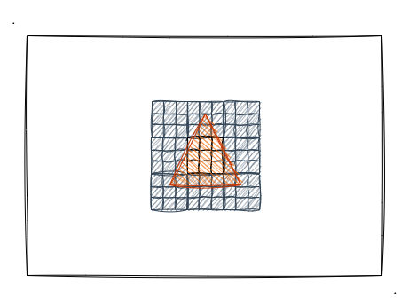
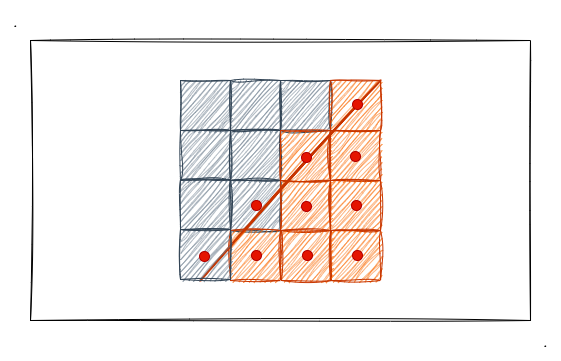
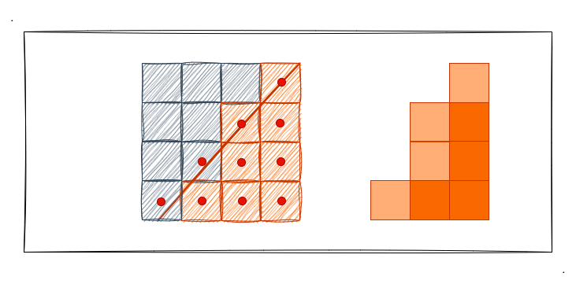
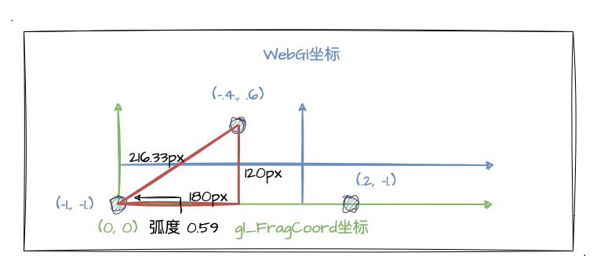
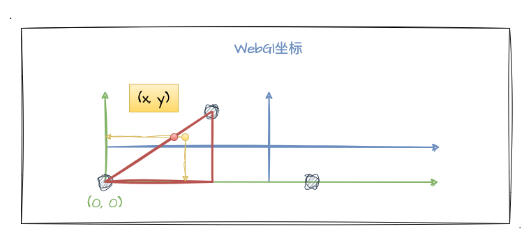
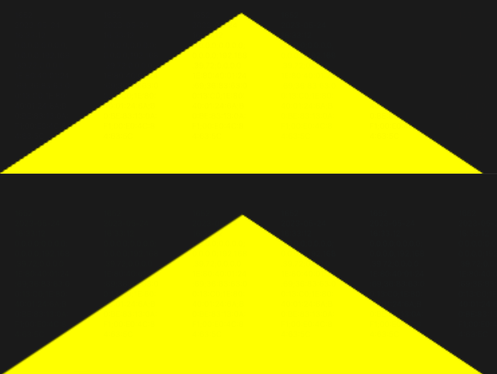

# 3. 实战消除锯齿

经过上一小节的学习，我们了解到了片元着色器中的一个新的内置变量——`gl_FragCoord`，通过它我们可以拿到每一个片元（像素点）的 `x`、`y` 值，因而我们可以干预每一个像素点的颜色值！在上一节中，我们通过它实现了一个以 `x` 为轴从左到右从绿到黄的一个渐变色正方形。

那这一小节，我们继续深入，再次借助 `gl_FragCoord` 的能力来实战一下消除锯齿，顺便巩固我们对图形绘制流程的熟悉，深入理解顶点着色器、片元着色器的工作内容。

**在正文开始前，先声明，本文是加深我们对颜色、着色器、图像绘制过程理解的实战 demo，真实场景消除锯齿请参考业界方案和类库。**

## 什么是锯齿

什么是锯齿？相信大家通过字面意思就大概能明白，那就是一种凹凸不平的像锯齿一样的东西。我们直接看看前一小节彩色三角示例的放大截图：


如截图所示，我们肉眼就能看出三角形的**两条腰**明显要比**底边**的显示效果更加的"不平滑"，那这种"不平滑"其实就是图像锯齿。（本文不会特别深入，感兴趣的同学可以自己找点资料来深入学习）

锯齿是怎么产生的呢？其实就是图像边缘（不同颜色）之间的**颜色生硬过渡**（采样不足造成）产生的，特别是**圆弧、斜边**这种场景锯齿感会特别明显，而水平、垂直方向上基本看不出什么锯齿感。

就以上述的截图为例，我们画布的颜色是黑色，然后三角形的三个边是其他的颜色（反正不是黑色），如果颜色之间生硬过度就会出现锯齿的情况。我们通过图片来大概分析一下锯齿的产生：



光栅化步骤后的每个片元的情况如上图所示，深色背景和橙色三角形被分割成一个一个格子，这些格子组成了屏幕像素。以上图为例，我们想象每个网格正中心为取色点，当三角形的范围盖过了取色点那就为橙色，否则为黑色。我以斜边的一个分块为例画了下图：



如图所示，取色点在斜边范围内的像素被绘制成了橙色，而没在范围内的被绘制成黑色。就这个图而言，我们已经可以看见锯齿了，这也就是锯齿产生的基本原因。

那我们要如何消除锯齿呢？其实原理很简单，我们只需要让像素之间产生一定的渐变效果，就能从肉眼上去除锯齿了！对于这一点，我们不需要想得太复杂，我们可以想象成将边缘的像素点的颜色设置成 **原色** 和 **背景色** 的**混合颜色**，以产生一种渐变色的效果，就能使得边缘的颜色过度平滑，锯齿也就不明显了。

关说不直观，我们直接看下图进行理解：



上图中，我把**靠近边缘的像素点**绘制成了透明度低一点的橙色，以形成三角形边和背景色之间的平滑过度效果，为的就是避免颜色之间"非黑即白"的生硬过度，如此一来就能从肉眼层面将锯齿消除了。

## 实战准备阶段

经过了半篇文章的铺垫，我们终于进入到实战环节了。我们现在知道了消除锯齿就是要实现一个边缘之间的平滑过渡效果，也就是渐变过渡。那我们回顾上一小节刚学习片元着色器的内置变量——`gl_FragCoord`，我说过我们可以用它来干预片元着色器对每个片元的颜色绘制，并且在上一节中我们已经通过它来实现正方形的颜色渐变了！那这一节，我们接着来使用它实现边缘的渐变效果！

首先我们先绘制出一个三角形，为了方便三角形边缘的坐标计算，我打算把三角形绘制在 `canvas` 的左下角，也就是 `gl_FragCoord` 坐标 (0, 0) 的位置。我按照下图的尺寸进行三角形绘制：



如图，这个是个钝角三角形，底边长 `180px * 2`，高度为 `120px`，然后我把画布的 宽度设置成 `600px`, 高度设置成 `150px`。图中蓝色字体的坐标对应 `WebGl` 系统中的坐标。我把三角形的颜色设置为黄色，最终可以画出如下的三角形：

:::demo
third/3_1
:::

如示例程序中的黄色三角形，我们发现锯齿感更加严重了（特别是左腰的边）！这是个好事情，毕竟我们实现锯齿消除后，可以更清晰地看到前后的效果差异。那接下来，我们进行实战消除锯齿前的最后准备阶段，了解一些 GLSL 中的内置函数。

### `GLSL——mix`

首先来看看函数用法，详细可以参考 [mix-OpenGL](https://registry.khronos.org/OpenGL-Refpages/gl4/html/mix.xhtml)：
```C
mix(vec4 x, vex4 y, float a)
```
函数的会返回 `x` 、 `y` 的线性混合值，可以看成是 `x*(1 - a) + y*a` 的结果。（注意，`x` 、 `y` 是 `vec4` 类型，本案例代表的是 `rgba` 的颜色值）

我们可以简单理解为它可以帮我们根据 `a` 值取两个颜色之间的插值，就跟上一节提到的 `varying` 变量 的插值一样的。**反正我们记住一点，当 `a` 为 `0` 时，就是只取前面的颜色，当 `a` 为 `1` 时就是只取后面的颜色，处于中间时取中间颜色**！


所以，在消除锯齿的艰巨任务中，它就是帮我们处理颜色渐变的关键函数。

### `GLSL——atan`

再来看看我们熟悉又陌生的反正切函数，详细可以参考 [atan-OpenGL](https://registry.khronos.org/OpenGL-Refpages/gl4/html/atan.xhtml)。这个函数我不算太细致的讲，因为正切、正弦这种都涉及数学知识了，大家也都学过，自己按照自己的方式去回顾一下就好了。（我也是翻了好些资料重学这些中学时期都能倒背如流的三角函数知识了～）

这里提到这个函数，**我们只需要知道我们用它来计算三角形斜边上的 `y` 值坐标即可（知 `x` 求 `y`）**。

这里是函数的用法：
```C
float tanARadian = atan(120., 180.);
```
emm，然后顺便提一下，GLSL 中内置了很多数学相关的函数，如 `sin`、`cos`、`sqrt` 等等，并且我们都可以**直接进行调用**，不需要像 JavaScript 一样通过 `Math.xxx` 的形式去调用的。

### `GLSL——smoothstep`

详细了解可看 [smoothstep-OpenGL](https://registry.khronos.org/OpenGL-Refpages/gl4/html/smoothstep.xhtml)，它是用来求两个值之间的插值的。我们可以关注文档对他的详情描述：

> **smoothstep** performs smooth Hermite interpolation between 0 and 1 when edge0 < x < edge1. This is useful in cases where a threshold function with a smooth transition is desired.

百度翻译一下就是：当 `edge0 ＜ x ＜ edge1` 时，**smoothstep** 在0和1之间执行平滑埃尔米特插值。这在需要具有**平滑过渡的阈值函数**的情况下是有用的。所以它很适合我们的这个需求！

那么，它的用法是：
```C
// edge0 下边缘的值；edge1 上边缘的值
smoothstep(genType edge0, genType edge1, genType x);
```

`edge0` 代表下边缘的值，`edge1` 代表上边缘的值，也就是一个是 `min`，一个是 `max`。 我们分三种情况看它的返回结果：
1. 第三个参数 `x` 小于 `edge0（min）` 时，会返回 `0.0`
2. 第三个参数 `x` 大于 `edge1（max）` 时，返回 `1.0`
3. 第三个参数 `x` 位于 `edge0（min）` 和 `edge1（max）` 之间时，会返回 `x` 在这个区间内与 `edge0（min）` 距离的占比

## 实战 `gl_FragCoord` 消除锯齿

> 注意！本次实战仅消除三角形左腰的锯齿。

简单实现的方案：我通过 `gl_FragCoord.xy` 获得每一个点的坐标，判断这个坐标是否接近三角形的左腰边线的位置（通过三角函数计算），如果接近的话就设置一定的渐变颜色，以产生平滑的过渡效果。



如上图所示，**黄色点**代表其中一个像素点，我们可以通过 `gl_FragCoord.xy` 获取到它的坐标。**红色点**代表左腰线上的点，我们通过当前的 `gl_FragCoord.x` 坐标和正切公式计算出它的 `y` 值，直接判断**黄色点的 `y` 值和红色点的 `y` 值的差**是否处于一定范围，是的话则设置渐变。

核心的片元着色器代码如下：
```js
const fragmentGradientCode = `
  precision mediump float;
  varying vec4 v_Color;

  void main () {
    // 求角度 A 的弧度值，对应图中的左下角的锐角
    float tanARadian = atan(120., 180.);
    // 计算 当前坐标点 和 左腰坐标点 y 值的 差
    float vertexY = gl_FragCoord.x * tan(tanARadian) - gl_FragCoord.y;
    // 混合背景色(黑色) 和 v_Color(黄色)
    gl_FragColor = mix(vec4(0., 0., 0., .9), v_Color, smoothstep(.1, 2.4, vertexY));
  }
`
```

如下示例程序，我们通过将两个三角形放在一起做对比，看看消除锯齿后的效果差异吧！（仅对第二个三角形的左腰边线进行锯齿消除处理）

:::demo
third/3_2
:::

为了让大家更清楚的看到差异，我把示例程序放大后的效果截图放出来：



## 总结

本文的最后，跟大家一起回顾本文的主要内容：
1. 锯齿产生的根本原因：边缘、背景颜色的生硬过渡产生肉眼可见的凹凸不平的像素锯齿
2. 消除锯齿的关键，通过渐变颜色产生平滑的过渡效果，使得肉眼看起来图像的边缘比较平整
3. 了解 GLSL 内置函数并实战使用，稍微深入片元着色器的代码编写。相关函数如 `tan`、`atan`、`smoothstep`
4. 用 `gl_FragCoord` 实战干预像素点的颜色，加深对 WebGl 中图像绘制，片元着色器工作原理的理解
