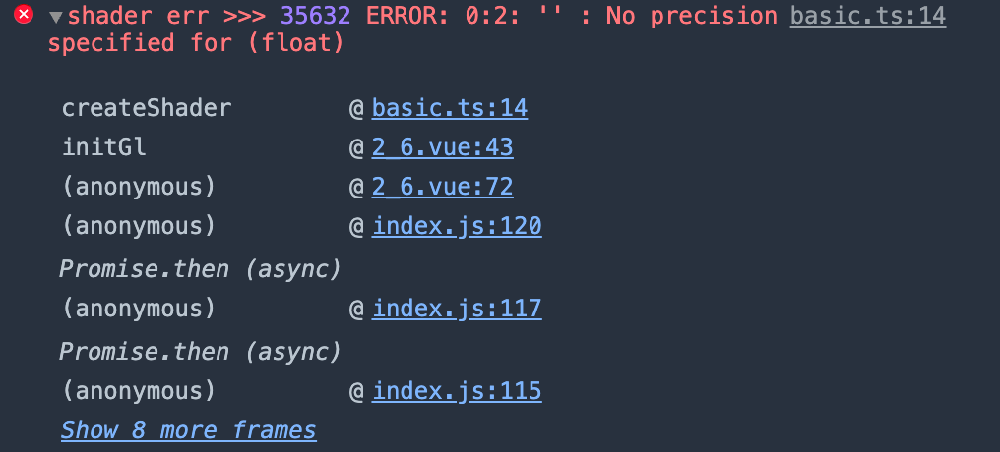

# 4. 绘制动态颜色点

经过上一小节的学习，我们已经掌握了通过 `attribute` 变量传递动态值给**顶点着色器**实现动态点的绘制。但其实我们的点都只有蓝色这一种颜色，那么这一节，我们来实现动态改变点的颜色！

## `uniform` 变量

上节讲到 `attribute` 变量时有提到一下 `uniform` 变量，不过没有展开讲。我们上节讲到 `attribute` 变量时，特别提了它**只能在顶点着色器**中使用，而我们要实现动态颜色绘制的话，我们得对 **片元着色器** 下手，于是乎我们就找来了 `uniform`。

`uniform` 变量可以在顶点着色器和片元着色器中被访问，而我们用其来声明变量的方式跟 `attribute` 是一样的，比如：
```glsl
// 存储限定符 类型 变量名
uniform vec4 u_FragCOlor
```

在着色器中声明变量后，我们就可以改造一下片元着色器的代码了，那首先我们回顾一下之前的代码：
```js
const fragmentCode = `
  void main () {
    // 顶点颜色——蓝色 (R, G, Bule, A)
    gl_FragColor = vec4(0.0, 0.0, 0.9, 1.0);
  }
`
```

可以看到，我们给内置变量 `gl_FragColor` 赋值了一个固定的 `vec4` 类型的颜色值，那么我们现在使用 `uniform` 对其进行改造：
```js
const fragmentCode = `
  precision mediump float;
  uniform vec4 u_FragColor;
  
  void main () {
    gl_FragColor = u_FragColor;
  }
`
```

**注意一点**！上面代码中使用 `precision mediump float;` **精度限定词**来指定变量的范围和精度。不加的话，在创建片元着色器的时候会出现如下错误：



其实就是告诉我们**未为指定浮点精度**，详细大家可以看看这个 [stackoverflow](https://stackoverflow.com/questions/13780609/what-does-precision-mediump-float-mean)。所以新手上路自己敲代码的时候得注意一下这点。

接下来，我们跟 `attribute` 变量赋值一样，先通过 api **获取变量的存储位置**，**再给其设值**就可以了。整体是非常相似的，只是 api 有点区别：

| api                                                                                                                | 参数值                                          | 参数值说明                                                                           | 返回值             |
|--------------------------------------------------------------------------------------------------------------------|-------------------------------------------------|--------------------------------------------------------------------------------------|--------------------|
| [gl.getUniformLocation](https://developer.mozilla.org/en-US/docs/Web/API/WebGLRenderingContext/getUniformLocation) | (program, name)                                 | 1. program：<br> WebGL program 对象<br>2. name：<br>获取的变量名                     | 属性位置的下标数字 |
| [gl.uniform[1234]f[v]](https://developer.mozilla.org/en-US/docs/Web/API/WebGLRenderingContext/uniform)             | (index, v0, v1, v2, v3) <br>以 `uniform4f` 为例 | 1. index：<br>attribute 变量的存储位置<br>2. `v0`-`v3`：<br>代表 rgba 每位值的浮点数 | -                  |

我们根据 `attribute` 变量的用法方式，可以将上一节的 示例程序 进行一个小的改造：
```js
// 获取 unfirom 变量存储位置
const u_FragColor = gl.getUniformLocation(program, 'u_FragColor')
// 通过 随机数 对 rgb 进行赋值，透明度固定为 0.8
gl.uniform4f(u_FragColor, Math.random(), Math.random(), Math.random(), .8)
```

在原本示例程序的基础上加上这几行代码，我们再来看看这个示例程序的运行效果：

:::demo
second/4_1
:::

在示例程序中点击鼠标，可以看到有五颜六色的像素点。这一步，我们成功实现了像素点的随机颜色。那么接下来，我们再认识另外一个变量 `varying`。


## `varying` 变量

`varying` 变量也可以帮助我们实现绘制动态变化的颜色点，它的作用是从顶点着色器向片元着色器传输数据。如果说顶点着色器和片元着色器有 **类型和变量名 都完全相同的 `varying` 变量**，那我们可以把变化的数据传递到顶点着色器，顶点着色器中的**同名同类型 `varying` 变量**会被**传入到片元着色器中**。

这么说可能有点绕，我们通过代码来进一步理解 `varying` 变量。代码中注意变量的命名，按照之前所说的规则 `a_Xxx` 代表 `attribute` 变量、`v_Xxx` 代表 `varying` 变量。

```js
const vertexCode = `
  attribute vec4 a_Position;
  // 定义 a_Color 动态接受值
  attribute vec4 a_Color;
  // 定义 v_Color 接收、传递颜色值（跟片元着色器一致）
  varying vec4 v_Color;

  void main () {
    gl_Position = a_Position;
    gl_PointSize = 24.0;
    v_Color = a_Color;
  }
`

const fragmentCode = `
  precision mediump float;
  // 定义 v_Color，注意类型、变量名跟顶点着色器的一致，用于接收变量
  varying vec4 v_Color;

  void main () {
    gl_FragColor = v_Color;
  }
`
```

上述代码我们可以发现，先通过 `a_Color` 接收 JavaScript 的传值，再将其赋值给**顶点着色器**的 `v_Color` 变量，这时候，片元着色器中的同名同类型 `v_Color` 变量就能动态接收到颜色值了。

这里，再通过一张图来详细了解 `varying` 变量获得值的一个数据流向：


那最后一步，我们当然是还是通过实现一个示例程序来实战一下 `varying` 变量的使用。其实代码并不复杂，我们也是直接对着上一个示例程序进行一定的修改即可。首先我们要使用这一小节提到的着色器代码，然后在 JavaScript 中获取 `a_Color` 并对其传值即可。

:::demo
second/4_2
:::

如上示例程序，效果跟 `uniform` 中的一模一样！但是原理稍有不同而已。建议大家都动手敲一敲代码，便会更深刻的记住到他们的用法。

## `uniform` 、 `varying` 之间的区别

好，那么相信大家看完 `varying` 变量之后就会有一个疑问：`uniform` 、 `varying` 之间有区别吗？什么时候要用哪个变量呢？

有这样的疑问证明你跟我一样是个好奇宝宝，因为到这一章节为止我们还没有讲到"**缓冲区**"的概念，所以并不是很好地阐述他们的区别。我打算通过**举例描述**和**图片**来讲解他们之间的区别，如果还是没太懂也没关系，看完缓冲区之后再回来看这一小节就一定可以理解！

uniform 的英文意思有 "一致的"、"统一的"；而 varying 的英文翻译过来是 "不同的"、"易变的"。其实我们从他们的意思就可以大概知道他们之间的区别，那接下来我们通过一个例子来理解他们的区别。

现在我们绘制点的时候，每次调用**一次** `gl.drawArrays` 来绘制**一个点**，那当我们使用"缓冲区"的时候，我们可以实现**一次** `gl.drawArrays` 绘制**多个点**。

基于此，因为我们可以理解为 `unifrom` 变量是全局的，所以当我们绘制的时候，颜色值只有一个 `gl_Color = u_Color`，如果我们不断给 `u_Color` 赋值，那新的值就会覆盖旧的值，最后绘制的时候就以最后的颜色值为准。

而 `varying` 变量是可变的，我们通过**缓冲区**不断地给顶点着色器中的 `a_Color` 赋值（其实也是给 `v_Color` 赋值了，因为`v_Color = a_Color`），那对应这个点的片元着色器也会接收到当前从顶点着色器中传递下来的 `v_Color` 值。以此就可以在一次的绘制中，多个点绘制不同的颜色。

如果还是有点疑惑我们可以借助下图来帮助理解：


当然，这里并不需要你立马就理解他们之间的区别，我们可以学完缓冲区之后，再回来看这一节，那么你一定会恍然大悟。

## 总结

本文的最后，跟大家一起回顾本文的主要内容：
1. `uniform` 变量可以被顶点、片元着色器共同访问，我们可以理解为一个全局变量。
2. 获取 `uniform` 变量位置再进行赋值操作的流程跟 `attribute` 变量的一致，只是 api 稍有不同。
3. 通过 `varying` 变量可以实现从顶点着色器向片元着色器中传递值，依旧可以实现绘制动态颜色的需求。
4. `uniform` 跟 `varying` 变量的核心区别就是前者是不变的，全局的；后者是可变的，具体表现在由每个顶点着色器传入片元着色器中可以有不同的值。
