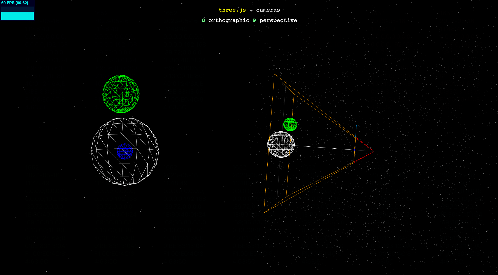
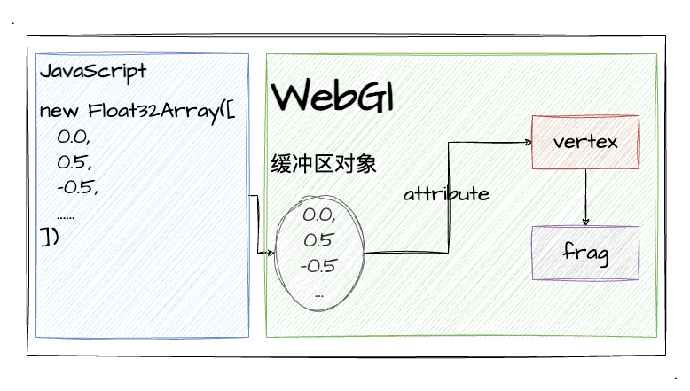
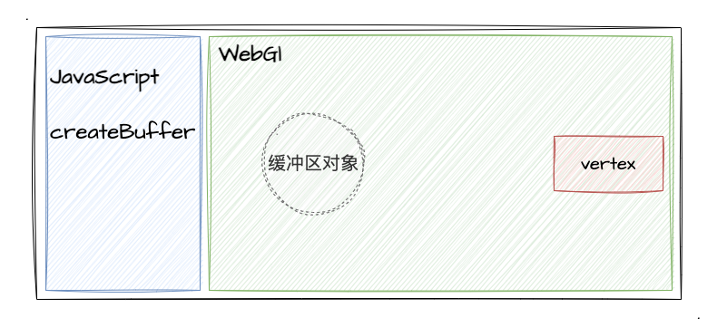
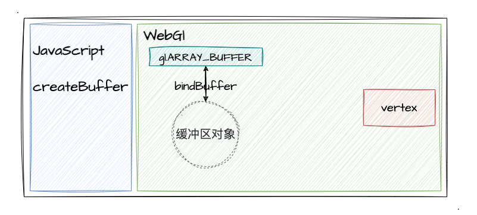
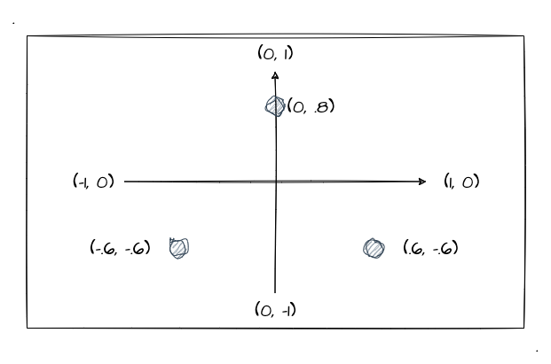
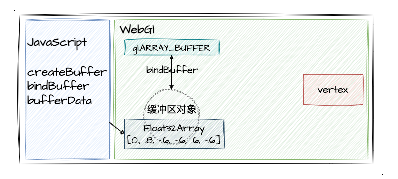
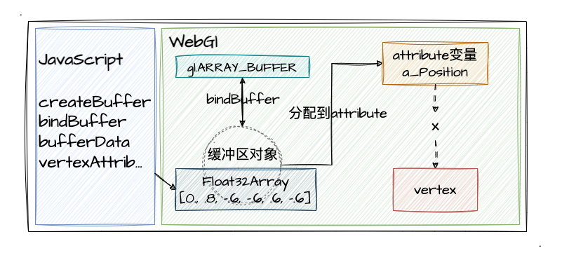
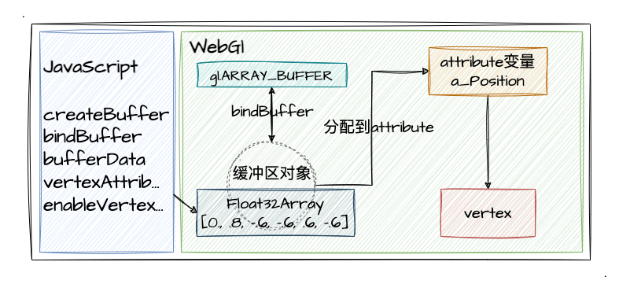

# 5. WebGL绘制线和三角

经过前面几个小节的学习，我们已经学习了点的绘制；一些相关的 GLSL 语法、内置变量和写法，那么从这一节开始，我们将继续深入了解**缓冲区对象**，通过 WebGL 来绘制线和面。

虽说是用 WebGL 绘制线和面，但其实大家应该早就知道了 3D 图形的基本单位是三角形，也就是三角形是所有面、3D 图形的基础。我们可以直接在 [three.js](https://threejs.org/examples/#WebGL_camera) 的这个 demo，很显然立体图形是通过拼合多个三角形构成的，所以说**三角形是 3D 图形的基础**。



## 缓冲区对象

我们想一想，缓冲区对象是什么？为什么需要缓冲区对象？

回顾之前我们绘制点的做法，我们都是通过 `gl.drawArrays()` 来实现单个点的绘制，而且当时我们还简单介绍了一下这个 api 的用法（[第2小节](/content/二、WebGL基础/2.%20WebGL绘制点.html)）。我们在这里简单回顾一下：

| api       | 参数值 | 参数值说明 | 返回值                              |
|--------------|------|-----------------------------------|--|
| [gl.drawArrays](https://developer.mozilla.org/en-US/docs/Web/API/WebGLRenderingContext/drawArrays) | (mode, first, count) | 1. mode：<br>`gl.POINTS` 绘制单个点<br>2. first：<br>指定开始绘制的点<br>3. count：<br>指定绘制多少个点 | - |

可以看到参数值说明，我们之前只了解了其中一个 mode 值——`gl.POINTS`。那其实 mode 还有其他的参数值，比如：
- `gl.LINE_STRIP`
- `gl.LINE_LOOP`
- `gl.TRIANGLES`

等等...我们通过它的英文名称不难发现 points 、line 、triangles 不就是 点、线、三角形吗？没错，其实我们改变 `gl.drawArrays` 这个 api 的 mode 的参数值，WebGL 就帮我们绘制对应的图形。

那么问题来了，之前我们绘制一个点的时候只需要传入一个点的坐标位置给到 `gl_Position` 即可，但是我们现在**绘制线和三角形**，最少一次调用 `gl.drawArrays` 之前都得设置两个以上的顶点坐标值对吧？所以，这个时候我们就需要**缓冲区对象**了。

缓冲区对象可以**一次性传入多个顶点数据**（包括但不限于坐标数据，还可以有颜色和其他的），保存在缓冲区中，后续顶点着色器、片元着色器就可以使用里面的数据。

我们通过下图来大概了解缓冲区的应用过程：
1. js 中定义了 `Float32Array` 类型的数组（我们可以简单理解为普通 js 数组）
2. 将 js 数组传递并存储于缓冲区对象中
3. `gl.drawArrays()` 绘制时，顶点、片元着色器可以通过缓冲区读取多个顶点数据



图画得比较简单，一时没看懂没关系，我们接着往下走，当你使用缓冲区成功绘制出线、三角形的时候再回来看这个图会有更深的理解。

## 使用WebGL缓冲区

缓冲区的使用遵循一个步骤，其中也会涉及到一些新的 api ，我们一步一步来看：
1. 通过 `gl.createBuffer` 创建缓冲区对象
2. 通过 `gl.bindBuffer` 绑定缓冲区对象（无法直接操作缓冲区对象）
3. 通过 `gl.bufferData` 写入缓冲区数据，如上图中的 `Float32Array` 数据
4. 通过 `gl.vertexAttribPointer` 将缓冲区数据分配到 `attribute` 变量
5. 通过 `gl.enableVertexAttribArray` 开启 `attribute` 变量

好像是稍微有那么一点复杂，涉及各种 api 的使用和参数传递，但是其实我们可以在学习之后自行将其进行一定的封装，沉淀为一个工具函数。处于学习阶段的我们需要掌握它，所以还是有必要了解每一个步骤。那接下来，我们一步一步的来展开说说吧！

### 1. 创建缓冲区对象

首先是创建缓冲区对象，我们可以在 [MDN-gl.createBuffer](https://developer.mozilla.org/en-US/docs/Web/API/WebGLRenderingContext/createBuffer) 看看这个 api 的具体用法，这个算是非常简单了，因为我们不需要管任何参数！

```js
// 直接调用创建缓冲区对象
const buffer = gl.createBuffer()
```

当我们执行了这行代码，相当于在 WebGL 中创建了一个缓冲区对象：



顺带提一下，有来就有回，有创建就有删除！我们可以通过 [gl.deleteBuffer](https://developer.mozilla.org/en-US/docs/Web/API/WebGLRenderingContext/deleteBuffer) 来删除对应的缓冲区（了解一下，不属于本节重点）。

### 2. 绑定缓冲区对象

关于这一步，我们可以这样理解：上文有提到一点**不能直接操作缓冲区对象**，所以我们需要把缓冲区对象需要绑定到一个 target 上，然后我们去操作 target。其实可以类比成 es6 的 `Proxy`，将这一步理解为一个代理的概念。

我们可以先通过 [MDN-gl.bindBuffer](https://developer.mozilla.org/en-US/docs/Web/API/WebGLRenderingContext/bindBuffer) 来了解这个 api 的基本用法。

1. 它的第一个参数——`target`。

| target                                                                                                         | 参数值说明                                  |
|----------------------------------------------------------------------------------------------------------------|---------------------------------------------|
| `gl.ARRAY_BUFFER`                                                                                              | 包含顶点属性的 Buffer，如坐标数据、颜色数据 |
| `gl.ELEMENT_ARRAY_BUFFER`                                                                                      | 包含顶点的索引值 Buffer                     |
| [WebGL2相关参数](https://developer.mozilla.org/en-US/docs/Web/API/WebGLRenderingContext/bindBuffer#parameters) | （感兴趣可以去 MDN 里看，本节暂时不涉及）   |

我们可以发现有 target 的类型有很多，本节我们只关注 `gl.ARRAY_BUFFER` 即可。根据 MDN 对他的描述，我们可以知道他是**作为包含顶点属性 Buffer 的一个 target**，又因为我们目前通过 Buffer 存放我们 N 个**顶点的坐标**，所以我们将 Buffer 绑定到它身上。

2. 它的第二个参数——`buffer`

这个就没什么好说的了，他就是我们创建的 Buffer ，也就是上文提到的 `gl.createBuffer()` 的返回值。

相应的代码实现如下：
```js
// 第一个参数 target；第二个参数 buffer
gl.bindBuffer(gl.ARRAY_BUFFER, buffer)
```

那么此时，我们将刚才创建的一个缓冲区对象绑定到了 `gl.ARRAY_BUFFER` 这个 target 上：



### 3. 缓冲区写入数据

老规矩，我们先来看看 [MDN-gl.bufferData](https://developer.mozilla.org/en-US/docs/Web/API/WebGLRenderingContext/bufferData) 的 api 用法：`bufferData(target, srcData, usage)`（看 WebGL1 的即可）。

1. 第一个参数是 target，跟上一小节是一样的（可参考上小节的表格）。还记得我们不能直接操作缓冲区对象吗，所以我们需要通过 target 来给它赋值。
2. 第二个参数是 srcData，我们可以传入一个**类型化数组**，如 `Float32Array`
3. 第三个参数是 usage，这里有几个可选值，我们目前用 `gl.STATIC_DRAW`（数据写入缓冲区一次，但可用于多次绘制） 即可。

有些参数我们暂时用不着的，我也不会都罗列出来，~~反正没用到的我们看了也记不住~~。有需要的自行查 MDN 详细看吧。这里我再提一点就是第二个参数中提到的**类型化数组**。

前端开发中我从没用过除了 Array 外的数组，但为什么 WebGL 这里使用了类型化数组呢？就是为了性能优化。平时我们用的 Array，我们可以往里面放任何类型的数据，如 number、 string、甚至是个对象（树形数组）。但 WebGL 绘制 3D 图像的时候是要处理很多个顶点数据（各种浮点数），所以用类型化数组能让其处理起来更有效率。

那么关于类型化数组，我们依然可以通过 [MDN-typed arrays](https://developer.mozilla.org/en-US/docs/Web/JavaScript/Guide/Typed_arrays) 来了解它，里面不仅有提到 `Float32Array` 、 `Float64Array`...太多了，大家自己去看吧。反正在 WebGL 的开发中，我们应该都要常用这种类型化数组的了。

接下来，我们通过一个图来把我们的坐标数据搞出来。还是老规矩画 2D 的，我们先不管 `Z` 轴：



如上图所示，这三个点就是我们一会要绘制线、三角形用到的点，我们将其**成对**放到类型化数组中，然后再将其写入缓冲区对象中。

```js
// 成对放置顶点数据 [<x, y>, <x, y>]
const vertices = new Float32Array([
  0., .8, -.6, -.6, .6, -.6
])
// 写入缓冲区
gl.bufferData(gl.ARRAY_BUFFER, vertices, gl.STATIC_DRAW)
```

到这一步我们已经将数据写入缓冲区对象中了：



### 4. 分配缓冲区数据给 `attribute`

其实这一步我们并不陌生，回顾 [3. WebGL绘制动态点](/content/二、WebGL基础/3.%20WebGL绘制动态点.html)，之前我们是通过 `gl.vertexAttrib2f` 将数据动态传递到 `a_Position` 中的，然后再赋值给 `gl_Position`。但是这个 api 一次只能分配一个值，我们现在却有一整个数组的顶点数据，所以这里我们需要 `gl.vertexAttribPointer` 这个 api。

老规矩，我们先看 [MDN-gl.vertexAttribPointer](https://developer.mozilla.org/en-US/docs/Web/API/WebGLRenderingContext/vertexAttribPointer) 对其的介绍。其作用是将绑定到 `gl.ARRAY_BUFFER` 的缓冲区对象传递到顶点着色器的 `attribute` 变量。（我理解为将一个指针给到顶点着色器中的 `attribute`）

可能首次看到这个 api 的语法的同学都被吓到了，参数是真的多：
```js
gl.vertexAttribPointer(index, size, type, normalized, stride, offset)
```
不过其实没关系，我们这一节只需要注意前两个参数即可。那我们直接来看看前两个参数：
1. 第一个参数 index 其实就是 "index of the vertex attribute"，所以它就是顶点着色器中的 `attribute` 变量而已
2. 第二个参数 size，指的是每个顶点分配到的**缓冲区数据的个数**，值范围是`[1-4]`（因为我们的顶点变量是 `vec4` 类型的数据）。如果这个值为1，那剩下的数据将会进行一个补 `0`，最后一个值补 `1`。

关于第二个参数直接可能有点晦涩，我们接着往下走，通过本文的示例程序实现来理解会更深刻。直接看代码：

```js
// 第一个参数顶点着色器的 attribute 变量 a_Position，第二个参数值是 2
gl.vertexAttribPointer(a_Position, 2, gl.FLOAT, false, 0, 0)
```

那么此时的整个缓冲区的状态到了下图：



由上图可以看到，我们已经将缓冲区中的值分配到 `attribute` 变量 `a_Position` 中了，但是顶点着色器现在还不能访问到缓冲区中的数据。

### 5. 开启 `attribute` 变量

在前面所有准备工作就绪后，我们最后需要通过 `gl.enableVertexAttribArray` 来开启 `attribute` 变量。

直接看 [MDN-gl.enableVertexAttribArray](https://developer.mozilla.org/en-US/docs/Web/API/WebGLRenderingContext/enableVertexAttribArray) 对其的介绍。

这个 api 的用法相比前面的就非常简单了，接收一个 index 参数，而这个 index 就是顶点着色器中的 `attribute` 变量。

```js
gl.enableVertexAttribArray(a_Position)
```

此时，我们的所有缓冲区创建、激活流程终于走完了，现在的顶点着色器可以使用分配到 `attribute` 中的缓冲区数据了：



到这一步，我们关于缓冲区的所有操作就完成了，接下来就可以开始绘制我们的线段、三角形了！

## 绘制线和三角

因为绘制线、三角，我们不绘制点了，所以可以不用去设置 gl_PointSize 的值了。针对绘制线、面，我们重新搞个最简单的顶点着色器、片元着色器代码块如下：
```js
const vertexCode = `
  // 待分配缓冲区的 attribute 变量
  attribute vec4 a_Position;

  void main () {
    gl_Position = a_Position;
  }
`

const fragmentCode = `
  void main () {
    // 颜色固定为蓝色
    gl_FragColor = vec4(0.0, 0.0, 0.9, 1.0);
  }
`
```

好，那接下来跟之前绘制点的流程一样，我们需要获取绘图上下文、创建着色器、创建 `program` ，最后再进行绘制。那稍微需要我们注意的只有一个，那就是绘制的 api ——`gl.drawArrays`，我们先简单回顾一下：
| api       | 参数值 | 参数值说明 | 返回值                              |
|--------------|------|-----------------------------------|--|
| [gl.drawArrays](https://developer.mozilla.org/en-US/docs/Web/API/WebGLRenderingContext/drawArrays) | (mode, first, count) | 1. mode：<br>`gl.POINTS` 绘制单个点<br>2. first：<br>指定开始绘制的点<br>3. count：<br>指定绘制多少个点 | - |

首先我们关注**第一个参数** `mode`。是的，之前绘制点的时候，我们的 `mode` 传入的是 `gl.POINTS`，因为我们这次需要绘制线和三角，所以我们需要用到其他的 `mode`。我们看 MDN 中的 `mode` 值有很多种，这个我们下一节再进行分析，本节我们使用如下 `mode`：
1. `gl.LINE_STRIP` 绘制到下一个顶点的直线
2. `gl.TRIANGLES` 为三个点绘制一个三角形

关于第二个参数 first，这里我们依旧传 `0` （可理解为数组下标0）即可，表示我们从缓冲区数据的第一个数据开始绘制。

那 **最后一个参数 `count`** 也是需要我们注意的，因为这里我们不传 `1` 了，这里我们需要传 `3`，相当于告诉 WebGL 我们这次绘制**需要绘制三个点**。

```js
// 绘制直线
gl.drawArrays(gl.LINE_STRIP, 0, 3)
// 绘制三角形
gl.drawArrays(gl.TRIANGLES, 0, 3)
```

ok，一切都准备就绪，我们可以直接绘制出线和三角了。接下来，直接通过示例程序来给大家展示一下最后的绘制效果把：

:::demo
second/5_1
:::

## 总结

本文的最后，跟大家一起回顾本文的主要内容：
1. 了解通过**缓冲区对象**可一次性传入多个顶点数据，实现多个点、线段、三角形的绘制
2. 使用缓冲区的五个步骤：创建、绑定、写入数据、赋值 `attribute` 变量、`attribute` 变量
3. 实战绘制线和三角，学习 `gl.drawArrays` 的不同参数用法
