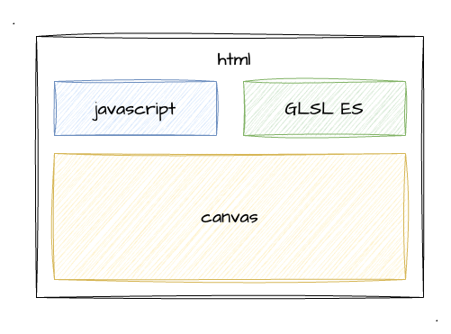
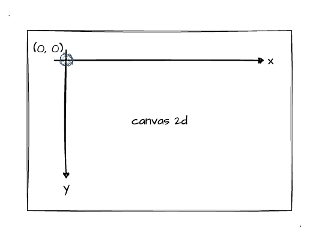
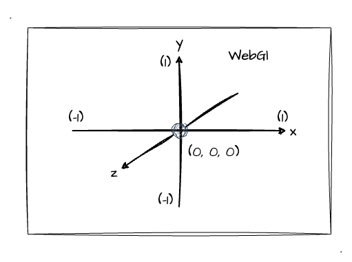
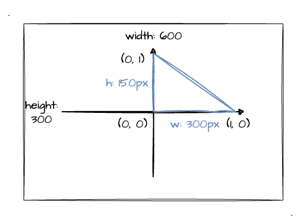

# 1. 初识WebGl

## WebGl 是什么？

[维基百科](https://zh.wikipedia.org/wiki/WebGL)是这样定义 WebGl 的：
> WebGL是一种JavaScript API，用于在不使用插件的情况下在任何兼容的网页浏览器中呈现**交互式2D和3D图形**。WebGL完全集成到浏览器的所有网页标准中，可将影像处理和效果的GPU加速使用方式当做网页Canvas的一部分。WebGL程序由JavaScript编写的句柄和OpenGL Shading Language（GLSL）编写的着色器代码组成，该语言类似于C或C++，并在电脑的图形处理器（GPU）上执行。

也就是说，我们可以通过编写 `JavaScript` + `GLSL` 代码就可以在**浏览器**中实现 2D、3D 效果。直接就能用，无需安装各种环境，搞各种配置！这也是作为前端开发者的好处（~~食物链底端的原因~~）之一！

关于 WebGl 的发展历史，它的前身 OpenGL 的相关内容，感兴趣的同学自行了解，本文将不会展开。回到主题，我们继续聚焦于 WebGl 的零基础上车，go go go！

## WebGl 三要素

首次接触 WebGl，非常有必要了解 WebGl 程序是怎么运行起来的，它的运行机制将贯穿我们整个 WebGl 的学习之旅。

上文引用 维基百科 对 WebGl 的介绍中，好像提到了canvas？还有JavaScript？还有GLSL？那这个几个大佬他们是...

ok，不卖关子了，正是 WebGl 程序运行三要素：
1. HTML5标签 —— `canvas`（超文本标记语言）
2. `JavaScript`（脚本语言）
3. `GLSL ES`（着色器语言）



也就是说，只要具备这三要素，我们就能愉快地在浏览器上实现各种**三维图形**的网页了。

> 当然，刚开始了解到 `GLSL` 这门语言的我们一定倍感陌生，不必紧张，通过逐步深入地学习，我们会慢慢地熟悉它。目前我们简单地将其理解成一门似于C或C++的 "画图语言"即可。

## canvas

相信 `<canvas>` 这个标签大家一定不会陌生，WebGl 正是基于它来绘制 3D 图形的！

我认为最简单理解 `canvas` 的方式就是它的直译——**画布**。它就好比一张白纸，允许我们通过 JavaScript 这支画笔在上面动态的绘制图形。

多说无益，我们直接实战画图来贴切地了解它吧：

:::demo 
basic/1_1
:::

如上示例程序，我们通过简单的几行代码便在 `canvas` 中绘制了一个蓝色的正方形和圆形。总结出三点：
1. 设置 `canvas` 的 `width` 、 `height` 属性**指定绘制的像素区域**
2. 获取 `canvas` 绘图环境：`getContext('2d')`
3. 设置颜色值 `RGBA`；设置绘图坐标、尺寸

观察其中**核心的画图代码**，我们直接调用了 api 并传入参数（坐标、尺寸）。
```js
// 矩形
ctx.fillRect(0, 0, 100, 100)
// 圆形
ctx.arc(240, 50, 50, 0, Math.PI * 360 / 180)
```

ok，这就是简单的 `canvas` 绘制 2d 图形的程序（本文将默认你有一定的 `canvas` 基础，不会对其详细展开）。

接下来，我们将直接使用 WebGl 编写第一个绘图程序以便和 `canvas 2d` 绘图形成一个对比！到此，我们可以先留意一下 `getContext('2d')` 、 `RGBA`（第二节中介绍） 和 `坐标` ，因为这几个在 WebGl 绘图中也会用到，但是稍有不同。

## 第一个 WebGl 程序

如果按照上文 `canvas 2d` 的绘图方式来实现 WebGl 的绘制，你是否会想到如下实现：
```js
// 绘图环境
const gl = canvas.getContext('webgl')
// 调用绘制 api
gl.fillRect(x, y, z, length, width, height)
```

哈哈哈，想法非常好，但是现实很残酷。WebGl 并没有直接提供对应的绘图 api 给我们调用，而是需要我们自己编写一个叫 "**着色器**" 的程序，也就是 GLSL。

这里，我们不抠细节，直接通过一个实战案例来过一遍 WebGl 程序的所有"执行要素"。再次强调！当前你无需仔细关注每一行代码实现，只要关注绘制流程即可。

首先回顾一下 WebGl 程序的三要素！
1. `canvas`
   - 获取 `canvas` 元素
   - 获取绘图环境 `getContext('webgl')`
```js
// html 标签
<canvas id="ice-canvas"></canvas>

// 获取 canvas 
const canvas = document.querySelector('#ice-canvas')
// 获取 WebGl 的绘图上下文（传入的参数是 webgl）
const gl = canvas.getContext('webgl')
```
2. `JavaScript`
   - 创建顶点着色器
   - 创建片元着色器
   - 创建 `GLSL` 着色程序
```js
// 创建顶点着色器
const vertexShader = createShader(gl, gl.VERTEX_SHADER, vertexCode)
// 创建片元着色器
const fragmentShader = createShader(gl, gl.FRAGMENT_SHADER, fragmentCode)
// 创建 GLSL 着色程序
createProgram(gl, vertexShader, fragmentShader)
```
3. `GLSL ES` （着色器）
   - 顶点着色器函数
   - 片元着色器函数
```js
const vertexCode = `
  void main () {
    // 顶点坐标
    gl_Position = vec4(0.0, 0.0, 0.0, 1.0);
    // 顶点渲染像素大小
    gl_PointSize = 24.0;
  }
`
const fragmentCode = `
  void main () {
    // 顶点颜色——蓝色
    gl_FragColor = vec4(0.0, 0.0, 0.9, 1.0);
  }
`
```
没错，你完全可以理解为，我们写 WebGl 程序时，GLSL 就是以字符串的形式"嵌入" JavaScript 中的。这段着色器代码最终将会交由 GPU 去执行。

接下来通过一张图来加深我们对整个执行阶段的理解：


了解了一个基本的 WebGl 程序要素后，我们通过一个实战代码来看到实现的效果（如下示例程序）。
:::demo
basic/1_2
:::

当你点开示例程序源码的时候，你会发现实现一个小小的像素点就需要大量的代码！这是因为 WebGl 是**比较底层**的，它没有像 `canvas 2d` 那样有一些成型的 `api` 来调用，很多地方都需要自己实现。

在接下来的学习过程中，我会将一些比较基础的实现（每次绘制的必要代码）进行封装，比如示例程序中的 `createShader`、`createProgram` 这种常用的函数。这部分将在下一篇文章中进行，我们先接着本文往下走！

初步接触了 WebGl 的程序了，我们用它来绘制了一个二维的像素点。但是大家有没有发现者**像素点所处的位置**跟我们直接用 `canvas 2d` 绘制图形的位置有点小不同呢？用 WebGl 绘制的像素点明显偏向示例程序的中间，我们简单来看看它的坐标数据：
```js
// 顶点着色器
gl_Position = vec4(0.0, 0.0, 0.0, 1.0);
```
通过上述代码，我们看到 `gl_Position` 的值的前三个位置分别都是 `0.0`（暂时不用管第四个），也就是说当前的坐标 `(x, y, z)` 对应的是 `(0, 0, 0)`，也就是坐标轴的原点！

从表象来看，貌似**坐标轴的原点处于画布的中心**？回顾一下 `canvas 2d` 中绘制的第一个矩形，它的 `(x, y)` 值也是设置的 `(0, 0)`，但却是在示例程序的最左边出现的。难道说他们之间的坐标轴是不同的？

## WebGl 坐标

讲到 WebGl 坐标，那一定是要跟 canvas 2d 进行一个对比的。所以这里我们先看看 `canvas 2d` 的坐标系。如图所示，`canvas 2d` 的默认坐标系中，**原点是在左上角**的。



相比之下，WebGl 的坐标系会更加符合我们的认知（如下图所示），大家在学生时代的数学、物理课程中肯定经常使用。



这里我们除了关注 WebGl 的坐标原点外，我们还需要关注它的**坐标范围**。没错，我已经在图中将其表示出来了，它的坐标范围是 `(-1, 1)`，如果说我们习惯使用 `canvas 2d` 直接使用宽高的像素来绘制图像，那在使用 WebGl 的时候我们需要进行一定的转换。

将坐标范围设计成 `(-1, 1)` 有什么好处呢？其相当于一个百分比单位，我们可以不用关注 canvas 的具体宽高了，canvas 的大小伸缩里面的内容都能"等比例"的展示。

光说太晦涩了，我们通过一个示例程序来探究 WebGl 的坐标值吧。

首先看看示例中的相关绘图信息：
1. canvas 宽高分别为 `600 * 300`
2. 在坐标系的第一象限绘制一个直角三角形（直角边占满`x`，`y`轴）
3. 三角形的三个坐标分别为 `(0, 0)`、`(0, 1)`、`(1, 0)`
4. 换算下来，直角边的长度分别为 `300px`、`150px`



那接下来，我们通过 WebGl 程序将其实现：
:::demo
basic/1_3
:::

还是老规矩，这里我们不关注代码实现，只需要看示例程序的运行结果和**关注它的顶点坐标**即可：
```js
// 三个顶点坐标的值：(0, 0)、(0, 1)、(1, 0)
const vertices = new Float32Array([0., 0., 0., 1., 1., 0.])
```
上面代码块中 两两成对 的就是我们这次示例中的三个顶点的坐标了。经过本示例，相信你已经对坐标值范围有一定的理解了，但我们仿佛漏了一点一直没说，那就是 `Z` 轴。

因为 WebGl 是处理三维图形的，所以它使用三维坐标系统，自然会比普通的二维图形多了个 `Z` 轴。默认情况下，WebGl 采用**右手坐标系统**，所以我们就关注右手坐标系统即可，**本书的所有案例都遵循右手坐标系统**。（注意：WebGl本身既不是右手坐标系，也不是左手坐标系，感兴趣的同学可以自行查阅相关资料）

如果使用右手坐标系统的话，WebGl 中的 `Z` 轴是垂直于屏幕，正方向朝外，负方向朝内。 这里借助 [Cocos](https://docs.cocos.com/creator3d/1.1/manual/zh/concepts/scene/coord.html) 的一张图来给大家加深理解：


相信到这一步，你应该深入理解了 WebGl 的坐标系统了！有了它，在后续的 WebGl 图形绘制中你将如鱼得水。

## 总结

本文的最后，跟大家一起回顾本文的主要内容：
1. WebGl 程序运行三要素：`canvas` + `JavaScript` + `GLSL`
2. WebGl 绘制二维图形需要编写 `GLSL` 着色器代码，没有像 `canvas 2d` 直接的 api 调用。
3. WebGl 的坐标轴原点在中心，并且坐标值的范围是 `(-1, 1)`，本文使用 右手坐标系统。
