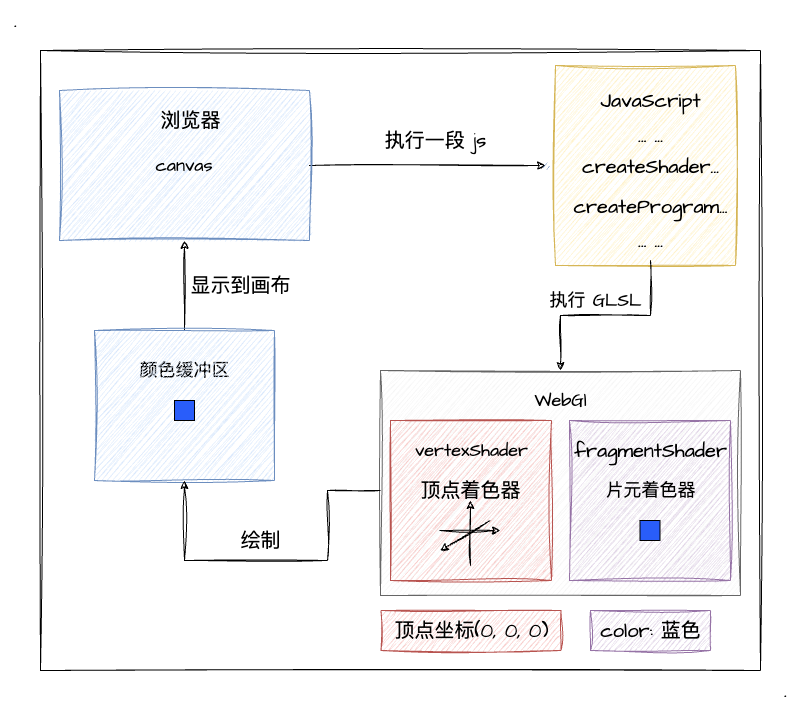
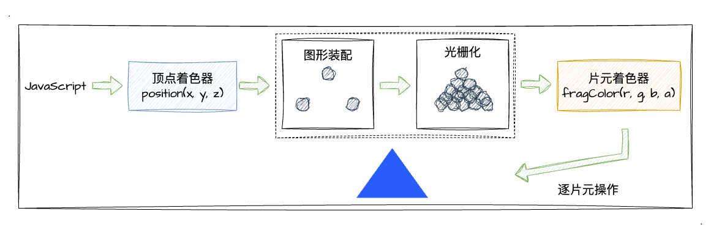
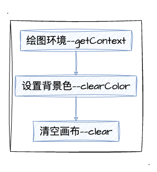

# 2. WebGl绘制点

相信经过上一小节的学习，你已经具备一定理解 WebGl 程序的能力了（三要素、坐标系）。上一小节中，我们已经看到两个 WebGl 绘制的二维图形了，但是并没有展开具体的实现，那这一小节，我们将走进 WebGl 程序的代码实现，深入着色器的实现细节，let's go！

> 关于 `GLSL` 这门语言的学习建议，我认为可以先通过实战中用到的代码一步一步学习（**用到什么学什么**），纸上得来终觉浅，代码一定要自己敲一下，相信经过一定量的代码编写，你便会逐渐熟悉。

## 什么是着色器？

在上一小节中，我们都了解到了 WebGl 程序有着色器这个角色，但我们还没有正式的跟它见面。我们通过下图回顾一下着色器在 WebGl 中的角色：



图中，我们清晰得知 WebGl 需要两种着色器：
1. **顶点着色器**。用来描述顶点属性，比如坐标位置。其中，顶点我们可以理解为他是三维空间中的一个点`(x, y, z)`。
2. **片元着色器**。逐片元处理颜色。片元是 WebGl 的术语，它其实指的是每一个像素，逐片元的意思就是计算出当前绘制的每个像素的颜色值。

当我们把 顶点着色器 和 片元着色器 组合起来使用（**成对使用**），那么就形成了一个 **着色程序**（program）。着色程序将在 GPU 中运行，根据我们设置的一系列状态值，再使用 `gl.drawArrays` 这类着色方法便可以绘制出各种图形。

为了加深大家对两个着色器的理解，我们通过一个 **WebGl 绘制三角形** 的细分图解来看看两个着色器之间是如何工作的：



如上如所示，当我们画一个三角形的时候：
1. 顶点着色器会被**调用三次**完成三个顶点的处理，接着会有一个 "图形装配" 、 "光栅化" 的过程（上图虚线部分，这一块会在后续讲到颜色的时候深入介绍）。其中光栅化的意思就是将装配后的图形转换成每一个像素点。
2. 片元着色器根据 `gl_FragColor` 的配置信息对光栅化后的每一个像素进行着色处理。如果说是蓝色，那么片元着色器就会将每一个像素点的涂成蓝色。

简单来说，其实就是运行三次顶点着色器画了三个顶点，三个顶点进行连接后产生了一个三角形的图形区域，再运行 n 次（n个像素点）片元着色器将每个像素点进行上色，最终就画成了一个蓝色三角形。

其实，我们看到的所有图像，它的背后都是一个一个五颜六色的像素点组合起来的，所以我们可以很好的理解着色器为什么是 **成对工作** 的原理。一方面通过顶点着色器（各种坐标点）就可以把图形的形状描述出来，另一方面再通过片元着色器将整个图形形状内的所有像素点进行上色，最终就可以呈现出一个完整的图像了。

## 编写简单的着色器代码

首先，我们先了解一下本次代码中用到的 GLSL 语言的 **类型** 和 **内置变量**。

### 1. 顶点着色器
用到的**数据类型**

| 类型  | 描述                                                 |
|-------|------------------------------------------------------|
| float | 浮点数                                               |
| vec4  | 由4个浮点数组成的矢量 `(float, float, float, float)` |

顶点着色器的**内置变量**

| 变量名       | 类型  | 描述             | 默认值 |
|--------------|-------|------------------|--------|
| gl_Position  | vec4  | 顶点位置、坐标   | -      |
| gl_PointSize | float | 点的尺寸（像素） | 1.0    |

内置函数

| 函数名 | 描述                                                            |
|--------|-----------------------------------------------------------------|
| vec4   | 用法：`vec4(v0, v1, v2, v3)`。根据 `v0` - `v4` 创建 `vec4` 对象 |                                              

接下来我们深入看看 `gl_Position`，它的类型—— `vec4` 明显比 `gl_PointSize` 的 `float` 要特别。如果说我们需要的顶点坐标数据是 `(x, y, z)`，那么好像也才只有 3 个浮点数，那第 4 个数是什么呢？

通常，我们添加 `1.0` 作为第四个参数 `w`，也就是 `(x, y, z, 1.0)`。由四个数组成的矢量叫做 [齐次坐标](https://zh.wikipedia.org/zh-hans/%E9%BD%90%E6%AC%A1%E5%9D%90%E6%A0%87)，齐次坐标 `(x, y, z, w)` 其实等价于三维坐标 `(x/w, y/w, z/w)` 。抛开这么多复杂的概念，我们当前只需要明确一点：当我们**使用齐次坐标表示三维顶点坐标时，最后一个值传 `1.0` 即可**。           

### 2. 片元着色器

片元着色器的**内置变量**
| 变量名       | 类型 | 描述                              | 默认值 |
|--------------|------|-----------------------------------|--------|
| gl_FragColor | vec4 | 指定片元（像素）颜色，格式为 `RGBA` | -      |

当然，片元着色器中 `gl_FragColor` 的值类型是 `vec4` 就很好理解了，因为其一一对应 `RGBA` 中的每一位。当然，我们在这里还是有一点需要注意的，就是**颜色值范围**。

作为前端开发的我们，对于 `RGBA` 的取值应该更熟悉 `(0, 255)`，其中值越高颜色就越亮。但是 WebGl 继承 OpenGl 的颜色取值，它的范围是 `(0.0, 1.0)`，`RGB` 的值越高颜色越亮，而对于透明度 `A` 来说，值越高就越不透明。

### 3. 着色器代码

在了解了 GLSL 的一些基础知识后，我们再来看上一小节的**顶点着色器**代码：

```js
const vertexCode = `
  void main () {
    // 顶点坐标
    gl_Position = vec4(0.0, 0.0, 0.0, 1.0);
    // 顶点渲染像素大小
    gl_PointSize = 24.0;
  }
`
```
1. 定义了一个 `main` 函数
2. 设置 `gl_Position` 顶点的三维坐标对应为 (0, 0, 0)
3. 设置 `gl_PointSize` 大小为 24 像素
  
**片元着色器**：
```js
const fragmentCode = `
  void main () {
    // 顶点颜色——蓝色 (R, G, Bule, A)
    gl_FragColor = vec4(0.0, 0.0, 0.9, 1.0);
  }
`
```
1. 同样定义了一个 `main` 函数
2. 设置 `gl_FragColor` 的值为蓝色 `(R=0, G=0, B=0.9, A=1)`

这样看下来非常简单有没有！不过你也许发现了它跟 JavaScript 有点不同，GLSL 是一门**强类型语言**，也就是我们需要定义好一个变量的类型。不过相信大家写过 TypeScript 也不会对变量类型感到陌生。所以我们在后续写 GLSL 代码的时候要注意一下变量类型，不能像写 js 一样任性了。

## 清空绘图区

了解完着色器代码后，我们可以进入点的绘制实现了。不过为了先让大家热身热身，了解 WebGl 程序中 JavaScript 要用来做什么，我们先从一个更简单的小案例开始——清空绘图区，也可以理解成是给 canvas 上一层背景色！

我们先来思考一下，如果要让 canvas 有一个背景色，我们需要做什么：



紧接着，我们看看一些需要用到的 api：

| api       | 参数值 | 参数值说明 | 返回值                              |
|--------------|------|-----------------------------------|--|
| [gl.clearColor](https://developer.mozilla.org/en-US/docs/Web/API/WebGLRenderingContext/clearColor) | (r, g, b, a) | <br>r: 红色<br>g: 绿色<br>b: 蓝色<br>a: 透明度<br>注意值的范围是`(0, 1)`，超出将会被截断到 0 或 1 | - |
| [gl.clear](https://developer.mozilla.org/en-US/docs/Web/API/WebGLRenderingContext/clear) | (buffer) | `gl.COLOR_BUFFER_BIT` 颜色缓冲区，默认透明背景<br>`gl.DEPTH_BUFFER_BIT` 深度缓冲区，默认值是 `1.0`<br>`gl.STENCIL_BUFFER_BIT` 模板缓冲区，默认值是 `0`<br> | - |

因为我们清空绘图区其实就是清空颜色缓冲区，所以上述清除接口 `gl.clear` 的参数中，我们仅需要使用 `gl.COLOR_BUFFER_BIT`，其他的可以先不用管。

将上图的步骤转换成核心代码，我们只需要简单的几行就可以实现清空绘图区了：
```js
// 绘图环境
gl = getContext('webgl')
// 传入背景色
gl.clearColor(r, g, b, a)
// 清除颜色缓冲区
gl.clear(gl.COLOR_BUFFER_BIT)
```

这里我们注意一点，`gl.clearColor(r, g, b, a)` 是有**记忆**的，如果我们后续清空绘图区的颜色不需要改变，那我们只需要 **指定一次 `clearColor`** 即可。

我们可以通过以下示例程序亲自感受一下清空绘图区：
:::demo
basic/2_1
:::

## 绘制一个点

到这一阶段，终于所有的准备工作都做完了，我们开始用 WebGl 一步一步的把像素点绘制出来把！

### 1. 绘图环境
老规矩，第一步一定是获取绘图环境上下文的。直接上代码：
```js
const canvas = document.querySelector('#ice-2_2')
const gl = canvas.getContext('webgl')
```

### 2. 创建着色器
我们需要创建顶点、片元两个**着色器**。具体的着色器代码我们复用上文所提到的[着色器代码块](/content/二、WebGl基础/2.WebGl绘制点.html#_3-着色器代码)，他们分别放在 JavaScript 变量 `vertexCode` 和 `fragmentCode` 中。

接下来，我们看看如何创建着色器，首先看**顶点着色器**：
```js
// 创建顶点着色器
const vertexShader = gl.createShader(gl.VERTEX_SHADER)
// 传入我们编写好的顶点着色器字符串代码
gl.shaderSource(vertexShader, vertexCode)
// 编译着色器
gl.compileShader(vertexShader)
```
当然了，**片元着色器**也是按照如此流程进行生成，只是 `createShader` 传的参数不一样：
```js
// 除了一些参数不一样，整体流程均可参考上述顶点着色器
const fragmentShader = gl.createShader(gl.FRAGMENT_SHADER)
// 传入我们编写好的顶点着色器字符串代码
gl.shaderSource(fragmentShader, fragmentCode)
// 编译着色器
gl.compileShader(fragmentShader)
```

### 3. 创建着色器程序

前文介绍着色器的时候有提到，会有一个 着色程序 将 顶点着色器 和 片元着色器 组合起来，成对使用。

```js
// 创建着色器程序
const program = gl.createProgram();
// 为程序添加 顶点着色器
gl.attachShader(program, vertexShader);
// 为程序添加 片元着色器
gl.attachShader(program, fragmentShader);
// 连接 顶点着色器 和 片元着色器，也就是组合成对
gl.linkProgram(program);
// 应用着色器程序，告诉 WebGl 绘制的时候使用这个着色程序
gl.useProgram(program);
```

ok，到这里所有的准备工作就已经完成了，我们仅剩最后一步绘制了。在调用绘制函数之前，我们先来简单回顾一下我们做了什么：
1. 获取绘图上下文 `gl`
2. 编写着色器代码 `vertexCode` 、 `fragmentCode`
3. 创建着色器 `createShader`
4. 创建着色器程序 `createProgram` 连接顶点、片元着色器

接下来，我们仅需要调用一个绘制函数 `gl.drawArrays` 并传入一定参数**即可完成点的绘制**。我们先来看看这个 api 的相关点：
| api       | 参数值 | 参数值说明 | 返回值                              |
|--------------|------|-----------------------------------|--|
| gl.drawArrays | (mode, first, count) | 1. mode：<br>`gl.POINTS` 绘制单个点<br>2. first：<br>指定开始绘制的点<br>3. count：<br>指定绘制多少个点 | - |

当然，`mode` 总共有七种参数值，包括且不限于 `gl.POINTS`、`gl.LINE_STRIP` 等等，这些我们都不着急马上就看，等后面实现其他图形绘制的时候我们会学到的。因为看完不用马上就忘了，所以我们现在只需要关注画点的 `gl.POINTS` 就够了。
```js
gl.drawArrays(gl.POINTS, 0, 1)
```

最后，我们重新看看上一小节中 [第一个 webgl 程序](/content/二、WebGl基础/1.%20初识WebGl.html#第一个-webgl-程序)的无封装代码实现的示例程序：

:::demo
basic/2_2
:::

其实看到这里，有的小伙伴会觉得整个 WebGl 的程序会有点复杂，我们需要调用好多个 `gl.xxx` 的 api 去做很多事情，又是写 GLSL 的、又要创建着色器、编译着色器、创建着色程序......

不知道你们有没有发现，我并没有把所有的 api 都罗列成表格去详细介绍他们的参数、用法。这是因为我认为学习 WebGl 不应该重点背 api 的参数、用法，我们更多的是掌握流程、会用核心的 api 即可。

其实像 创建着色器、创建 program 这种常用的方法函数，我们可以把它封装起来，后面就直接调用了。所以，我也只有在这篇文章中会一行一行的写各种 `gl.xxx`，后面的示例程序都会直接使用封装好的工具函数。

## 总结

本文的最后，跟大家一起回顾本文的主要内容：
1. 了解**顶点、片元着色器**的基本**工作原理**。
2. 了解如何写着色器代码，一些基本的 GLSL 语法、类型、内置变量。
3. 实现了**清空绘图区**，并且知道 `gl.clearColor` 指定颜色会一直复用不用重复设置。
4. **如何绘制一个像素点**：获取绘图环境；编写着色器代码；创建着色器；创建着色程序；使用 `gl.drawArrays` 绘制
