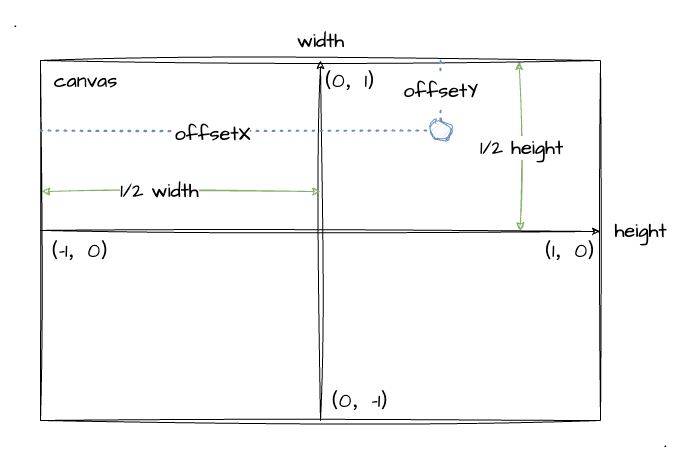

# 3. WebGl绘制动态点

经过上一小节的学习，你已经掌握了如何使用 WebGl 绘制一个像素点。但是你有没有注意到，我们点的坐标是提前写好在顶点着色器中的，是一个静态的数据。那我们如何让顶点的数据变起来呢？

## 动态传递顶点坐标

我们要绘制动态点，那么就要有一个**动态获取顶点坐标的途径**，更直接地说，我们需要进行 JavaScript 和 GLSL 之间的信息交互。那我们首先来回顾一下之前的顶点着色器代码：
```js
const vertexCode = `
  void main () {
    // 顶点坐标
    gl_Position = vec4(0.0, 0.0, 0.0, 1.0);
    // 顶点渲染像素大小
    gl_PointSize = 24.0;
  }
`
```
上面实现顶点着色器代码的时候，我们是直接将内置变量 `gl_Position` 复制给了一个固定的 `vec4` 类型的值。现因我们需要绘制动态顶点，所以我们的赋值应该是需要通过变量来实现，而不是直接使用一个静态的数值。

所以，我们需要这样实现顶点着色器的代码：
```js
const vertexCode = `
  // 定义了一个名为 a_Position，类型为 vec4 的 attribute 变量
  attribute vec4 a_Position;

  void main () {
    // 将变量赋值给顶点坐标
    gl_Position = a_Position;
    // 顶点渲染像素大小
    gl_PointSize = 24.0;
  }
`
```
对比旧的代码块，我们不难发现新增了一个 `a_Position` 的变量，并且将其赋值给了内置变量 `gl_Position`。除此之外，代码中还出现了一个我们没见过的 `attribute` 的字样，那我们先来了解一下它。

## `attribute` 变量
GLSL 中有三种类型的变量，而 `attribute` 就是其中之一。详细介绍如下表：

| 存储限定符 | 描述                                                               |
|------------|--------------------------------------------------------------------|
| attribute  | 在**顶点着色器中使用**                                             |
| varying    | 在顶点、片元着色器中定义，用于**从顶点着色器向片元着色器传递数据** |
| uniform    | 可理解为**全局变量**，在顶点着色器、片元着色器中都能对其访问       |

对于以上这些变量，我们都可以在 **JavaScript 中获取到他们引用地址，并对他们设置值**。于是乎～ JavaScript 到 GLSL 之间的数据传递桥梁就被搭建起来了。

另外提一点命名小规范，我们可以通过 **类型前缀+变量名** 的方式。比如说我们的一个 `attribute` 变量，我们以 `a_Xxx` 的方式来命名。放到案例中既为变量 `a_Position`。

ok，我们回到主题。接下来，我们只需在 JavaScript 中获取这个变量 `a_Position` 再赋值就能实现动态传递顶点坐标了。所以，我们先来看看这两个 api：

| api                                                                                                              | 参数值                                       | 参数值说明                                                          | 返回值             |
|------------------------------------------------------------------------------------------------------------------|----------------------------------------------|---------------------------------------------------------------------|--------------------|
| [gl.getAttribLocation](https://developer.mozilla.org/en-US/docs/Web/API/WebGLRenderingContext/getAttribLocation) | (program, name)                              | 1. program：<br> WebGl program 对象<br>2. name：<br>获取的变量名    | 属性位置的下标数字 |
| [gl.vertexAttrib[1234]f[v]](https://developer.mozilla.org/en-US/docs/Web/API/WebGLRenderingContext/vertexAttrib) | (index, v0, v1) <br>以 `vertexAttrib2f` 为例 | 1. index：<br>attribute 变量的存储位置<br>2. `v0`、`v1`：<br>浮点数 | -                  |

紧接着马上进入实战！我们把上一小节的绘制点**绘制到画布的左上角**，并且在 JavaScript 对其进行赋值。按照上述 api 的用法，我们**先获取变量位置**，再**对变量进行赋值** `(-.9, .7)` 这个靠近左上角的坐标位置。

```js
// 获取 a_Position 的变量地址
const a_Position = gl.getAttribLocation(program, 'a_Position')
// 对 a_Position 变量赋值
gl.vertexAttrib2f(a_Position, -.9, .7)
```

:::demo
basic/2_3
:::

注意观察这个示例程序的实现代码，跟之前比较有明显不同的是我们这次的顶点着色器并没有直接写死静态数据，而是通过 `a_Position` 这个 `attribute` 变量来给他赋值。好，那么在此我们已经掌握了动态传递顶点坐标的实现了，接下来我们再实现一个示例程序——鼠标点击生成点。

## 鼠标交互绘制点

对于熟悉前端开发的同学来说，这个根本不在话下，毕竟这可是饭碗啊。不过为了更熟悉 GLSL 我们还是可以拿这个小需求来练手练手。

简单分析实现方式，其实我只要获取到鼠标点击的坐标值，并将**其成功转换成 WebGl 的坐标值**，再通过上述动态传递顶点坐标的方式实现点的绘制即可。

所以代码实现对我们来说并不难，稍微麻烦一点的就是坐标转换了。于是我们可以借助图来帮助我们理清坐标点的转换关系：



由上图所示，我们可以得出这个数学等式：
- `x`轴坐标：(`offsetX` - `1/2宽度`) / `1/2宽度`
- `y`轴坐标：(`1/2高度` - `offsetY`) / `1/2高度`

因为目前我们要绘制的是二维点，所以我们无需关注 `z` 轴的情况，就让它为 `0` 即可。

接下来，我在示例程序中把功能实现出来（为了方便大家看出画布的边框范围，设置了黑色的背景色）：

:::demo
basic/2_4
:::

我们直接在示例上操作鼠标即可实现在点击的位置绘制出一个蓝色的像素点。

通过这个示例（当打开"每次清空绘图区"时），我们也顺便印证了之前提到的**清空绘图区**的一个细节点，当我们指定了一次背景色后，我们下次调用 `gl.clear(gl.COLOR_BUFFER_BIT)` 清空颜色缓冲区就可以恢复之前的纯色背景了，无需重新指定颜色值了。

既然我放了个 switch开关 在示例中，那当然是可以选择关闭的！当我们关闭 "每次清空绘图区" 功能时，我们在每次点击后**背景直接消失**了。其实这个开关只是控制是否调用 `gl.clear` 而已，具体实现在 `drawFn` 里：
```js
// 当打开 switch 时，每次绘制前都执行一次清空绘图区
isClear.value && gl.clear(gl.COLOR_BUFFER_BIT)
```

其实在绘制点之后，颜色缓冲区就被 WebGl 重置为默认颜色了，也就是 `(0.0, 0.0, 0.0, 0.0)` 透明度为 `0` 的透明背景。所以，如果我们希望保持一个背景色不变，需要在每次绘制前都调用一次 `gl.clear` 。

之所以要把这一点拿出来说，因为我认为大家读到这里的时候一定会有一个疑问，那就是既然我绘制前调用不调用 `gl.clear` 绘制点都会被清空，那我想让**每一次绘制的点都保留下来**要怎么做？我们接着往下看。

## 缓存颜色缓冲区

针对上一小节的问题，我们可以这样想：当我们每次点击重新绘制时**WebGl 会清除掉上次的颜色缓冲区**。因为表象告诉我们，当没打开 "每次清空绘图区" 时，不光是蓝色的像素点没了，更是连黑色的背景色也没了。

其实 WebGl 系统的绘制操作是在颜色缓冲区中进行的，绘制结束后再将颜色缓冲区中的结果显示到屏幕上，然后默认情况下的颜色缓冲区就会被重置，所以内容会丢失。

那我们想缓存每一次的绘制操作，我们应该怎样做呢？关于这一点，我们可以在 [MDN canvas.getContext](https://developer.mozilla.org/en-US/docs/Web/API/HTMLCanvasElement/getContext) 中可以找到答案——`preserveDrawingBuffer`。关于这个配置项，MDN 是这样描述的：
> If the value is true the buffers will not be cleared and will preserve their values until cleared or overwritten by the author.

也就是说，当我们设置 `preserveDrawingBuffer: true` 时，颜色缓冲区就不会被清除，我们马上通过下文的示例程序试试效果:

:::demo
basic/2_5
:::

根据示例程序我们可以知道，当我们不打开 "每次清空绘制区" 功能时，每次点击绘制的点都被缓存下来了，并且背景色也不会变成透明，这样符合我们的预期。而对于代码的实现，我们仅仅通过配置 `preserveDrawingBuffer` 这个属性就可以了：
```js
canvas = document.querySelector('#ice-2_5')
// getContext 中配置 preserveDrawingBuffer 为 true
gl = canvas.getContext('webgl', { preserveDrawingBuffer: true })
```

## 总结

本文的最后，跟大家一起回顾本文的主要内容：
1. 在 GLSL 顶点着色器代码中使用 `attribute`变量 动态接收值
2. JavaScript 通过获取变量位置 `getAttribLocation` 和设置变量值 `vertexAttrib[1234]f[v]` 实现数据传递
3. 通过换算坐标为 `(-1, 1)` 实现了鼠标绘制像素点
4. 通过在 `canvas.getContext` 中配置 `preserveDrawingBuffer` 属性实现颜色缓冲区的缓存
