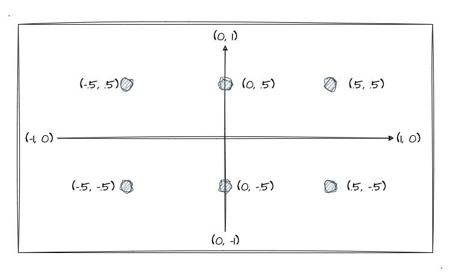
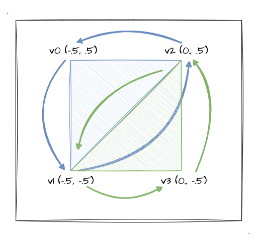

# 6. WebGl绘制基本图形

经过上个小节的学习，我们已经掌握了 WebGl 中如何绘制线和三角，学习了缓冲区对象，那这一节，我们继续深入 WebGl 的绘制能力，掌握如何用 WebGl 绘制出更多的基础图形。

上一节有提到，所有的 3D 图形的基础都是三角形，但是抛开实现复杂的 3D 图形，我们需要知道如何利用 **`gl.drawArrays` 的不同 `mode` 和不同顶点的组合来绘制一些基本图形**，这将会是本文的重点内容。

## 绘制`LINE`的组合图形

说到 LINE 其实我们并不陌生，因为上一小节我们通过 `gl.LINE_STRIP` 绘制了一个小锐角。

:::demo 
basic/5_1
:::

那本节，将在之前的基础上，使用不同的绘制 `mode` 来看看都能实现怎么样的图形效果。

为了更加体现出每个 `mode` 的区别，本文的示例程序采用 6 个顶点来绘制，但是基本代码跟上一小节是一致的，也是会使用到缓冲区，所以对于具体的代码实现本文不会再赘述了，我们更多要关注是每个 `mode` 的绘制效果即可～

还是跟之前一样，我们先通过一幅图来看看本文所用到的顶点和坐标：



本文的示例程序都会以上述的顶点坐标来实现各种基本图形的绘制。
```js
// 本节的顶点坐标
const vertices = new Float32Array([
  -.5, .5, -.5, -.5,
  0., .5, 0., -.5,
  .5, .5, .5, -.5
])
```

关于 LINES 的相关 `mode`，我们先大概了解一下他们的定义：
1. `gl.LINES` 绘制单独的线段
2. `gl.LINE_STRIP` 绘制连接的线段
3. `gl.LINE_LOOP` 绘制连接的线段，最后一个点会和第一个点连接

光说不够直观，我们直接通过示例程序亲自来感受一下他们之间的区别：

:::demo
basic/6_1
:::

根据示例程序，我们可以发现不同的 `mode` 会绘制出不同的线段效果，那以后我们可以灵活的通过组合使用不同的 `mode` 来实现各种线段图形了。不过在这里需要提醒一下大家，我们的**顶点顺序有可能会影响最终的绘制结果**，具体表现在点与点之间的连接顺序不同导致出现不同的图形结果。

比如我修改一下缓冲区数据中点的顺序，将**每一对**点的**前后顺序改变**一下，看看改变点顺序后的示例程序：

:::demo
basic/6_2
:::

可以发现 `LINE_STRIP`、`LINE_LOOP` 绘制出的线段图形跟上一个的示例程序**呈镜面对称关系**，顶点数据除了顺序改变其余都没改变：
```js
const vertices = new Float32Array([
  -.5, -.5, -.5, .5, // 每两个为一组，改变前后两组的顺序
  0., -.5, 0., .5,  // 每两个为一组，改变前后两组的顺序
  .5, -.5, .5, .5 // 每两个为一组，改变前后两组的顺序
])
```

## 绘制`TRIANGLE`的组合图形

学完了线段的基本图形绘制，我们到"面"的基本图形绘制了。与其说是面，不如说是通过三角形组合起来的基本二维图形而已。

我们这一节接着沿用本文的最开始的顶点坐标：
```js
const vertices = new Float32Array([
  -.5, .5, -.5, -.5,
  0., .5, 0., -.5,
  .5, .5, .5, -.5
])
```

好吧，没什么好说的，我们还是一样先了解一下每个 `mode` 的基本概念：
1. `gl.TRIANGLES` 绘制多个**单独**的三角形
2. `gl.TRIANGLE_STRIP` 绘制组合的三角形，**从第二个点开始**，每三个点构成一个三角形。比如下文逆时针绘制的图片 `v1`（就是第二个点） 跟 `v2`、`v3` 就组成一个新的三角形。
3. `gl.TRIANGLE_FAN` 绘制组合的三角形（扇形），**全部三角共用同一个点**，每**下一个点**和**前一个三角形的最后一条边**组成新的三角形

注意一点，三角形的绘制是按照 **逆时针** 的顺序绘制，比如我们看下图：



该图按照本示例的坐标，展示了 `gl.TRIANGLE_STRIP` 时前四个顶点之间的绘制关系，可以发现第一个三角形是 `(v0, v1, v2)` 的顺序绘制的（逆时针），而**第二个三角形则是 `(v2, v1, v3)` 也是一个逆时针顺序**。

光说肯定不直观，我们接着上示例程序给大家体验一下，加深理解（为了让大家看出区别，我这里通过不同的颜色去绘制了三个三角形。如果大家看示例代码的话，不用深究缓冲区的顶点坐标数据，这个涉及到**步进参数**的知识，暂时还没讲到那一块）：

:::demo
basic/6_3
:::