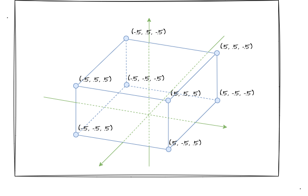

# 1. 打开3D世界的大门

经过前面几章的学习，我们已经基本掌握着色器shader的写法，了解 WebGL 的工作原理、基础图形的绘制、颜色和纹理，还有矩阵、矢量等 WebGL 相关的数学知识，也懂得了如何实战图形的2D变换！

在学习和铺垫了很多枯燥无味的基础知识后，我们终于要开始接触到 WebGL 神奇的另外一面——三维图形了！于是乎，当我们学成以后，那种炫酷网页上面的 3D 效果对于我们来说一定是小菜一碟！

本章呢，我将从第一个 3D 图形的**实战**开始（立方体），并从实战中发现问题，一一解决。相信在实战中通过不断地解决问题来实现我们期望的效果，我们可以**反推**出 3D 图形绘制的关键点和**核心概念**，事不宜迟，我们开始吧！

## 第一个3D图形

简要回顾我们 2D 图形的绘制流程，基本上就是定一个**顶点坐标**，然后配置片元着色器**上色**，最后调用**绘制函数** `gl.drawArrays`。其实，绘制 3D 图形也是遵循以上的步骤的，其中跟 2D 图形相比，最大的不同的就是多了个 `Z` 轴了。

我们之前学习过 2D 的**基础图形绘制**，我们知道 WebGL 的世界中有点、线和三角形，那么通过对他们的组合使用我们便可以绘制各式各样的图形。这样的规律放到 3D 图形中依然适用。

比如本文我们要实战绘制一个**立方体**，我们可以这样来分析：立方体是由六个矩形面（前、后、左、右、上、下）组成的图形。

:::demo
fifth/1_1
:::
