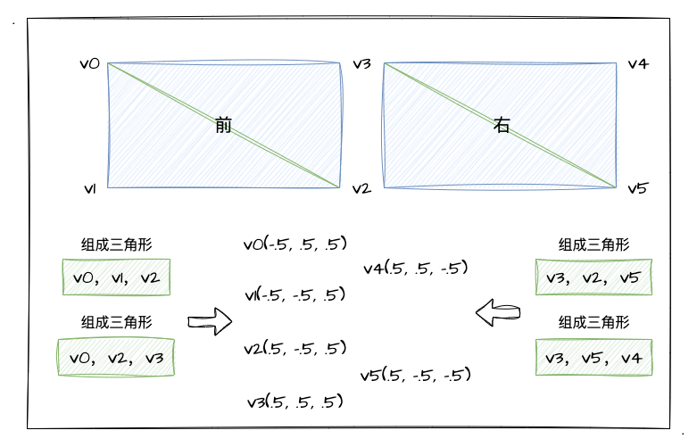

# 1. 打开3D世界的大门

经过前面几章的学习，我们已经基本掌握着色器shader的写法，了解 WebGL 的工作原理、基础图形的绘制、颜色和纹理，还有矩阵、矢量等 WebGL 相关的数学知识，也懂得了如何实战图形的2D变换！

在学习和铺垫了很多枯燥无味的基础知识后，我们终于要开始接触到 WebGL 神奇的另外一面——三维图形了！于是乎，当我们学成以后，那种炫酷网页上面的 3D 效果对于我们来说一定是小菜一碟！

本章呢，我将从第一个 3D 图形的**实战**开始（立方体），并从实战中发现问题，一一解决。相信在实战中通过不断地解决问题来实现我们期望的效果，我们可以**反推**出 3D 图形绘制的关键点和**核心概念**，事不宜迟，我们开始吧！

:::demo
fifth/1_2
:::

## 如何绘制3D图形

简要回顾我们 2D 图形的绘制流程，基本上就是定一个**顶点坐标**，然后配置片元着色器**上色**，最后调用**绘制函数** `gl.drawArrays`。其实，绘制 3D 图形也是遵循以上的步骤的，其中跟 2D 图形相比，最大的不同的就是多了个 `Z` 轴了。

我们之前学习过 2D 的**基础图形绘制**，我们知道 WebGL 的世界中有点、线和三角形，那么通过对他们的组合使用我们便可以绘制各式各样的图形。这样的规律放到 3D 图形中依然适用。

本文我们要实战绘制一个**立方体**，我们可以这样来分析：立方体是由六个矩形面（前、后、左、右、上、下）组成的图形。比如我们看下图：


上图中，我在 WebGL 坐标系中绘制了一个**区间**在 `[-0.5, 0.5]` 的立方体。根据我们之前学习的绘制基础图形，我们依然可以通过 `gl.drawArrays` 配合 `gl.TRIANGLES` 、`gl.TRIANGLE_STRIP` 等 mode 将一个一个矩形面绘制出来，然后连着绘制好6个面即可。

但是我们认真看上图，我们可以发现真正组成立方体的点其实只有 `8` 个！但如果我们通过 `gl.TRIANGLES` 这个 mode 来执行 `gl.drawArrays`时，不难想象我们需要准备 `36` 的顶点坐标！为什么呢？因为一个面需要两个三角形，每个三角形需要 `3` 个点，一个面就需要 `6` 个点...

### 初识`gl.drawElements`

针对上面提到的**点重复**的问题，我们可以通过 **`gl.drawElements`** 来解决。`gl.drawElements` 和 `gl.drawArrays` 类似，都是执行绘制的 `api`，那他们之间有什么不同呢？我们先来看看文档吧：[MDN-gl.drawElements](https://developer.mozilla.org/en-US/docs/Web/API/WebGLRenderingContext/drawElements) 。具体参数用法如下：

| 参数   | 参数值说明                                                                                                                                           |
|--------|------------------------------------------------------------------------------------------------------------------------------------------------------|
| mode   | 绘制方式（跟`drawArrays`一样）。`gl.POINTS`、`gl.LINE_STRIP`、`gl.LINE_LOOP` <br> `gl.LINES`、`gl.TRIANGLE_STRIP`、`gl.TRIANGLE_FAN`、`gl.TRIANGLES` |
| count  | 需要绘制的顶点数(可理解为**索引数组的长度**)                                                                                                         |
| type   | 指定索引值的数据类型                                                                                                                                 |
| offset | 偏移值。在索引数组中开始绘制的位置                                                                                                                   |

可以看出来其实跟 `gl.drawArrays` 是差不多的，就多了个 `type` 的参数值。这个 type 值的是**索引值**的数据类型，那什么是索引值呢？回顾我们之前通过 `gl.drawArrays` 绘制图形时，图形的数据都是放在缓冲区中的，并且**绑定在 `gl.ARRAY_BUFFER` 这个 target 中**（也就是我们通过 `gl.ARRAY_BUFFER` 去操作缓冲区数据）。

那么，如果要使用 `gl.drawElements` 来绘制呢？没错，如你想象的那样，我们需要用到缓冲区中的另外一个 target —— `gl.ELEMENT_ARRAY_BUFFER`（已经忘记的可以回顾一下 [绑定缓冲区对象](/content/二、WebGL基础/5.%20WebGL绘制线和三角.html#_2-绑定缓冲区对象) 章节）。

那么 `gl.ELEMENT_ARRAY_BUFFER` 是**用于元素索引 buffer 的target**（详情可以回顾 [MDN-bindBuffer](https://developer.mozilla.org/en-US/docs/Web/API/WebGLRenderingContext/bindBuffer) 的第一个参数 target），管理着具有**索引结构**的数据。对比 `gl.ARRAY_BUFFER` 来看，`gl.ARRAY_BUFFER` 是关乎存储在缓冲区中的**顶点坐标、纹理坐标、颜色数据**的 target。

简单总结一下，我们可以通过 `gl.drawElements` 来解决**重复定义顶点**的问题！

### 初识索引

既然上面提到我们可以通过 `gl.drawElements` 配合顶点索引值来避免重复定义顶点，那么**索引值**又是怎么定义来的呢？我们接着看下图：


图中我把具体的坐标点替换成了 `v0-v7` 的坐标序号，分了前后左右上下 **`6` 个面**，其中刚好 `8` 个点就表示了所有正方形的顶点了。那我们顺着这 `8` 个点，看看如何通过他们**组装成一个个三角形**，最后再组成**一个个矩型**的吧！

首先我们分析"前"、"右"这两个个面，顶点分别是 `v0-v5`。于是我们可以推导出下图关系：



如上图所示，我们可以推导出"前"、"右"两个面的**顶点索引跟坐标的关系**。也就是说当我们按照`0-5`的顺序存放顶点坐标到缓冲区中，我们的索引值也**按照顶点坐标的顺序来编排**即可**实现对应关系**。

接着看上图我们可以得知，`v0，v1，v2` 、 `v0，v2，v3` 等**顶点的组合**均可实现三角形，我们按照这个顺序，**以面为单位**编排索引值即可。最后我们可以这样来编排我们的顶点数据和索引数据：
```js
const vertices = new Float32Array([
  -.5, .5, .5, // v0
  -.5, -.5, .5, // v1
  .5, -.5, .5, // v2
  .5, .5, .5, // v3
  .5, .5, -.5, // v4
  .5, -.5, -.5, // v5
  ...
])

const indices = new Uint8Array([
  0, 1, 2, 0, 2, 3, // 前
  3, 2, 5, 3, 5, 4, // 右
  ...
])
```

这里需要我们注意一下，我们的**索引值 `indices` 用的是 `Uint8Array` 的类型数组**。如果接着使用之前接触过的 `Float32Array` 数组，会遇到以下的 `warning`且导致绘制失败：
> GL_INVALID_OPERATION: Vertex buffer is not big enough for the draw call

也就是是说按照上述规律，只要我们把所有顶点、索引对应配置好，就完成了立方体的数据准备了。目前处于学习阶段的我们，我建议大家最好都亲自编排一下顶点、索引，以加深对他们的理解。虽然实战场景我们可以靠工具来帮我们解决这个繁琐的步骤～

## 绘制第一个立方体

那么，铺垫了这么久，终于到了令人激动的环节——实战部分。其实我们使用 `gl.drawElements` 来绘制立方体跟之前用 `gl.drawArrays` 真的很相似，我们的顶点坐标、颜色值依然是通过 `ARRAY_BUFFER` 存放到缓冲区中，只是现在多了一种缓冲区数据——**索引值**。

在上一小节已经跟大家一起推导过索引值的由来了，这里就不一一推导了，直接给出我推导后的索引结果：
```js
const indices = new Uint8Array([
  0, 1, 2, 0, 2, 3, // 前
  3, 2, 5, 3, 5, 4, // 右
  4, 5, 6, 4, 6, 7, // 后
  7, 0, 6, 0, 1, 6, // 左
  0, 3, 4, 0, 4, 7, // 上
  1, 2, 5, 1, 5, 6 // 下
])
```

那么现在需要把这段索引值存到 buffer 中，并且 target 为 `gl.ELEMENT_ARRAY_BUFFER`。这个我们按照正常的创建 buffer 流程来走即可：

```js
const indexBuffer = gl.createBuffer()
// 注意绑定的 target 是 gl.ELEMENT_ARRAY_BUFFER
gl.bindBuffer(gl.ELEMENT_ARRAY_BUFFER, indexBuffer)
// 这里传入索引数据
gl.bufferData(gl.ELEMENT_ARRAY_BUFFER, indices, gl.STATIC_DRAW)
```

顶点和颜色值的 buffer 创建我就不赘述了，还不是很清楚的同学可以自己查看示例代码。

当然在绘制前，我们需要**开启隐藏面消除**，通过 `gl.enable` 这个 `api` 来开启。具体的我们后面再细聊，目前先大概知道有这一步即可！

```js
gl.enable(gl.DEPTH_TEST)
```

那当我们准备好 顶点坐标、颜色值、索引值 等数据后，就可以调用 `api` 进行图形绘制了。注意噢，这里我们是使用 `gl.drawElements` 了。

```js
// mode 为 gl.TRIANGLES，总共绘制 8 次
gl.drawElements(gl.TRIANGLES, 8, gl.UNSIGNED_BYTE, 0)
```

话不多说，直接看示例程序的效果如何吧？

:::demo
fifth/1_1
:::

这么乍眼一看！怎么是个矩形？？？还记得小学时候学过一门课叫**画杨桃**不？也就是说杨桃在不同的角度看他是不一样的，也就有可能会出现一个**五角星**的形状！同理，我们正方向看一个立方体的时候，只能看到其中一个面，当然是个矩型了！

那怎么才能**体现出他是个立方体呢**？我们不妨转动它的角度来观察它。示例程序中我已经实现了鼠标交互，当我们点击立方体，再拖动时就会出现**角度变换**，这时候我们就可以看出来是个立方体了！

具体的旋转操作相信我们已经非常熟悉了，其实就是上一章 **矩阵乘矢量** 的相关内容！也就是说这里，我们通过鼠标交互计算出鼠标移动的距离放入到**旋转矩阵**中，再乘上原本的顶点坐标就可以实现立方体的旋转了～所以，这里也再一次印证了**矩阵对于图形学来说是多么重要**了吧！

## 总结

本文我们实战了第一个立方体图形。现在回顾一下核心知识点：
1. 确立**顶点坐标**和**索引值**的关系
2. 实战新`api`——`gl.drawElements` 通过索引值来绘制立方体
3. 绘制立方体时还需要通过 `gl.enable(gl.DEPTH_TEST)` **开启隐藏面消除**
4. 结合上一章学习的**图形变换**，通过旋转立方体来实现不同角度观察立方体

那么本文实战的立方体是一个**渐变色**的立方体，跟我们文章开头的示例正方体还是有点差距的！这里我们很容易想到原因：因为**公用顶点**无可避免的会**发生渐变**。毕竟 `v0` 点出现在**前**，**上**，**左**三个面中，那它将在三个面之间共享一个颜色，没办法做到一个面一个颜色。根据我们之前学习的图形着色的"**内插**"过程，如果两点颜色不相同的话，最终绘制结果是一定会发生渐变的。那么如何绘制 `6` 面个为不同颜色的立方体呢？我们下节揭晓！
