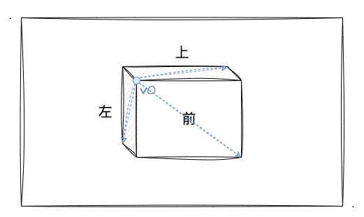
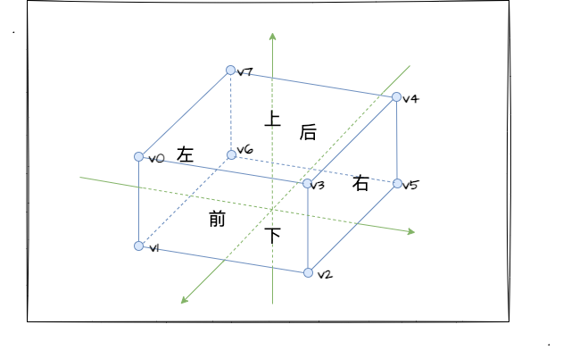
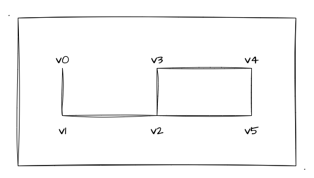
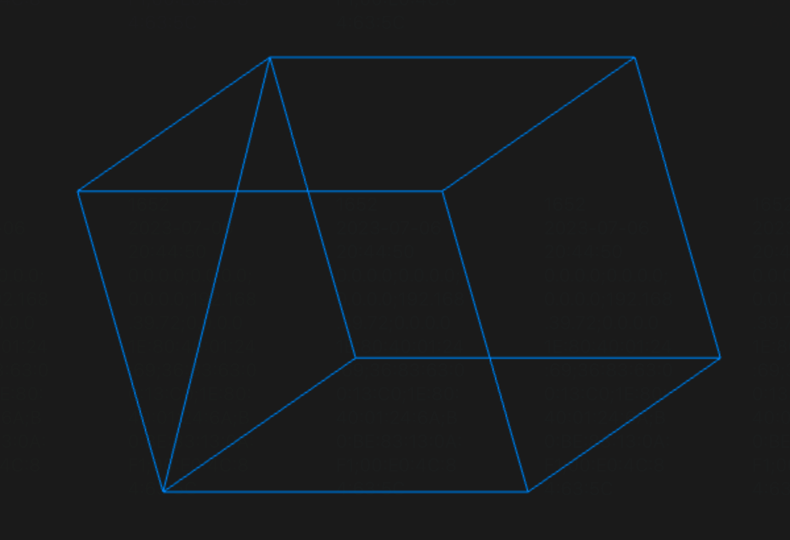

# 2. 深入立方体的绘制

上一小节中，我们实战了一个渐变色立方体的绘制，学习了新的绘制`api`，但是在文章的结尾，我留下了个疑问，就是如何绘制一个6面为不同纯色的立方体呢？那我们这一节将继续探讨关于立方体的绘制！

## 构造立方体数据

那么，上一节的文末我简单分析了一下仅用 `8` 个顶点来绘制立方体无法实现六面为不同纯色立方体的原因。那这里，我们配合图片来加深一下理解：



如图所示，如果仅使用 `8` 个点来绘制立方体的时候，蓝色顶点 `v0` 将被 **前、上、左** 三个面**共享**。也就是说只要当前面的**其他顶点颜色**跟 `v0` 的不同，那一定会被 WebGL 的内插行为致使那个面产生一个颜色渐变的效果。

所以基于以上的分析，我们如果要实现六面为**不同纯色**的立方体，那就不能出现**公共点**。也就是说我们不能出现一个点被多个面公用的情况！因此我们就需要将立方体的每个面**分别绘制**，那么一个面至少得用 `4` 个点来表示，六个面总共需要 `24` 个点～

现在我们来看看上一小节渐变立方体的顶点、颜色和索引值的数据：

```js
// 顶点坐标
const vertices = new Float32Array([
  -.5, .5, .5, // v0
  -.5, -.5, .5, // v1
  .5, -.5, .5, // v2
  .5, .5, .5, // v3
  .5, .5, -.5, // v4
  .5, -.5, -.5, // v5
  -.5, -.5, -.5, // v6
  -.5, .5, -.5,  // v7
])
// 颜色值
const colors = new Float32Array([
  1., 1., 1., 1.,
  1., 1., 0., 1.,
  1., 1., 1., 1.,
  1., 0., 1., 1.,
  0., 1., 1., 1.,
  0., 0., 1., 1.,
  1., 1., 0., 1.,
  0., 1., 1., 1.,
])
// 索引值
indices = new Uint8Array([
  0, 1, 2, 0, 2, 3, // 前
  3, 2, 5, 3, 5, 4, // 右
  4, 5, 6, 4, 6, 7, // 后
  7, 0, 6, 0, 1, 6, // 左
  0, 3, 4, 0, 4, 7, // 上
  1, 2, 5, 1, 5, 6 // 下
])
```

其实列了一大堆数字，我并不是要大家去看这一个个数字，而是需要大家能一一对应得上每**行**数据之间的关系。我们重点看 `vertices` 顶点坐标数组 和 `indices` 索引数组。这里 `vertices` 总共有 `8` 个顶点坐标数据，并且在 `indices` 索引数组中，通过 `0-7` 的索引一一对应上了每个顶点坐标。

大家可能也注意到 `indices` 索引数组中**每行数据**后都有注释表明这一堆索引是组合立方体的哪一个面的。那基于前文的构造六面不同纯色立方体的顶点个数分析，如果我们要用 `24` 个顶点坐标来绘制立方体，显然上述的 `vertices` 顶点坐标数组的**坐标个数是不够的**～

所以，我们需要把 `vertices` 数组的顶点坐标数扩充到 `24` 个，并且我们通过 `0-23` 的索引值，重新组织六个面以形成一个新的立方体。当然啦，别忘了我们还要给每个面设置颜色，所以 `colors` 数组中的颜色 `RGBA` 值也是要匹配对应的 `24` 个。

那么为了让大家更清晰地看出每个独立面的配置，我把顶点坐标、颜色放置在同一个数组中，最后通过**步进参数**、**偏移参数**（忘了的赶紧回顾下[三、1. 绘制彩色的三角](/content/三、WebGL颜色和纹理/1.%20绘制彩色的三角.html#gl-vertexattribpointer的神奇参数)）完成对不同类型的数据进行读取。

```js
const vertices = new Float32Array([
  // 蓝（顶点坐标 + RGBA）
  -0.5, -0.5, 0.5, 0.98, 0.86, 0.078, 1, // 0
  0.5, -0.5, 0.5, 0.98, 0.86, 0.078, 1, // 1
  0.5, 0.5, 0.5, 0.98, 0.86, 0.078, 1, // 2
  -0.5, 0.5, 0.5, 0.98, 0.86, 0.078, 1, // 3
  // 绿（顶点坐标 + RGBA）
  -0.5, 0.5, 0.5, 0.45, 0.82, 0.24, 1, // 4
  -0.5, 0.5, -0.5, 0.45, 0.82, 0.24, 1, // 5
  -0.5, -0.5, -0.5, 0.45, 0.82, 0.24, 1, // 6
  -0.5, -0.5, 0.5, 0.45, 0.82, 0.24, 1, // 7
  // 全部数据大家请移步到示例程序的源码中查看吧
  ...
])
```

如上代码块可以看出，现在我们通过 `4` 个顶点来描述一个面，换句话说就是**索引从 `0-7` 仅仅也就描述了两个面**，所以要描述完整个立方体需要 `0-23` 的索引值。于是我们可以看看现在的**索引值数组**：

```js
// 索引从 0-7 变成 0-23
indices = new Uint8Array([
  0, 1, 2, 0, 2, 3,
  4, 5, 6, 4, 6, 7,
  8, 9, 10, 8, 10, 11,
  12, 13, 14, 12, 14, 15,
  16, 17, 18, 16, 18, 19,
  20, 21, 22, 20, 22, 23
])
```

通过这样的数据配置，我们就能实现一个六面不同纯色的立方体了，也就是我们上一小节开头的立方体。示例程序如下：

:::demo
fifth/1_2
:::

## 实战线立方体

那么，在了解了索引构造立方体后，为了加深大家的印象，我们接着实战一个**由线段组成的立方体**。我们简单回顾之前绘制基础图形时关于线段绘制的 `mode` ：
1. `gl.LINES` 绘制单独的线段
2. `gl.LINE_STRIP` 绘制连接的线段
3. `gl.LINE_LOOP` 绘制连接的线段，最后一个点会和第一个点连接

那么上述的三种 mode，不管我们选用哪一种都可以实现我们的线立方体，只是要组合使用的顶点数据不同而已。那这里，我以 `gl.LINE_STRIP` 为例来实战线立方体。首先我们接着回顾上一节中的一个顶点坐标图：



我们只要按照点和点之间的顺序把顶点连接起来，只要最后形成一个**闭合的图形**，那就大功告成了。比如 `v0、v1、v2、v3` 配合 `v3、v2、v5、v4` 就可以形成如下的图形：



没错，只要我们慢慢推导，最后能形成一个**全闭合的六面体**就行了。这里我再提醒一下，目前处于学习阶段呢，最好自己推导一下索引值加深印象（顺便加深对 `gl.LINE_STRIP` 等 `mode` 的理解），即使以后的实战中我们可以通过工具来生成模型...

再推导索引值顺序的过程中，我们要注意一下面与面连接之间的处理，避免出现斜线连接就行了（比如下图）。最后，虽然有些线段之间是重合的，但是我们看起来是一个完整的线立方体也是无伤大雅的，毕竟没人看得出来哪里重合了～



好了，具体的推导我就不一一讲解了，我们直接看示例程序吧：

:::demo
fifth/2_1
:::

## 深度测试

上一节中，我一笔带过了一个绘制 3D 的小点——深度测试，通过 `gl.enable(gl.DEPTH_TEST)` 这个 api 来 **开启隐藏面消除**。

那怎么为止隐藏面消除呢？

## 总结

本文更多是针对上一节的内容进行一个加深巩固，通过实战六面不同的纯色立方体和线立方体，跟大家一起更加深入地了解了关于 **索引值** 的实战使用，也顺带回顾了"消失"了一段时间的**线段绘制**。
