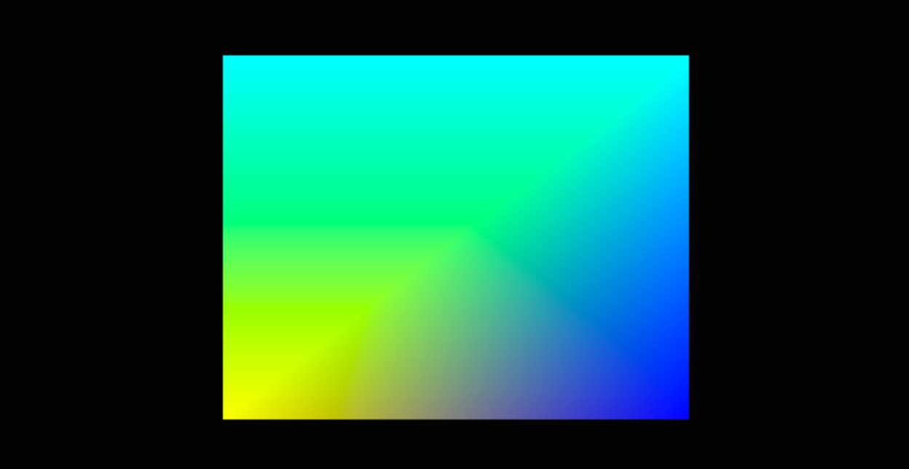
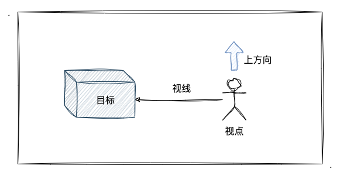
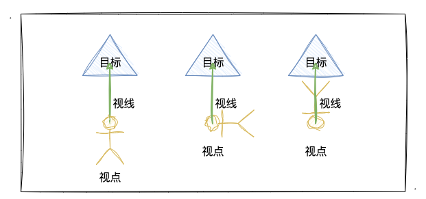
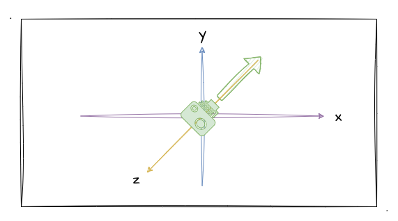
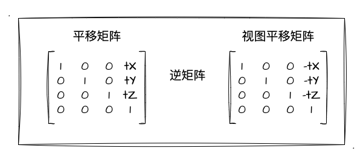
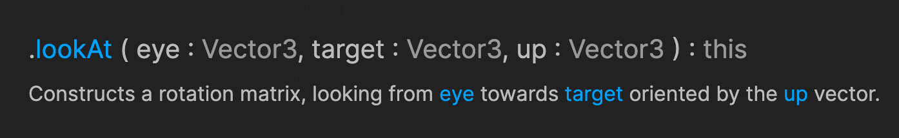

# 3. 奇妙的相机

从上两个小节我们已经掌握了立方体的绘制方式，并且我们可以通过一定的手段（旋转）来观察出我们绘制的是一个立方体而不是普通的矩形。那么在这其中，涉及到了一些 3D 绘制中的概念知识，我们这一节就来学习一下吧！

## 什么是相机？

也许有同学跟我一样，其实没用过 `three.js`，并且也不熟悉这个框架，但是对于其中的一个概念——**相机**，却是早有耳闻。不过即使你曾经不懂得这个概念也没关系，这一小节跟着我的步伐，我们一起来探索一下什么是相机。

还有小伙伴记得如下截图吗？这是第一节绘制渐变立方体时候的示例截图。



没错，仅从这个截图来看，你绝对不可能知道这是一个立方体的示例程序。从这个图中我们可以深刻地体会到，3D 图形虽然跟 2D 图形相比它多了一个**深度**，也就是 `Z` 轴，但是**其最终还是会被绘制到我们的二维屏幕**中。

因为出现了上述的问题，于是乎我就通过一定的手段（比如说旋转），使立方体以"不同地角度"呈现在我们面前。这样一来，我们就可以发现它是一个立方体图形了（如下图所示）。


没错，我们作为观察者，可以通过**不同的角度、距离**去观察我们的立方体图形，这也就是一个**相机**的概念了。相机代表着我们观察一个 3D 图形的观察点，比如说我们是以什么样的角度观看目标的？我们是在多远的位置观看目标的？

所以我觉得，用相机来描述 3D 图形的**观察者视觉**是非常形象、生动的。好比我们平时生活中，从不同的角度、距离去拍摄一些 3D 的物体，都会得到不太一样的照片效果～现实中负责拍照物体的我们，完全可以类比成在 3D 图形世界中的观察者，也就是相机了！

## 了解视图矩阵

上一小节中我们了解了相机的概念，那这一小节开始，我们深入研究下如何描述相机的观察方向，或者说要在三维场景中明确我们如何观察一个物体，需要**具备什么样的条件**。并且当我们拥有了观察物体的所有条件后，怎么在 WebGL 中将其表现出来。

要确定出相机和观察目标之间的关系，这里我们要引入三个概念：
1. **视点**。观察点，也可以理解为三位坐标中的相机位置，是**视线的起点**。
2. 观察**目标点**。被观察的目标点，视线将穿过目标点且继续延伸。
3. **上方向**。图形绘制到屏幕时向上的方向，将配合视点、目标点固定图形的显示方位。



他们之间的关系如上图所示。那么**视点**和**目标点**在理解层面应该是没什么异议的，但是对于**上方向**可能会有同学不解。对于上方向的理解，我再画一张图出来大家就好理解了：



如上图所示，即使我们明确了**视点**和**目标点**，并且能连线出**视线**，但我们正着看、转着看、还是倒着看呢？所以，仅仅确定了视点和目标点，仅能敲定出视线，具体的观察角度，还需要有**上方向**来帮我们确认。

一句话总结就是：要确定最终图形绘制到屏幕上的样子，**视点、目标点、上方向三者缺一不可**。

在了解完相机的观察方向相关概念后，我们应该如何把相机的概念跟我们的代码结合起来呢？答案就是本小节的主题——**视图矩阵**。视图矩阵可以用来表示相机在场景中的状态，有视点、观察目标、上方向，换句话说，视图矩阵要确定最终图形绘制到屏幕上的样子。

> 在介绍**视图矩阵**之前，我还想带着大家先回忆一下之前的平移、旋转等矩阵。之前我将数学公式代入矩阵乘矢量的算式中，逐步推导出相应矩阵。并在后续的实战中，我借助**矩阵的库**`Matrix4`来创建、运算矩阵。所以再次接触到新的矩阵时，我们依然按照以往的知识和经验来学习。

回到主题，其实**视图矩阵其实也有分平移、旋转、缩放**这几种，那他跟我们之前学过的这些变换矩阵有什么区别呢？我们可以从默认的视图矩阵入手。默认的视图矩阵应该是位于**原点**位置，面向屏幕朝 `Z` 轴的负方向，对应的坐标系关系如下图（绿色代表相机，正对屏幕朝内）：



如图所示，现在的相机基于坐标轴原点，并且我们可以想象我们观察的目标点在 `(0, 0, -1)`。如果此时我们想旋转地观察目标，应该怎么做？按照之前的惯例，我们会用目标点**乘上一个旋转矩阵**来**转动目标**。那如果我不转动目标，我们转动相机呢？

没错，就如你想的那样，当目标点相对静止的时候，我们**转动相机**依然可以做到旋转地观察目标（这里就是敌不动我就动）。但是这里我们要注意一个点，那就是我们改变相机的位置观测图形会跟直接变换图形这种方式产生一个**反方向**的效果。拿比较好观察的平移矩阵来做例子，直接变换图形时候的平移矩阵和变换相机位置的**视图平移矩阵**其实是**逆矩阵关系**。



当然，我们拥有了 视点、观察目标点、上方向 等要素条件，完全可以根据他们的数据信息构造出一个**既有平移又有旋转**的**视图矩阵**。但关于这个视图矩阵的推导，我打算放到下一节中来讲，不然放在一起内容就太多了。因此这一节主要是让大家知道、了解视图矩阵的存在意义和作用。


## 用相机观察图形

在学习完相机的基础概念、视图矩阵后，紧接着进入实战环节。这次，我们通过**旋转视图矩阵**来观察绘制在 WebGL 中的图形。当然，在实战开始前当然还是去看看 `three.js` 的 `Matrix4` 这个库有没有提供相关的 `api`！

毫无意外，我们在其中找到了 [lookAt](https://threejs.org/docs/index.html#api/en/math/Matrix4.lookAt) 方法（详细可以点进去看看），那么这个 api 是用来构造**旋转视图矩阵**的。其用法如下：



因此，创建这个旋转视图矩阵仅需要我们传入 视点、观察目标点、上方向 三个**矢量**坐标就可以了。于是我分别创建了三个矢量如下（位于坐标原点，看向屏幕内）：

```js
const camera = new Vector3(0, 0, 0)
const target = new Vector3(0, 0, -1)
const up = new Vector3(0, 1, 0)
```

接下来，我们仅需用把这三个矢量丢进去 `Matrix4` 中的 `lookAt` 方法里面就可以创建出视图矩阵了。在 JavaScript 端处理完矩阵后，就要到顶点着色器了。此时，已经得到视图矩阵的我们，是不是又到我们熟悉的矩阵乘矢量了呢？

没错，其实顶点着色器这一步我们依然不需要有任何的修改，因为它依然可以表示成 `gl_Position = 矩阵 x 矢量` 的方式，只是此时的矩阵不再是旋转矩阵、模型矩阵，而是视图矩阵而已。

所以这里，顶点着色器的实现仅仅对命名做了修改：

```C
// 这里矩阵命名为视图矩阵
gl_Position = u_ViewMatrix * a_Position;
```

最后，我沿用了第二节六面纯色立方体的 demo 来改造，通过**鼠标操作改变相机的位置**来观察立方体。示例程序如下：

:::demo
fifth/3_1
:::

注意！！！这个示例程序是**移动相机的位置**，立方体是静止的。所以操作示例程序时大家可以发现，立方体的变换方向跟相机位置的变换方向是一个**反方向**（比如相机向右移动，立方体向左旋转）！这一点，很好的印证了上一小节提到过的 “我们改变相机的位置观测图形会跟直接变换图形这种方式产生一个**反方向**的效果” 这句话了。

其实在操作相机观察立方体变换的时候，有没有感觉立方体就像是在做旋转变换一样？有这个感觉就对了。基于这一点我们可以得出一个结论：**其实我们移动相机来观察立方体时看到的变换效果，跟我们固定相机观察立方体的旋转、平移的变换效果是等价的**。这句话读起来虽然很绕，但是相信学到这里的你已经能自己 get 到这个等价关系了。

## 总结
本文的最后，跟大家一起回顾本文的主要内容：
1. 相机的概念。通过相机，描述三维世界中观察者的信息。
2. 视点、观察目标点、上方向三者共同决定图形最终如何渲染到屏幕上。
3. 视图矩阵。是涵盖了视点、目标点、上方向三个矢量信息的矩阵。
4. 用相机观察图形跟直接对图形做变换操作其实是等价的。
