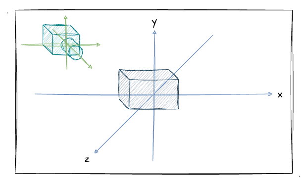
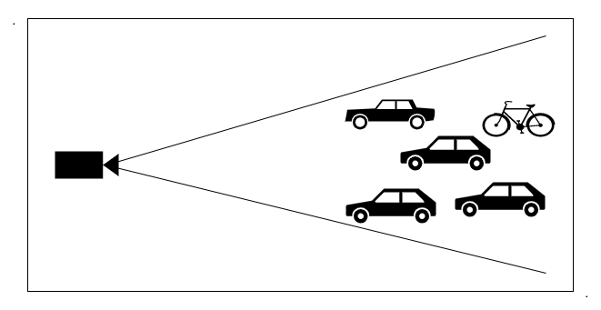
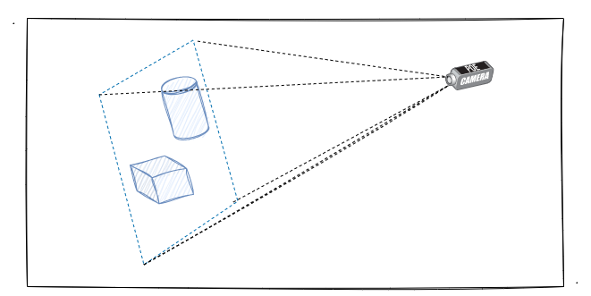
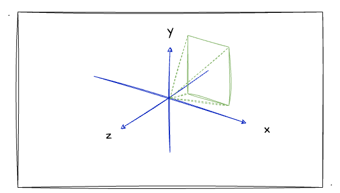
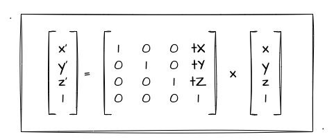
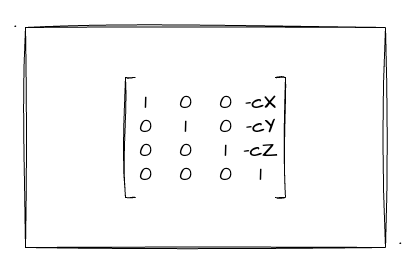

# 4. 进阶——推导视图矩阵

上一节我们初步了解了相机和视图矩阵，并且通过 `three.js` 的 `lookAt` 方法实战感受了通过相机观测图形的效果，get 到了变换相机位置观测图形和变换图形自身是一个反方向但变换是等价的效果。那么这一节，我跟大家一起来推导一下视图矩阵，以加深对相机这个概念的理解！

## 如何理解视图矩阵？

上一节在介绍相机的时候，我实战了一个示例程序，效果是当我们改变相机方向时，立方体是向相机的反方向旋转的。因此我们得出了移动相机观察立方体其实是移动立方体的**等价逆变换**。

相信大家一定知道，相机可以实现观察物体的关键便是**视图矩阵**。但上一节内容中，关于这个矩阵是长什么样，它的意义是什么等疑问都没有深入展开，而是直接套用了 `three.js` 矩阵中的 `lookAt` 方法来实现了相机效果而已。

我们其实可以想象成在世界坐标系中，既有我们的场景，也有一个相机。而这个相机，他有坐标点、视线、和上方向，所以我们可以理解成相机存在于世界坐标系中，并且**它有一个属于自己的坐标系（相机坐标系）**。

如上图所示，相机（绿色坐标轴）位于世界坐标系（蓝色坐标轴）的一个位置观察立方体，并且它也有一个自身的坐标系。而相机的坐标系，完全可以通过我们上一节经常提的 **视点、观察点、上方向** 来求出。

或者我们可以这么理解，当我们没有设置相机时，相机就是默认在世界坐标系的原点、上方向为 `Y` 轴，视线沿着屏幕朝内（`Z`的负半轴）。

既然相机有一个自身的坐标系，这也就意味着当我们把**世界坐标系中的场景放到对应的相机坐标系**中，便是最终绘制在屏幕上图像的最终形态了。而这一变换坐标系的过程，便是依靠 **顶点坐标 左乘 视图矩阵** 的数学算式而实现的。这一点还是比较好理解的，毕竟这跟我们之前学习的**平移矩阵、旋转矩阵**的图形变换，再到后来复合变换所用的**模型矩阵**是一个异曲同工的图形变换。因此，这也再一次说明了矩阵对于 WebGL 真的非常重要。

当然，相机跟场景还有一个特性那就是**当相机、场景同时做等价变换时，相机中所看到的图像都是一样的**。比如下图，我用相机水平方向拍摄一个圆柱和一个正方体：

现在我要**相机跟场景中的物体**一起做绕 `Z` 轴做小幅度的逆时针旋转：

由这两图这可以看出，场景、相机同时进行了旋转变换，相机中拍摄出来的图像是不会变的。

简单总结：其实视图矩阵的作用就是把**世界坐标系跟相机坐标系做一个转换**，把世界坐标系场景放到相机里。 当然 WebGL 中的矩阵并不仅仅有上述的模型矩阵、视图矩阵，还有后续我们要学到的投影矩阵，他们统称为 MVP 矩阵，相信经过后续的学习，我们会逐步揭开图形成像的各种秘密。

## 推导视图矩阵

根据前文的讲述我们知道，视图矩阵会把原本世界中的场景放到相机里。因此，我们就要基于这一点，**推导出基于世界坐标系的相机坐标系**。结合上一节学习的内容，我们可以知道相机会有 视点、观察目标点、上方向 三种数据信息，于是我们可以通过**对这些相机的信息**来推导出我们的视图矩阵。

视图矩阵推导的两个要点：
1. 使相机坐标系的原点跟世界坐标系的原点**重合**
2. 将世界坐标系旋转成相机坐标系，也就是 `Y` 轴跟相机的上方向**重合**，看向 `Z` 轴的负方向

当经过上述的变换操作后，下图将会是相机最终的变换结果（相机往`Z`轴负方向看去）：

根据我们已学过的知识，上述几点变换的最终结果无非就是对相机进行了 **平移矩阵 x 旋转矩阵** 的复合变换。并且通过上图我们可以清晰地看出来，其实相机坐标系跟世界坐标系最大的区别就是`Z`轴是朝屏幕内的。

首先我们从**平移**入手。回顾之前我们推导出来的平移矩阵（矩阵最右边一列）：

现在我们假设**相机坐标**为 `(cX, cY, cZ)`，为了使其跟世界坐标系原点 `(0, 0, 0)` 重合，那直接跟自身坐标相减即可（将相机平移到世界坐标原点），也就是 `(-cX, -cY, -cZ)`。所以我们直接把后者代入平移矩阵即可得到如下矩阵：

将相机平移到原点后，紧接着我们要把**视点到观察点的视线方向**变换为指向 `Z` 轴的负半轴 `(0, 0, -1)` 位置；并且还要把**上方向转动到跟 `Y` 轴重合**，也就是坐标 `(0, 1, 0)`。

:::demo
fifth/3_2
:::