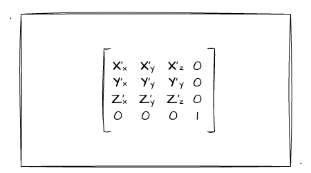
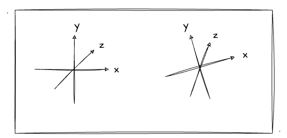
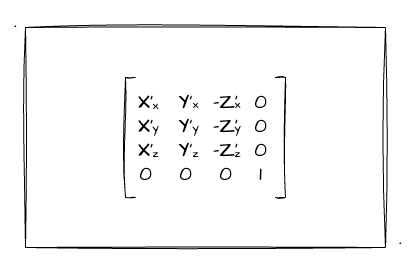
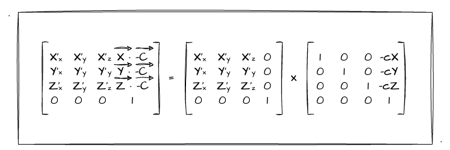
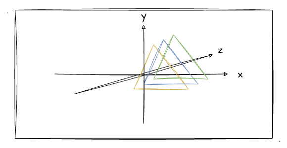

# 5. 实战相机渲染引擎

上一节我们深入地了解并推导了视图矩阵，完全的数学推导多少有点枯燥无味了，所以我们想办法让其炫酷起来。推导得这么辛苦，当然是得实战体验一波效果啦！所以本节将通过 javaScript 实现视图矩阵，实战一个简易的相机渲染引擎！

既然要自己实现一个相机渲染引擎，那肯定有一些需求点的。所以在实战内容开始之前呢，先大概讲讲本次实战要实现的功能：
1. 同时平移视点、观察点，实现图形的**反方向平移效果**
2. 仅改变视点，实现**不同角度**地观察图形

那么，让我们带着上述的两个需求点开始本文的实战内容吧！（建议看过前文[视图矩阵推导](/content/五、WebGL三维世界/4.%20进阶——推导视图矩阵.html)的再来看本文会更容易理解～）

## 用`js`实现视图矩阵

我们要想实现一个简易的相机渲染引擎，毫无疑问首先要用 `js` 实现一个**视图矩阵**（而我们的定点着色器核心代码依然是一个坐标点左乘视图矩阵而已）。也就是说，当我们给相机传入不同的 视点、观察点、上方向 数据时，浏览器最终会渲染出不一样的图像呈现在我们面前。


### 1. 创建`ViewMatrix`类

首先我们创建一个视图矩阵的 `class`，并且初始化一个单位矩阵在它的 `elements` 属性中：

```js
class ViewMatrix {
  elements: Float32Array

  constructor() {
    this.elements = new Float32Array([
      1, 0, 0, 0,
      0, 1, 0, 0,
      0, 0, 1, 0,
      0, 0, 0, 1
    ])
  }
}
```

在上述的基础上，我们给 ViewMatrix 添加一个 `lookAt` 的方法。简单处理，这个方法接收 `9` 个参数，包含 视点、观察点、上方向 三种数据的 `x、y、z` 值。直接通过 ts 的定义来看看吧： 

```ts
// c...代表相机；t...代表观察点；u...代表上方向
interface TLookAt {
  (cX: number, cY: number, cZ: number, tX: number, tY: number, tZ: number, uX: number, uY: number, uZ: number): void
}
```

ok，`lookAt` 方法中，我们就要按照上一节对视图矩阵中 `x、y、z` 轴的推导转化为 js 中的实现。最终就要实现当给其传入不同的 视点、观察点、上方向 数据后可以得到对应的视图矩阵！我们马不停蹄开始旋转矩阵的实现！

### 2. `lookAt`中的旋转矩阵

这里，我们简单回顾一下上一节我们推导出来的**旋转矩阵**：



因此，我们需要做的就是把矩阵中 `X'、Y'、Z'` 的值都求出来就行了。这一点对我们来说并不困难，因为上一节我们对每一个值进行了推导，这里更多的是用 js 套用数学公式来实现而已。

但这里我们要注意一点：**WebGL中的矩阵是列主序**。这一点之前在[矩阵实战图形变换](/content/四、WebGL二维动画/3.%20用矩阵实战图形变换.html#矩阵实战平移)中有提到。因此，在我们实战过程中，我们**要把数学推导出的行主序的矩阵做一个转置**，以最终传递到 WebGL 中使用。

首先，我们来实现旋转矩阵的`Z`轴求解。上一节讲过，求两点之间形成的向量，用后者减前者即可（忘记的回顾一下前文）。所以，我们只要把 观察点坐标 减去 视点坐标，求得的就是相机的`Z`轴。将实现放到代码里，其实就是：
```js
// t...代表观察点；c...代表相机；
zX = tX - cX
zY = tY - cY
zZ = tZ - cZ
// 以下是归一化实现
zToNormal = 1 / Math.sqrt(zX * zX + zY * zY + zZ * zZ)
zX *= zToNormal
zY *= zToNormal
zZ *= zToNormal
```

代码中，使用观察点减视点坐标求得 `zX、zY、zZ` 坐标后，还做了**归一化**处理。

那么归一化是什么？为什么要把向量归一化处理呢？笔者是这么理解的：归一化可以将矢量等比例变化，从而转换为**单位矢量**。因为我们这里要求出的**相机的坐标系**，所以我们仅需要关注矢量方向，不用关注模长。（感兴趣的朋友自行查阅相关资料吧）

概念性的东西，我们知道就行了，更关键的是我们需要知道怎么用。所以接下来一起看看归一化用公式如何表达。当前，把`|Z|`记作为`Z`的模长（**模长为`Z`轴上每个分量的平方相加后再开方**）；此时把`Z`轴归一化即为：
```
Z' = Z / |Z|
```
我在代码中把他们写成 `zX *= zToNormal` （乘的是一个倒数），其实就是相除法。至于为什么这么写，是有关矢量除法的问题（详细的我也没太了解清楚，求个数学大牛来教学教学）。anyway吧，暂时可以不用在数学上研究这么深入，懂得运用就好。

求得`Z`轴后，现在我们还有上方向（`up`坐标值）的数据，于是我们就可以通过**矢量叉乘**的方式来求出相机的`X`轴了！ 那如何求三维矢量的叉积？我们回顾之前看过的[维基百科](https://zh.wikipedia.org/zh-hans/%E5%8F%89%E7%A7%AF)对**矢量叉乘**的说明：


我们依着上图的计算公式，把`u、v`的值替换成我们的 Z轴 和 上方向 就行了。比如说上图的`u2`换成`zY`，`v3`换成`uZ`以此类推...好了，话不多说，直接上代码：

```js
xX = zY * uZ - zZ * uY
xY = zZ * uX - zX * uZ
xZ = zX * uY - zY * uX
// 进行归一化处理
xToNormal = 1/ Math.sqrt(xX * xX + xY * xY + xZ * xZ)
xX *= xToNormal
xY *= xToNormal
xZ *= xToNormal
```

如上代码块所示，我们通过叉乘就求出了相机的`X`轴，现在就剩下相机的`Y`轴了。相机的`Y`轴不就是我们传入的上方向吗？那是不是直接用上方向来充当相机的Y轴就行了呢？

答案是**不行**。不得不说，其实我一开始也是这么认为的，但其实不然。我们通过代入一个例子来理解这一点，现比如相机坐标系就是世界坐标系，上方向为`Y`轴，垂直于`X、Z`形成的平面。此时如果我们调整了视点、观察点的位置，导致整个世界坐标系发生了旋转，那Y轴是不是也要跟着转呢？



如上图，当调整了视点、观察点数据后（坐标系发生旋转），可能会导致上方向不再是`(0,1,0)`了，但它依然是保持着垂直于`X、Z`平面！说到这里，已经第二次提到`Y`轴垂直于一个面了，所以大家应该也能码上想到，求出相机的`Y`轴也就是将`Z`轴和`X`轴做叉乘法即可！我们直接看结果：

```js
yX = zZ * xY - zY * xZ
yY = zX * xZ - zZ * xX
yZ = zY * xX - zX * xY
```

如上所示，我们通过`X、Z`轴的叉乘求出`Y`轴。可能有同学发现了这里并没有做归一化处理，因为用于叉成的坐标轴已经是归一化后的坐标值了～

目前，我们已经完成了旋转矩阵 `X、Y、Z` 轴三轴的计算，接下来我们就把结果放到矩阵中吧。应该还记得我们初始化时候定了一个`4x4`单位矩阵的一维数组吧：

```js
this.elements = new Float32Array([
  1, 0, 0, 0,
  0, 1, 0, 0,
  0, 0, 1, 0,
  0, 0, 0, 1
])
```

现在我们就把计算，通过数组下标往里面替换就行了！但是这里我们依然要**注意一点**：WebGL中的矩阵是**列主序**。所以我们这里替换的时候，一定要记得是要以列主序的方式写入数据的。如图：



对着上图，我们一一代入数据就行了！这里还要注意一个点，图中的 **`Z`值需要传入一个负值**（具体的分析在前文也已经分析过了，还不理解的可以回去前文看看），所以记得把`Z`相关值传入的时候**取一个负数**！

```js
const e = this.elements
e[0] = xX
e[1] = yX
e[2] = -zX
e[4] = xY
e[5] = yY
e[6] = -zY
e[8] = xZ
e[9] = yZ
e[10] = -zZ
```

注意一点，`e[3]、e[7]、e[11]` 位置在旋转矩阵中是不需要用到的，是下文讲到的平移矩阵需要用的。

### 3. `lookAt`中的平移矩阵

我们都知道，视图矩阵中的平移矩阵非常简单，就是把相机移动到世界坐标轴的原点即可。只需要把传入的 `cX、cY、cZ` 取负再放到对应的位置就可以了。这里我们更重要的是处理旋转矩阵跟平移矩阵相乘后的值！

回顾上一节我们推导的最后结果：



其实这里的计算也不难，我们只要把旋转矩阵的 `X、Y、Z`矢量 一一乘上视点矢量即可！依然需要我们注意的就是**列主序**这件事，我们计算完的结果要通过列主序的方式放到 `elements` 属性中。矢量叉乘计算之前也有讲过了，这里就不再展开了。我把乘上平移矩阵的步骤放到一个方法 `multipleTranslateMatrix` 里，我们一起看看结果：

```ts
multipleTranslateMatrix (cX: number, cY: number, cZ: number) {
  const e = this.elements

  e[12] += e[0] * cX + e[4] * cY + e[8] * cZ
  e[13] += e[1] * cX + e[5] * cY + e[9] * cZ
  e[14] += e[2] * cX + e[6] * cY + e[10] * cZ
}
```
以上便是整个**视图矩阵**的代码实现了。另外提一下，关于 `e[15]` 的值，因为这两个矩阵相乘后它的值一直都是`1`，所以这里让他维持初始时候的`1`即可。

到最后，我们简单地回顾一下视图矩阵的整体代码框架：

```ts
  lookAt (cX: number, cY: number, cZ: number, tX: number, tY: number, tZ: number, uX: number, uY: number, uZ: number) {
    let xX, xY, xZ, yX, yY, yZ, zX, zY, zZ, xToNormal, zToNormal

    // 1. 求 Z 轴
    zX = ...
    // 2. 叉乘求 X 轴
    xX = ...
    // 3. 叉乘求 Y 轴
    yX = ...
    // 4. 乘上平移矩阵
    this.multipleTranslateMatrix(-cX, -cY, -cZ)
  }
```

## 实战视图矩阵变换

前文，我们顺利通过 js 自己实现了视图矩阵类——`ViewMatrix`。接着我们就直接在实战中应用，看一看效果。因为要凸显出相机旋转时候的效果，我这里在`Z`轴上画三个大小相等，位置稍微不等的三个三角形（`Y`轴递增），并且他们的**深度**数据不同。



如上图所示，这就是这次我们绘制黄、蓝、绿三个三角形，并且黄色在`Z`轴的最前面，绿色在最后面。这里我们先不管深度测试，我们直接按照WebGL的默认绘制行为就行了（后绘制的覆盖先绘制的图形）。也就是说，我们要先录入绿色三角形的数据，再到蓝色、最后是黄色。数据如下：

```js
const vertices = new Float32Array([
  // 绿
  0, 0.6, -0.6, 0.45, 0.82, 0.24, 1,
  -0.5, -0.4, -0.6, 0.45, 0.82, 0.24, 1,
  0.5, -0.4, -0.6, 0.45, 0.82, 0.24, 1,
  // 蓝
  0, 0.5, -0.4, 0.086, 0.53, 1, 1,
  -0.5, -0.5, -0.4, 0.086, 0.53, 1, 1,
  0.5, -0.5, -0.4, 0.086, 0.53, 1, 1,
  // 橙
  0, 0.4, -0.2, 0.98, 0.68, 0.078, 1,
  -0.5, -0.6, -0.2, 0.98, 0.68, 0.078, 1,
  0.5, -0.6, -0.2, 0.98, 0.68, 0.078, 1,
])
```

数据定义好了，我们再来看看顶点着色器怎么写：
```js
const vertexCode = `
  attribute vec4 a_Position;
  attribute vec4 a_Color;
  varying vec4 v_Color;
  uniform mat4 u_ViewMatrix;

  void main () {
    gl_Position = u_ViewMatrix * a_Position;
    v_Color= a_Color;
  }
`
```

细看代码发现，其实跟之前没什么两样～依然是外部传入的坐标数据 **`a_Position` 左乘视图矩阵 `u_ViewMatrix`**。然后这里通过 `varying` 变量传递颜色值到片元着色器。

这些我们之前都很熟悉了～紧接着，我们来看以下使用我们自己封装的视图矩阵 `ViewMatrix` 的写法。首先定义了三个初始的一维数组，分别代表相机位置、目标观察点、上方向：

```js
const camera = [0, 0, 0]
const target = [0, 0, -1]
const up = [0, 1, 0]
```

有了以上的数据，我们按照之前设计的 `lookAt` 用法，把每一个参数对应地传给该方法就行了！因为这里我定义的时候采用了**数组**的形式定义数据，所以在传入值的时候，**为了方便**，我采用了 js 中的 `apply` 函数！
```js
const matrix = new ViewMatrix()
// 用 apply 方便传入数组数据
matrix.lookAt.apply(matrix, [...camera, ...target, ...up])
// 把视图矩阵传入顶点着色器中使用
gl.uniformMatrix4fv(u_ViewMatrix, false, matrix.elements)
```

关于其他部分，都跟之前学习过程的2D图形绘制没什么区别了，最后也是用 `gl.drawArrays` 进行图形的绘制。有需要看详细源码的同学就自行点出源码查看即可！

那么，接下来简单介绍一下示例程序中的功能和效果：
1. 同时改变相机和观察点位置。类似于把相机平移，此时场景会向着相机的反方向平移（可以自行脑补一下是不是这样的）。
2. 仅改变相机位置。这个就类似旋转了，固定观察点，改变相机位置可以切换我们的观察角度，使图形发生旋转效果。

:::demo
fifth/5_1
:::

## 总结

本文的最后，跟大家一起回顾本文的主要内容：
1. 实战视图矩阵中旋转部分的代码实现。其中了解了归一化的知识点，并且明白了相机的`X、Y、Z`轴是如何计算出来的。
2. WebGL中的矩阵是**列主序**。虽然这一点之前我们就了解过了，不过一只没有实战应用过，所以可能印象不深。经过本文就应该对列主序有更深的印象了。
3. 同时平移相机、观察点时，相机实现平移，而场景图形则反方向平移；仅改变相机位置旋转相机时，场景图形反方向旋转。
