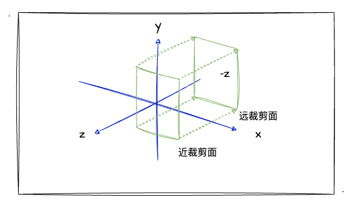
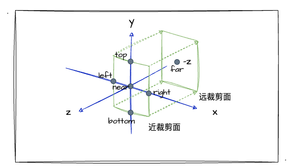
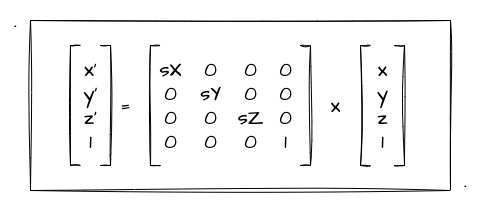
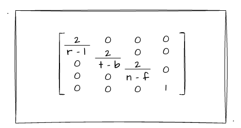

# 6. 相机的投影

经过前几节的学习，我们已经了解相机的概念，明白了相机对于 3D 图形绘制的重要的作用。但是我们仅仅分析了相机是如何观察图形的，却还没有提到可视范围，所以我们这一节就来一起探究一下相机的可视范围吧！

## 了解投影变换

上一节推导视图矩阵中，我有提过 MVP 矩阵。那其中，M就代表模型矩阵；V就代表了视图矩阵；而P就代表了本文要介绍的投影矩阵（Projection）了，也就是跟投影变换息息相关的矩阵知识。

基于上一节，我们理解了视图矩阵的概念其实就是把世界坐标系中的场景"放"到相机坐标系中，效果相当于相机在某个角度对场景进行拍摄，以最终呈现出图像绘制到屏幕上。但其实，最终成像的效果还有最后个环节——投影。那投影又是什么呢？我们接着往下看。

投影投影，顾名思义就是把物体投射到平面上，更简单的说，应该是一个场景从3D到2D的转换变化。毕竟，绘制的图像最终是在2D的屏幕中呈现给用户的。图形学中的投影变换有两种：**正交投影**、**透视投影**。关于**正交投影**和**透视投影**的区别，这有一张非常经典图快速帮助我们理解：


由上图我们可以看出，在两种不同的投影变换下，相机"拍摄"的可视空间、最终城乡都有所不同。其中，透视投影（左）的可视范围呈锥体，成像效果"近大远小"；而正交投影（右）的可视范围呈长方体，成像效果不随场景距离远近的而发生变化，呈平行光照的投影效果。

## 正交投影

接下来，我们详细了解一下正交投影。回到上文的图中，我们可以发现不论是正交投影还是透视投影，他们都有一个 Far clip plane 和 Near clip plane 的平面（远近裁剪面）。他们共同决定了相机的可视空间（在远、近裁剪面区间内的空间为可见），并且我们不难发现，正交投影中的远近裁剪面的大小是一致的，所以相机拍摄的空间为一个长方体！(主要看**图右**)


我们再接着看正交投影图中的近裁剪面，这里我们可以发现红、黄两球被投影到二维空间中，并且他们呈现出"等大"的图像，也就是说他们**不存在**"近大远小"的现象（对比透视投影中的近裁剪面看更明显）。

讲到这里，我们想一个问题：要怎么才能把一个3D图形转换为正交投影后的2D图形呢？问题不难，我们记住一个点即可，正交投影的效果**与深度无关**。换句话说，我们只需要 **`X、Y` 平面** 中的图形即可，所以只要留住`X、Y`的坐标数据，至于`Z`轴的数据直接丢掉即可！其实就是把图形"拍扁"！

这么说可能有点抽象，我们可以通过一个实际的算式来描述何为"拍扁"。比如我们把一个有深度（`Z`值不为`0`）的齐次坐标左乘以下矩阵：

```js
this.elements = [
  1, 0, 0, 0,
  0, 1, 0, 0,
  0, 0, 0, 0, // 这一行全部为 0，矢量左成后 Z 的值即为 0
  0, 0, 0, 1
]
```

回顾矩阵乘法中单位矩阵的特点：**任何矩阵与单位矩阵相乘都等于本身**。因此，我们把有深度的矢量左乘上述矩阵后，就将其`Z`的值变为`0`了，这就是一个"拍扁"的实现，这是不是比较好理解了呢？

另外，我们想一下前文提到的可视空间，远近裁剪面好像并没能在上述的矩阵中反应出来。默认渲染情况下，由于WebGL中的坐标系的范围是`[-1, 1]`，所以超出这个范围内的图形将被丢弃。所以，这也就解释了为什么上一小节我们实战相机渲染引擎的示例程序中，图形在某种情况存在被裁剪的现象：


如上图所示，绿色的三角形在相机旋转一定角度后被裁剪。根据这一个显示情况，我们有没有办法能在正交投影中给其**自定义一个可视空间呢**？我们接着往下看。



上图是**相机经过视图变换**后的情况，坐落于世界坐标轴中心，上方向与`Y`重合，并且看向`Z`轴的负方向。并且可以发现图中的绿色立方体，它所代表相机的拍摄空间，也就是正交投影的可视范围区间。

当然，上图中我们很难通过一定的数字化信息将这个可视区域的长方体表示出来。紧接着，我们给他添加 `left、right、top、bottom、near、far` 点位，使其可以通过**具体数值**的方式体现出位置、大小等。如下图：



由上图可以看出，正交投影可视区域的长方体的相关信息可以转化为如下：
1. `X`轴。可通过 `left、right` 两点表示
2. `Y`轴。可通过 `top、bottom` 两点表示
3. `Z`轴。可通过 `near、far` 两点表示

此时想象一下，如果我把这个长方体的可视区域，通过缩放变使得`X、Y、Z`轴的宽度都变成`[-1, 1]`的区间范围（也就是长度为`2`），并且再将整个长方体**移动到世界坐标轴的中心**，这样我们是不是就把整个长方体的可视区域在自定义范围的情况下变换到了世界坐标轴了呢？

因此，对于投影变换，又可以分成两点：
1. 将长方体缩放到`[-1, 1]`区间范围内。
2. 移动长方体到坐标中心。

## 推导&实现正交投影

经过前文对正交投影的了解，我们知道了正交投影是一种类似平行光照的投影，没有近大远小的视野效果，并且有一个长方体的可视空间决定视野范围。接下来，我将推导并用js实现这个正交投影变换的关键——正交矩阵！

首先要做的是将可是区域缩放为变长为`2`的长方体（WebGL的坐标范围`[-1, 1]`）。这里，我们简单回顾一下之前推导过的[缩放矩阵](/content/四、WebGL二维动画/3.%20用矩阵实战图形变换.html#实战其他的变换)：



由上可以看出，缩放值`sX-sZ`（缩放因子）位于矩阵的**对角线**中，满足 `x' = sX * x`。回到本文，也就是我们要把`left到far`的值经过缩放计算后放到对应的位置即可。解下来看看怎么求出长方体的`sX`的值。当前`X`轴的长度是`right - left`，`x'`的目标是`2`（因为缩放至边长为`2`），所以可以求得`sX`为：

```js
sX = 2 / (right - left)
```

`sY、sZ`亦是同样的计算方式，最后我们可以得到正交矩阵的**缩放矩阵**如下：



紧接着，我们要把长方体平移到坐标原点。平移矩阵我们应该比较熟悉了，这里就不展开介绍了。我们只要计算出如何将`X、Y、Z`轴移动到坐标原点，再放到矩阵的**最后一列**即可。


## 实战正交投影

:::demo
fifth/6_1
:::
