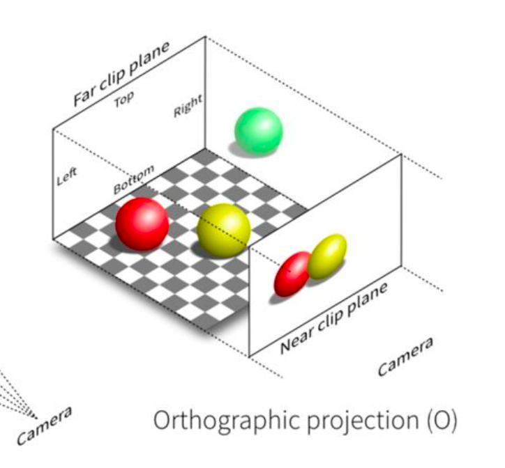
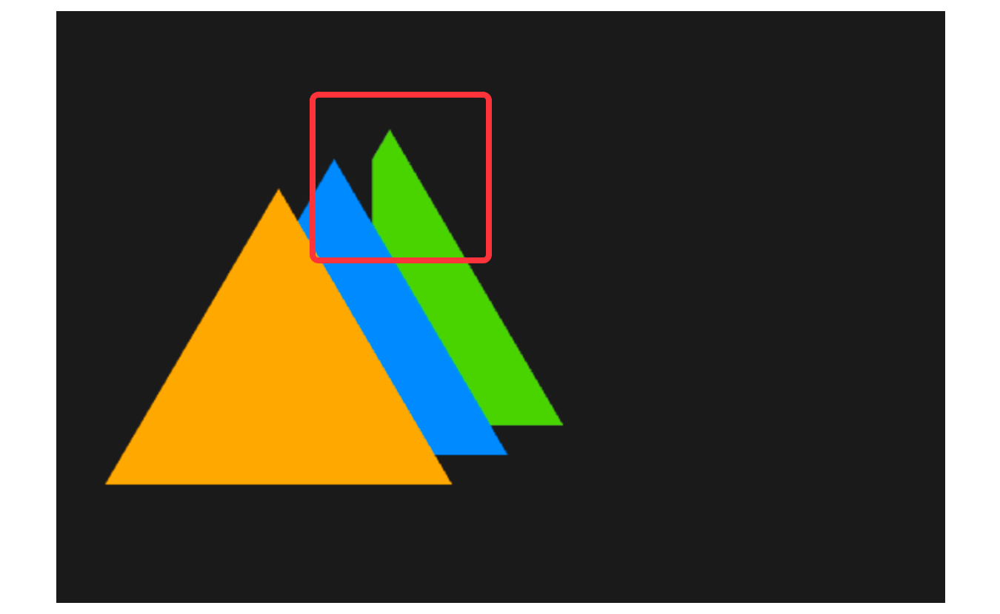

# 6. 相机的投影

经过前几节的学习，我们已经了解相机的概念，明白了相机对于 3D 图形绘制的重要的作用。但是我们仅仅分析了相机是如何观察图形的，却还没有提到可视范围，所以我们这一节就来一起探究一下相机的可视范围吧！

## 了解投影变换

上一节推导视图矩阵中，我有提过 MVP 矩阵。那其中，M就代表模型矩阵；V就代表了视图矩阵；而P就代表了本文要介绍的投影矩阵（Projection）了，也就是跟投影变换息息相关的矩阵知识。

基于上一节，我们理解了视图矩阵的概念其实就是把世界坐标系中的场景"放"到相机坐标系中，效果相当于相机在某个角度对场景进行拍摄，以最终呈现出图像绘制到屏幕上。但其实，最终成像的效果还有最后个环节——投影。那投影又是什么呢？我们接着往下看。

投影投影，顾名思义就是把物体投射到平面上，更简单的说，应该是一个场景从3D到2D的转换变化。毕竟，绘制的图像最终是在2D的屏幕中呈现给用户的。图形学中的投影变换有两种：**正交投影**、**透视投影**。关于**正交投影**和**透视投影**的区别，这有一张非常经典图快速帮助我们理解：


由上图我们可以看出，在两种不同的投影变换下，相机"拍摄"的可视空间、最终城乡都有所不同。其中，透视投影（左）的可视范围呈锥体，成像效果"近大远小"；而正交投影（右）的可视范围呈长方体，成像效果不随场景距离远近的而发生变化，呈平行光照的投影效果。

## 正交投影

接下来，我们详细了解一下正交投影。回到上文的图中，我们可以发现不论是正交投影还是透视投影，他们都有一个 Far clip plane 和 Near clip plane 的平面（远近裁剪面）。他们共同决定了相机的可视空间（在远、近裁剪面区间内的空间为可见），并且我们不难发现，正交投影中的远近裁剪面的大小是一致的，所以相机拍摄的空间为一个长方体！



我们再接着看正交投影图中的近裁剪面，这里我们可以发现红、黄两球被投影到二维空间中，并且他们呈现出"等大"的图像，也就是说他们**不存在**"近大远小"的现象（对比透视投影中的近裁剪面看更明显）。

讲到这里，我们想一个问题：要怎么才能把一个3D图形转换为正交投影后的2D图形呢？问题不难，我们记住一个点即可，正交投影的效果**与深度无关**。换句话说，我们只需要 **`X、Y` 平面** 中的图形即可，所以只要留住`X、Y`的坐标数据，至于`Z`轴的数据直接丢掉即可！

这时候，聪明的同学马上就想到了正交矩阵该怎么实现了。矩阵乘法中，矢量坐标左乘单位矩阵都等于自身，那现在要丢掉`Z`轴的数据，把单位矩阵的`Z`的相关值都变为`0`不就行了？

```js
this.elements = [
  1, 0, 0, 0,
  0, 1, 0, 0,
  0, 0, 0, 0, // 这一行全部为 0，矢量左成后 Z 的值即为 0
  0, 0, 0, 1
]
```

没错，就是这样！不过这个时候我们想一下上文提到的可视空间，远近裁剪面好像并没能在上述的矩阵中反应出来。按照默认的渲染方式，WebGL中的坐标系的范围是`[-1, 1]`，也就是超出这个范围内的图形将被丢弃而不会渲染出来。于是就会出现上一小节我们实战相机渲染引擎的示例程序中图形在某种情况被裁剪的现象。



如上图所示，绿色的三角形在相机旋转一定角度后被裁剪。那我们有没有办法能自定义一个可视空间呢？我们接着往下看。

## 透视投影
