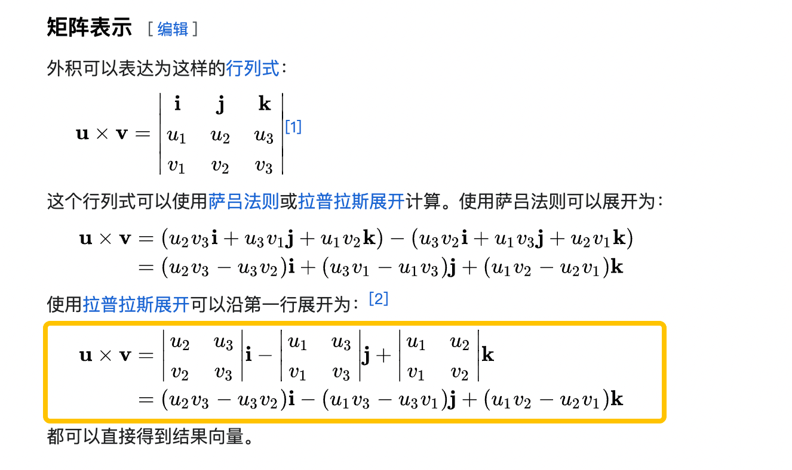

# 6. 相机的投影

经过前几节的学习，我们已经了解相机的概念，明白了相机对于 3D 图形绘制的重要的作用。但是我们仅仅分析了相机是如何观察图形的，却还没有提到可视范围，所以我们这一节就来一起探究一下相机的可视范围吧！

## 投影变换

上一节推导视图矩阵中，我有提过 MVP 矩阵。那其中，M就代表模型矩阵；V就代表了视图矩阵；而P就代表了本文要介绍的投影矩阵（Projection）了。

基于上一节，我们理解了视图矩阵的概念其实就是把世界坐标系中的场景"放"到相机坐标系中，效果相当于相机在某个角度对场景进行拍摄，以最终呈现出图像绘制到屏幕上。但其实，最终成像图像还有最后一步——投影，我们接着往下看。

关于正交投影和透视投影，有一张非常经典图已经将他们之间的区别描绘得淋漓尽致了。我们直接看看这张经典的投影图：

