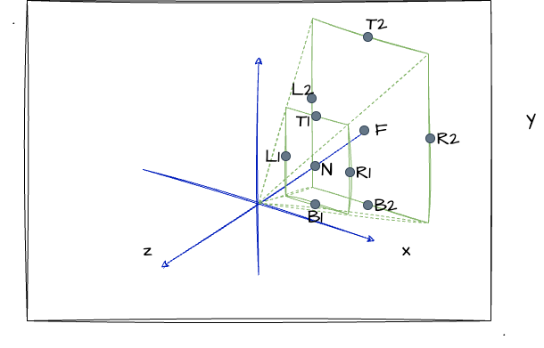
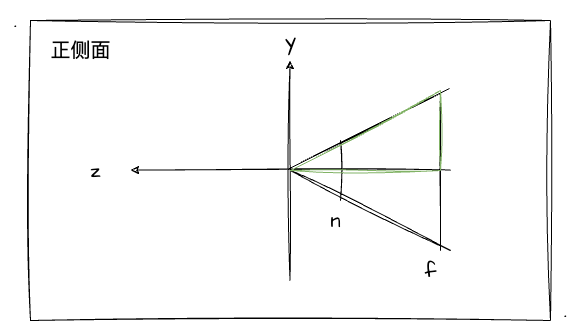
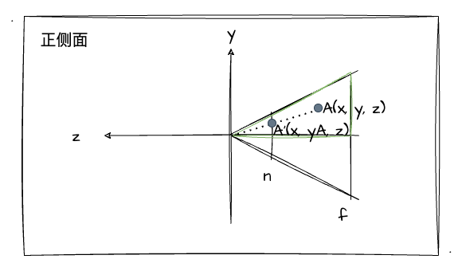
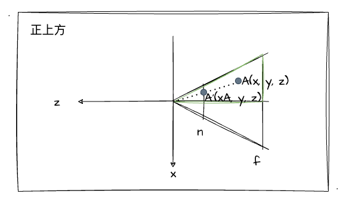

# 7. 透视投影

经过上一节的学习，我们已经了解并实战使用了投影之一的正交投影！那么本节，我们趁热打铁，把更贴近生活场景、更接近视觉效果，并且也是更难的透视投影也一探究竟吧！

## 了解透视投影

那么上一节也有提到透视投影，它更贴近生活，符合我们人的视觉效果，会有近大远小的现象。当然，这种投影的使用程度也是更加的广泛。跟上一节学习的正交投影的可视空间是长方体的不同，它的可视区域是一个类四棱锥，我们可以通过下图来回顾一下（左图）：


由上图（左）可以发现，透视投影的可视区间是四棱锥中的远近裁剪面决定的，近裁剪面跟远裁剪面之间形成了一个四棱台（近裁剪面小于远裁剪面）。并且图像会投影到近裁剪面上，这也是最终呈现在显示器上的图像结果。

这里，我们跟上一节一样，通过图、描点的方式，把透视投影的可视区域表达出来！当然，因为它不再是长方体结构，所以我们要分别对远近裁剪面进行描点～如下图：



上图中，我们依然通过 `left、right、top、bottom、near、far` 点位对透视投影的可视区域进行描述。与正交投影的不同的是，远近裁剪面大小不相同，所以对于 `top、bottom、left、right` 值我们分别对两个面进行标注。

这里我们可以试想一下，如果我们将远裁剪面进行一定的压缩，变成跟近裁剪面**等大的长方形**，那可视空间不就又回到了我们熟悉的**长方体**了吗？如此一来，只要我们把这个长方体移动到世界坐标原点吗，再缩放到`[-1, 1]`区间范围，不就是我们刚学完的正交投影变换吗！

所以，我们应该如何构造出这个长方体？简单来说就要压缩远裁剪面，把它压成近裁剪面大小。

比如说现在空间中有一个点`A(x, y, z)`，我们要做的就是把`x`压缩成`xA`，把y压缩成`yA`。我们先不着急想要怎么压缩，先找找透视投影可视区域有什么样的规律或者特性。比如现在我们从**正侧面**观察这个四棱台的特性：



上图中我描了绿色边的三角形在我们的九年义务教育中它叫啥？**相似三角形**有没有？那相似三角形的特性之一：**三组对应边均成比例**对此至关重要！为什么这么说？我们接着把案例（点`A`）代入进图中观察：



如图，当我们把`A`点进行压缩时，它最终压缩到的对应位置为`A'`，那此时，它的`Y`轴坐标将由原来的`y`变为`yA`。由于`A'`和`A`围成三角形为**相似三角形**，所以对于`y`轴的压缩值，我们可以通过以下等式来表示：

```js
// z是A点的z坐标值，n是近裁剪面的z坐标值；
z / n === y / yA
// 变换为：
yA = y * (n / z)
```

也就是说，对于变换后的 `yA` 来说，它的值等于 `y` 乘 `n/z` 的结果。同理，我们以同样的方式对`X`轴的坐标值进行转换。比如现在我们从**正上方**观察四棱台：



没错，跟从正侧面的规律是一样的，依然是相似三角形，依然是有**三组对应边均成比例**这个重要特性。并且，我们通过推导可以发现，`X`跟`Y`轴坐标的变换公式其实是一样的：

```js
// z是A点的z坐标值，n是近裁剪面的z坐标值；
z / n === x / xA
// 变换为：
xA = x * (n / z)
```

因此，我们可以得出一个结论：**对于可视空间四棱台中每一个坐标的`x、y`值都乘上 `n/z`，就可以把这个四棱台变换成一个长方体了**！

## 透视投影矩阵