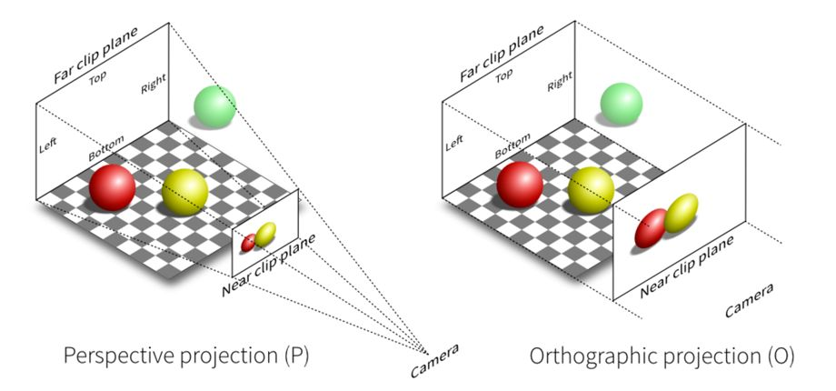

# 7. 透视投影

经过上一节的学习，我们已经了解并实战使用了投影之一的正交投影！那么本节，我们趁热打铁，把更贴近生活场景、更接近视觉效果，并且也是更难的透视投影也一探究竟吧！

## 了解透视投影

那么上一节也有提到透视投影，它更贴近生活，符合我们人的视觉效果，会有近大远小的现象。当然，这种投影的使用程度也是更加的广泛。跟上一节学习的正交投影的可视空间是长方体的不同，它的可视区域是一个类四棱锥，我们可以通过下图来回顾一下（左图）：

由上图（左）可以发现，透视投影的可视区间是四棱锥中的远近裁剪面决定的，近裁剪面跟远裁剪面之间形成了一个四棱台（近裁剪面小于远裁剪面）。
