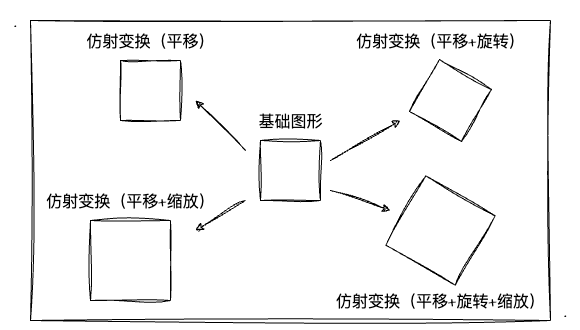

# 8. 粒子动画——实战MVP变换

在前面学习中，我们分别掌握了模型矩阵（M）、视图矩阵（V）、投影矩阵（P）的相关知识，但我们并没有完整地将三者的作用体验一通。所以本文，我么就通过一个实战案例来体验一下MVP矩阵变换的效果，顺便把之前学习的零散知识点串起来，做一个**总结性**的学习、回顾。

## 实战目标

相信看到标题都猜到了，本文的实战目标就是利用已学习过的知识制作一个简易的**3D粒子动画**效果。所以，我们更应该将侧重点放在对原知识点的回顾、总结，和对散乱的知识点通过实战将他们一一串起来，以达到融会贯通的层面。

粒子动画相信大家随便一搜都能找到很多炫酷的demo，但是！我本次实战的目的并不以达到炫酷的动画效果为目的，而是想通过**运用目前已经掌握的知识**实现一个简易的粒子动画效果而已！所以本文不会涉及到动画效果、缓动函数等运用，就是纯粹的让粒子"动起来"而已，大家可以放心食用！

废话不多说，我们首先来看看最终做出来的动画效果动图如下（此时用的**透视投影**效果）：


简单分析动图，我们大概可以吧整个实战目标分为以下几个步骤：
1. **绘制立方体**。这个我熟！至于要绘制一个还是多个呢？怎么绘制呢？
2. **粒子数组**。管理当前绘制的所有粒子，动画期间会动态增删粒子。
3. **粒子属性**。比如粒子的随机颜色、粒子的平移方向、粒子的旋转方向...
4. **实现相机**。相机观察粒子动画，允许通过**拖拽鼠标改变观察角度**
5. **切换投影方式**。切换正交、透视投影，观察不同投影下的粒子动画区别

上述`5`点就是本文实战的重点了，基于上述几点的实现后，我们只需要**递归调用绘制函数**就可以实现一个简易的粒子动画了。接下来，直接开干吧！

## 模型矩阵`Model`

在这一小节开始前，我们简单回顾一下[模型矩阵](/content/四、WebGL二维动画/4.%20图形的复合变换.html)是什么？之前我们学习过图形的**平移、旋转、缩放**变换，而将这些变换的矩阵相乘后就能得到一个**模型矩阵**，当我们把物体乘上我们模型矩阵后，便可以实现他的**复合变换**效果。（需要详细了解可以戳上链接）

而在这个粒子动画效果中，我们要怎么用模型矩阵呢？或者说我们要用他来干嘛呢？对于这个问题，我们可以回忆下前文的一个问题：**要绘制一个立方体还是多个呢？怎么绘制呢？** 当然这个问题可以有两种解法，我们可以绘制多个立方体（需要多组正方体的顶点数据）；也可以**只绘制第一个立方体**，再通过模型矩阵来改变他的位置、大小、旋转角度。

当然，对我来说肯定是后者更为简便，毕竟要一次性输入多个立方体的顶点坐标，工作量是更大的。那么，我如何在只定义第一个立方体的顶点后，变换出更多的立方体呢？这里就需要用到模型矩阵`Model`了。

其实上述的原理就是[仿射变换](https://zh.wikipedia.org/zh-hans/%E4%BB%BF%E5%B0%84%E5%8F%98%E6%8D%A2)，而维基百科是这么介绍他的：
> 仿射变换（Affine transformation），又称仿射映射，是指在几何中，对一个向量空间进行一次**线性变换**并接上一个**平移**，变换为另一个向量空间

简单来说就是对一个图形进行**线性变换（缩放、旋转）+平移**而产生一个"新"的**同类型图形**。所以，基于仿射变换的原理，我们可以知道，当我们有一个基础图形的时候，通过仿射变换我们可以得到很多个他的孪生兄弟！大的、小的、正的、歪的...



比如上图，我们通过`1`个**基础图形**经过`4`次仿射变换便得到了`5`个同类型的图形了！同理，在本文的实战中我也是通过对立方体做仿射变换从而得到多个立方体，从而实现粒子动画的基础。

既然已经知道了粒子的产生缘由，我们要如何用代码将其实现呢？其实也非常简单。首先我们要绘制**第一个立方体**，相信绘制立方体大家应该很熟悉了，之前也花了两节的时间来介绍立方体的绘制，所以这里就不再讲了。现在我们以以下数据为顶点坐标，通过索引的方式绘制出一个立方体：

```js
const vertices = new Float32Array([
  -.25, .25, .25,
  -.25, -.25, .25,
  .25, -.25, .25,
  .25, .25, .25,
  .25, .25, -.25,
  .25, -.25, -.25,
  -.25, -.25, -.25,
  -.25, .25, -.25,
])
```

紧接着，我们仅需要对这个立方体做**仿射变换**就好了。至于要做几次仿射变换，每次仿射变换的效果是怎么样的，这就是前文提到的核心步骤的`2、3`了。所以在仿射变换前，我们还需要准备好**粒子数组**和**粒子属性**。

关于粒子数组和属性，我仅做了简单的设计。每组绘制都会创建`n`个粒子，并且会生成随机的粒子颜色、位置、旋转和动画持续时间的粒子属性。直接看代码如下：

```js
// 创建粒子
const createTriangularPyramid = () => {
  // 8个为一组生成粒子，插入 triangularPyramids 的粒子数组中
  for (let i = 0; i < 8; i++) {
    triangularPyramids.push(randomCubeParams())
  }
}

// 随机立方体参数
const randomCubeParams = () => {
  // 随机颜色、位移值、旋转参数、动画时间
  const u_Color = new Float32Array([Math.random(), Math.random(), Math.random(), .9])
  ......

  return {
    translate,
    rotate,
    u_Color,
    u_ModelMatrix,
    startTime,
    animationTime
  }
}
```

关于如何定义随机的位移值、动画时间等并不是本文的重要内容，所以这一块感兴趣的同学自己看源码吧，我就不一一讲解了。经过上述的 `createTriangularPyramid` 函数创建了一定数量的粒子后，我们便可以通过模型矩阵对其进行仿射变换了。接着我们看看仿射变换的关键——模型矩阵要怎么做。

```js
for (const triangularPyramid of triangularPyramids) {
  const translateMatrix = new Mat4()
  // 根据粒子的平移参数进行计算，作为每次平移的移动距离
  const translate = triangularPyramid.translate.map(_ => _ / 100 * 1.5)
  // 将平移参数放到平移矩阵中
  translateMatrix.setTranslate.apply(translateMatrix, translate)
   const rotateMatrix = new Mat4()
  // 同理，对粒子的旋转参数计算，再放到旋转矩阵中
  const rotate = triangularPyramid.rotate.map(_ => _ / 10)
  rotateMatrix.setRotate.apply(rotateMatrix, rotate)
  // 平移矩阵和旋转矩阵相乘得到模型矩阵
  triangularPyramid.u_ModelMatrix.multiply(translateMatrix).multiply(rotateMatrix)
}
```

上述代码块的核心就是，**通过随机生成的粒子运动属性（平移、旋转）进行一定的数学运算**。（这里的算式我随便写的，大家可以不用管。主要是调整动画的速度、幅度，并没有用任何运动函数）并分别生成平移矩阵、旋转矩阵，最后再通过 `multiply` 方法将两个矩阵相乘，得到**模型矩阵**。


最后，就是将所有的粒子进行一个绘制了。其实代码也很简单，我们只需要遍历粒子数组，多次调用 `gl.drawElements` 进行绘制即可。

```js
const draw = () => {
  // 清空缓冲区
  gl.clear(gl.COLOR_BUFFER_BIT | gl.DEPTH_BUFFER_BIT)
  // 执行多个立方体的绘制
  for (let i in triangularPyramids) {
    const item = triangularPyramids[i]
    // 随机颜色值
    gl.uniform4fv(u_Color, item.u_Color)
    // 随机的平移、旋转变换组成的模型矩阵（这一步就是仿射变换的关键）
    gl.uniformMatrix4fv(u_ModelMatrix, false, item.u_ModelMatrix.elements)
    // 绘制当前仿射变换后的立方体
    gl.drawElements(gl.TRIANGLES, indices.length, gl.UNSIGNED_BYTE, 0)
  }
}
```

如上代码块，每次绘制前清空上次绘制内容，再一一将粒子数组中的粒子通过模型矩阵变换后再绘制，我们便可以实现一次绘制"多个粒子"了。到这一步，我们已经完成了`MVP`变换中的`M`部分了，并且我们也实现了 **绘制立方体**、**粒子数组**、**粒子属性** 这三个粒子动画所需的核心步骤。

## 视图矩阵`View`

关于视图矩阵，我们要做的就是实现：相机观察粒子动画，允许通过拖拽鼠标改变观察角度。首先我们来看看我们要做成的效果：


其实上述的效果我们并不陌生，因为之前在[实战相机渲染引擎](/content/五、WebGL三维世界/5.%20实战相机渲染引擎.html)的篇章中过已经做过类似的，只是那时候是通过鼠标点击调整相机位置，而这里是用鼠标拖拽，所以有相同的知识点的话我就不再赘述了。

当然，要实现拖拽改变相机位置以实现多角度观察图形，最主要的便是跟鼠标事件做关联。也就是当 `mousedown、move` 等事件触发时，我们要计算相应的鼠标位移偏移值，并将偏移值转移到相机的 `x、y` 值上即可。

```js
const {
  mousedown,
  mousemove,
  mouseleave,
  mouseup
} = useMouseCamera({ moveOption, upOption })
```

相信！作为前端大佬的各位在处理鼠标拖拽这一块的实现肯定都了然于心了，所以我就不展开说了。我把拖拽的实现封到一个hook中（如上代码块），如需要详细了解的同学自己看源码吧。

视图矩阵中的最后一步，当然就是要得到这个矩阵啦，我们要把拖拽的变化同步到矩阵中，以便在顶点着色器中用坐标点去左乘它。这里，我们接着沿用之前封装好的 `ViewMatrix` 类，用它来创建视图矩阵。这里也没什么特别的，我们记住**视图矩阵**就是：**相机位置、观察目标点、上方向**决定的就行了。直接看代码：

```js
const createViewMatrix = (cameraArr: number[]) => {
  // 鼠标拖拽后改变的相机的位置（x、y）
  cameraArr[0] = getCameraPosition(cameraArr[0])
  cameraArr[1] = getCameraPosition(cameraArr[1])
  
  u_ViewMatrix = gl.getUniformLocation(program, 'u_ViewMatrix')
  const viewMatrix = new ViewMatrix()
  // 将新的相机配置传入（相机位置、观察目标点、上方向）
  viewMatrix.lookAt.apply(viewMatrix, cameraArr)
  gl.uniformMatrix4fv(u_ViewMatrix, false, viewMatrix.elements)
}
```

如此一来，我们已经求出了`u_ViewMatrix`的视图矩阵，也就是说我们已经完成了粒子动画`MVP`变换中的`V`部分了，剩下最后的便是投影矩阵了，我们接着往下看！

## 投影矩阵`Projection`

投影矩阵？刚许完没多久，还热乎呢！~~行，那我就不废话了，下一篇！~~这里简单讲讲吧，还是老规矩，先看看最后实现的效果：


就效果来看，透视投影和正交投影的区别还是挺大的！不过这里其实我并没有做特别多的事情，代码基本上跟上一节的一样的，就是在前端切换选项的时候，改变传入 `shader` 的 `u_ProjectionMatrix` 矩阵而已。整个切换放在 `vue3` 中，就一个 `watch` 的事情。

所以这里我也不介绍太多了，很多前两节的内容了，直接看代码吧：

```ts
watch(transformType, type => {
  const canvasEl = gl.canvas as HTMLElement
  // 获取 shader 中的 u_ProjectionMatrix 变量
  u_ProjectionMatrix = gl.getUniformLocation(program, 'u_ProjectionMatrix')
  if (type === 'perspective') {
    // 透视投影
    const perspectiveMatrix = new PerspectiveMatrix()
    // 配置透视投影
    perspectiveMatrix.setPerspective(fov, canvasEl.clientWidth / canvasEl.clientHeight, near, far)
    gl.uniformMatrix4fv(u_ProjectionMatrix, false, perspectiveMatrix.elements)
  } else {
    // 正交投影
    const orthographicMatrix = new OrthographicMatrix()
    // 配置正交投影
    orthographicMatrix.setOrthographicPosition(-10, 10, 8, -8, -100, 100)
    gl.uniformMatrix4fv(u_ProjectionMatrix, false, orthographicMatrix.elements)
  }
  draw()
})
```

这里，我们依然使用前面两节自己推算并实现的 `PerspectiveMatrix` 和 `OrthographicMatrix` 矩阵类，也是比较熟悉的代码了。需要注意的一点是对于裁剪空间的配置了：注意别把裁剪空间配置得太小了，不然可能观感不那么好。关于裁剪空间的配置，大家可以自行调整一下看看效果～

到此，我们已经把粒子动画`MVP`变换中的`P`部分也讲了，基本上将动画实现出来就是顺水推舟的事情了。不过，此时的你是不是想问，着色器要怎么写？其实`shader`部分跟之前的并没有太多的区别，而且我们要利用WebGL的矩阵运算功能，所以大概都能猜到`shader`长啥样了！

这里，我跟大家简单过一下shader吧：

```js
const vertexCode = `
  attribute vec4 a_Position;
  uniform mat4 u_ModelMatrix;
  uniform mat4 u_ProjectionMatrix;
  uniform mat4 u_ViewMatrix;

  void main () {
    // MVP矩阵相乘
    gl_Position = u_ProjectionMatrix * u_ViewMatrix * u_ModelMatrix * a_Position;
  }
`

const fragmentCode = `
  precision mediump float;
  uniform vec4 u_Color;

  void main () {
    // 随机颜色值
    gl_FragColor = u_Color;
  }
`
```

总体来看很简单，算得上核心的也就是：`gl_Position = u_ProjectionMatrix * u_ViewMatrix * u_ModelMatrix * a_Position` MVP矩阵相乘的这一行了吧。当然，聪明的同学可能想到，顶点着色器的执行次数会随着顶点数的增加而增加，这样写是不是存在一定的重复计算呢？

没错，对于同一个立方体的`8`个顶点来说，他们本次的`MVP`变换的结果应该是固定的，也就是`u_ProjectionMatrix * u_ViewMatrix * u_ModelMatrix`他们三者的乘积是固定的。本文是为了让大家更加直观的感受到MVP变换、直接看到MVP之间相乘，才这样把运算写在着色器中。

其实我们可以把MVP的运算放到`js`中，再将结果直接传入到`shader`中，这样子能减少顶点着色器的数学运算复杂度。比如我们可以把顶点着色器改变为如下：

```js
const vertexCode = `
  attribute vec4 a_Position;
  uniform mat4 u_MvpMatrix;

  void main () {
    // 直接左乘 MVP 矩阵
    gl_Position = u_MvpMatrix * a_Position;
  }
`
```

上述过程中，顶点着色器运行时便不用再处理MVP矩阵之间的乘法了。因而这也需要我们在`js`中完成并将结果传入`u_MvpMatrix`中，这将能一定程度的优化着色器的运算复杂度。

那，废话了一整篇，放上大家最期待的粒子动画示例程序吧，给大家亲自体验一下：

:::demo
fifth/8_1
:::

## 总结

本文中大部分的内容都是过往学习过的知识点，只是学的时候可能不知道怎么应用到实战中。所以，本文粒子动画实战中，我认为最有突破的知识点应该是通过**仿射变换**生成多个"粒子"。这一点拓展了我对平移、线性变换实际用途的认知。

通过实战粒子动画，终于将之前学习过的几种矩阵做了一个总结性的应用，算是把散乱的知识点串起来并且在实战中玩过了吧。所以对于本文，我还是建议大家更要把重点放在MVP变换中，以加深矩阵对图形、3D的重要性的理解。在本文过后，也算是小入门3D图形了，那接下来可能会开始学习光照的内容了，再接再厉吧。
