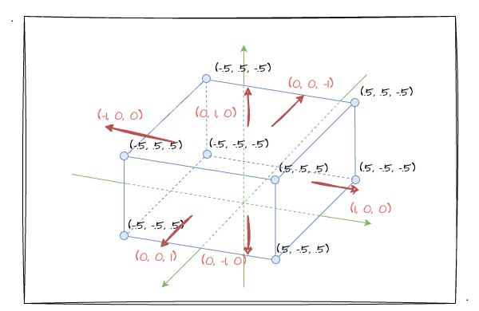
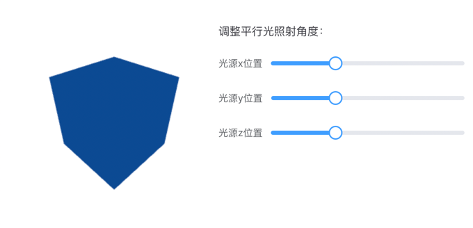

# 1. 初识光照

经过前一章节的学习，相信大家跟我一样已经初入3D的大门了，也对MVP变换有所了解了。这一章，我们开始进入跟3D图形效果息息相关的另一个知识点—— **光照** 的学习。

就我个人感觉而言，光照对3D效果的表现是非常重要的一环。回想小时候自己琢磨素描画的时候，都会通过给物体涂绘一些**阴影**效果，以此来凸显物体的**立体感**！比如我们看下图，通过对圆以及周边环境进行深浅不一的阴影处理后，一个立体的球形引入眼帘。


## 光照的本质

前文"素描画"的图中，可以发现图中既有球体的"影子"，也有各种深浅不一的**明暗面**，这些都是由于"光照"产生的效果。球的左上角因为有光照所以会比较"明亮"，而背面没有受到光照的地方相比之下便会显得暗淡无光。

当然对于这种明暗面、影子等自然现象我们是再熟悉不过的，因为这些现象充斥着我们的生活。但是不知道你是否有想象过，怎么才能把"光照"的特性代入到 WebGL 世界，让图形的 3D 效果更加逼真呢？

回顾一路上对 WebGL 的学习历程，顶点**着色器**、片元**着色器**永远是提到最多的"代名词"，或者说所有图形的绘制都逃不出shader。而我们细想"光照"带来的效果：明暗面、影子，无非都是对图形不同位置的**颜色**做一些变化和控制。讲到这里，你很容易就联想到一个东西——**片元着色器**。

没错，之前我们就知道逐片元操作正是在图形装配、光栅化后，对每一个像素绘制上颜色的过程，而"光照"带来的效果也是在"逐片元"的过程中得到的体现。所以，光照效果归根结底就是对图像每个部位颜色的控制、调节，而最终展示到屏幕上的颜色则是通过**入射光颜色、角度、和物体表面颜色**等参数**共同计算**出来的！ 所以事不宜迟，马上展开对它们的学习吧！

## 光源类型

基本光源类型可以氛围三种，如图所示：


其中，我们都可以通过不同的**参数**来定义不同光源的光照效果。
1. **平行光**。光线之间相互平行，可以用**方向**和**颜色**来定义平行光。
2. **点光源**。由点向周围发散的光（如灯泡），可以用**光源位置**和**颜色**来定义点光源。
3. **环境光**。从各光源发出后被反射到物体表面的光（周边物体反射过来的光），仅指定**颜色**即可定义环境光。

## 反射类型

当然，仅有光源是不能确定物体最终绘制的颜色，我们还需要考虑物体表面的颜色，和光的反射方向、颜色。于是，这里引入两种物体表面反射光的方式：
1. **漫反射**。主要针对**平行光**或者**点光源**，反射光在**各个方向上都是均匀**的（一种理想反射模型）
2. **环境反射**。主要针对**环境光**，其反射光其实就是**环境入射光的反方向**

这一节，我们先重点学习**漫反射**的知识，环境反射相关内容将放在下一篇文章中讲解。

### 漫反射

相信学理科的同学对漫反射应该不陌生。物理课中我们一定学习过漫反射和镜面反射～其中，黑板就是漫反射。它跟镜面反射最大的区别就是，它的表面的不光滑的，可以将光向四面八方进行反射。而产生镜面反射的表面是光滑的，它会使光沿着同一个方向反射出去，如果入射光是一段平行光，那它反射后依然是一段平行光。


上图即为物体表面被光源照射后，产生漫反射的反射光。当反射光进入眼睛，我们便可以看见物体，并且知道它的颜色。那**漫反射光的颜色**是怎么样的呢？有以下三点：
1. **入射光颜色**。前面有提到的，定义光源参数中都有颜色参数。
2. **物体表面颜色**。物体原色，即最初片元着色器中 `gl_FragColor` 接收的颜色值。
3. **入射光与表面的夹角`θ`**。入射角为**入射光线**与**物体表面的法线**的夹角（如下图所示）。


有了以上信息，我们可以根据公式计算出**漫反射光的颜色**：

```
漫反射光颜色 = 入射光颜色 x 物体表面颜色 x cosθ
```

上述算式中，颜色乘法的计算为**各矢量之间分别相乘**，如有`RGB1`和`RGB2`，他们之间相乘的计算为： `(R1 x R2, G1 x G2, B1 x B2)`各分量相乘。

根据上述的算式，我们不难发现以下**两点特性**：
1. 当`θ`为`0°`时，入射光与表面**垂直**，`cosθ` 的**值为`1`**，此时入射光正射表面。 如果入射光为白光，那么此时我们看到的受光面为**物体的原色**。
2. 当`θ`为`90°`时，入射光与表面**平行**，`cosθ` 的值为`0`，没有入射光照射到物体表面，此时应该为**黑色**。

为了让大家更清晰的理解上述两点特性，我再通过图例和实数代入计算推导一次上述特性。首先我们看两种入射光情况的图：


简单总结上图的重点：当入射光**垂直**照射眼睛看着的面时，我们可以看到的面应该为**蓝色**；当入射光**平行**照射眼睛看着的面时（没有照射到面，`0`为`90°`），我们看到的面应该为**黑色**。这种现象其实也是符合常识的，紧接着，我们将实数代入上述公式中再次证实这种现象。

首先回顾高中学习过的 `cos` 的特殊三角函数值：

| 角度 | 0°  | 30°     | 45°     | 60°   | 90° |
|------|-----|---------|---------|-------|-----|
| cos  | `1` | `√3/2` | `√2/2` | `1/2` | `0` |

目前假设有入射光为白光 `RGB(1, 1, 1)`，物体表面为蓝色 `RGB(0, 0, 1)`。并且假设此时入射角为`0°`，也就是入射光**垂直照射**物体表面，我们可以将所有数据代入上述公式来计算反射光的`RGB`，以`R`为例：

```
R反射光 = R入射光 x R物体表演颜色 x cos0° = 1 * 0 * 1
```

显然，上述计算结果为`0`，以此类推，我们可以得知最终所有的`RGB`值为`(0, 0, 1)`，依然是物体表面原色**蓝色**。所以我们可以推导出上述的结论：入射光直射物体表面时，反射光为物体表面的原色。

于是我们还可以顺理推出，如果入射光与物体表面**平行**，此时入射角为`90°`，`cos`的值为`0`，所以入射光平行物体表面时，物体表面的反射光是**黑色**的。并且我们还可以推出，当入射光于物体表面**存在一定角度时**，反射光的颜色依然是原色，只是**相比垂直入射时会暗一些**。

### 计算入射角`θ`

这一小节，我们将一起探讨如何计算入射角`θ`。为什么说要计算入射角呢？我们不妨先回顾前文光源小节的学习，我们定义光源基本上就是定义光的**颜色、方向**或者说是**光源的位置**，并没有定义入射角`θ`相关的数据，因此这就是我们要计算出入射角`θ`的原因。

当然，这一点其实并不太难，而且之前我们也学习过，其中的核心点即是：通过矢量的**点积**计算 `cosθ`。回顾以下点积的计算公式如下图：


基于上述数学基础，我们如何计算`cosθ`呢？首先，我们假设上述的`向量a、b`是光源的入射光、物体平面的法线向量。然后，我们需要**对光源方向、法向量做归一化处理**。归一化所带来的效果就是保持向量的方向不变，将其**模长变成`1`**。在 GLSL ES 中，我们可以调用内置函数 [normalize](https://registry.khronos.org/OpenGL-Refpages/gl4/html/normalize.xhtml) 获得。（详细可以点击外链了解用法）

如此一来，因为入射光、法线都做了**归一化**处理，所以他们的**模长都为`1`**，于是可以把上述的点积计算公式简化成以下算式（以符号`·`代表点积）：

```
cosθ = 光线方向 · 法线方向
```

所以，`cosθ`就是**归一化后的光线方向和法线的点积**。于是，漫反射光颜色的计算公式为：

```
漫反射光颜色 = 入射光颜色 x 表面颜色 x (光线方向 · 法线方向)
```

## 法线

法线方向即为物体表面的朝向，**垂直于物体表面**。那么对于法线这小节的学习，我们需要掌握的关键知识点有以下：
1. 如何确定表面的法向量
2. **法向量和位置无关**，一个平面只有一个法向量。


其中第`1`点，我们根据日常的经验不难发现一个平面其实是有**两个方向**的法向量的，更直接的说应该是一个面的**正反面**。所以，我们需要确定这个面的"正反"关系以确定我们所需要的法向量。


如上图所示，一个面的正反面之分在于它的顶点绘制顺序，正面的顶点顺序为顺时针，背面看的时候为逆时针。当然，我们要确认一个面的法向量，可以直接通过"**右手法则**"来确定（四指顺着顶点的绘制顺序握拳，此时大拇指伸直的方向即为法向量）。

接着，我们来看看第`2`点，其实也很好理解，我们直接看下图：


三个**平行**的平面A、B、C和平面C中的两个不同位置的点，他们都共有**同一个法向量**。

## 实战平行光的漫反射效果

经过一文的基础知识铺垫，终于可以进入实战环节了。这里，我们实战一个在平行光中产生漫反射现象的蓝色立方体。这里我直接使用 **`24`个顶点**配合**索引** 来绘制这个蓝色立方体，所以立方体的绘制我就不赘述了，跟之前一样。

### 设置法向量

然而这里跟之前绘制立方体有所不同的是，绘制所使用的数据中，除了顶点、颜色、索引，我们还多一个组数据——**法向量**。

接下来，我们就来看看正方体每个面的法向量。我直接沿用之前的图并在上面添加法向量坐标：



根据上图，我们指需要按照"右手法则"去编排顶点位置，并最终通过索引来绘制立方体就可以将这个蓝色立方体画出来了。这里我把所有的数据（顶点位置、颜色、该点的法向量）都放到一个数组里，并通过步进参数和偏移值去取对应的数值。简单看看我目前定义的数据（一个面为例）：

```js
  const vertices = new Float32Array([
    // 蓝 1（前）
    // 顶点(x, y, z) 颜色(r, g, b, a) 法向量(xn, yn, zn)
    -0.5, -0.5, 0.5, 0.08, 0.5, 1, 1, 0., 0., 1,
    0.5, -0.5, 0.5, 0.08, 0.5, 1, 1, 0., 0., 1,
    0.5, 0.5, 0.5, 0.08, 0.5, 1, 1, 0., 0., 1,
    -0.5, 0.5, 0.5, 0.08, 0.5, 1, 1, 0., 0., 1,
    ......
  ])
```

上述一行中共有`10`个值，他们分别代表`顶点(x, y, z) 颜色(r, g, b, a) 法向量(xn, yn, zn)`这些值，顺序是一一对应的（所有数据可点开示例程序的源码进行查看）。


### 编写着色器

紧接着来看一下**顶点着色器**跟之前的绘制立方体有何不同：

```GLSL
attribute vec4 a_Position;
attribute vec4 a_Color;
attribute vec3 a_Normal; // 顶点所处面对应的法向量
varying vec4 v_Color;
uniform mat4 u_MvpMatrix;
uniform vec4 u_LightColor; // 定义入射光颜色
uniform vec3 u_LightDirection; // 定义入射光的方向

void main () {
  gl_Position = u_MvpMatrix * a_Position; // 这一步是我们熟悉的 MVP 变换
  vec3 normal = normalize(a_Normal); // 归一化顶点对应的法向量
  vec3 normalizeLightDirection = normalize(u_LightDirection); // 归一化光线方向
  float dotProduct = dot(normal, normalizeLightDirection); // 求光线、法向量点积
  vec3 colorRes = vec3(u_LightColor) * vec3(a_Color) * dotProduct; // 计算反射光的颜色
  v_Color= vec4(colorRes, a_Color.a); // 将反射光的颜色传递给片元着色器
}
```

如上代码，从变量中看，依然有熟悉的 `a_Position`、`a_Color`、`u_MvpMatrix` 等变量，也有这次新增的一些定义如 `a_Normal`、`u_LightColor`等。主要看 `main` 函数的执行：
1. `u_MvpMatrix * a_Position`——`MVP`变换。这一点就不多说了，不熟悉的回看上一章。
2. 对**法向量、光线方向**进行**归一化**处理。调用 GLSL ES 内置的 `normalize` 函数。当然，光线方向是唯一的，所以归一化过程也可以提到 js 部分执行。
3. **求`cosθ`**。通过 GLSL ES 的内置函数 `dot` 计算法向量和光线方向的**点积**。
4. **计算反射光颜色**。公式：`漫反射光颜色 = 入射光颜色 x 表面颜色 x (光线方向 · 法线方向)`。
5. 将计算后的颜色值通过 `varying` 变量 `v_Color` 传递给片元着色器。

相比顶点着色器，**片元着色器**基本上就不需要改动了，还是之前那样即可：
```GLSL
precision mediump float;
varying vec4 v_Color; // 接收顶点着色器计算好的颜色值

void main () {
    gl_FragColor = v_Color;
}
```

### js设置相关配置

因为是绘制立方体，为了方便观察出立方体的效果，这里我把相机设置到立方体的右上角方向位置对场景进行观察，并且在投影中我使用更加接近生活的透视投影。相关设置代码如下：

```js
matrix
  .perspective(60, 1, 1, 100) // fov、宽高比、远近裁剪面
  .lookAt(1.3, 1.3, 1.3, 0, 0, 0, 0, 1, 0) // 视点、目标点、上方向
```

紧接着，我设置光照的颜色为白色，并传递给变量 `u_LightColor`；光线的方向默认为 `(3, 2, 1)` ，并传递给 `u_LightDirection`。

```js
// 白色的 RGBA
const lightColor = new Vector4(1.0, 1.0, 1.0, 1.0)
gl.uniform4fv(u_LightColor, lightColor.elements)
// xLight、yLight、zLight均为Vue的响应式变量，默认分别为3、2、1
const lightDirection = new Vector3(xLight.value, yLight.value, zLight.value)
gl.uniform3fv(u_LightDirection, lightDirection.elements)
```

于是乎，我们便可以看到如下的 demo：

:::demo
sixth/1_1
:::

示例程序中，我设置了可改变的光线方向`x、y、z`值，大家在拖动的时候可以法线不同的光线位置会对物体的颜色有不同程度的影响。比如：
1. 当光线方向处于 **正右上方** 时，立方体的面都为**同样的暗蓝色**。

2. 当光线 **平行于`X`轴** 入射时，立方体垂直`X`轴的面为蓝色，而其余面均为黑色。


针对上述的这些现象，相信你很容易就能根据本文所学的内容解释出来，我也不会展开解释这些现象了。这里我有一个疑问，虽然说上述情况都符合公式计算后得出来的结果，但貌似跟现实生活还是有些不一样。 好比第`2`点的现象，**现实中即使光线直射垂直`X`的面，但其余的面应该不至于是纯黑色的吧**？

没错，因为本文的实战demo仅涉及到了平行光的漫反射，还没有提到环境光～所以我们就暂且接受这种现象吧，下一节，我们将加入环境光以让这些现象更加贴近现实！

## 总结

本文的最后，跟大家一起回顾本文的主要内容：
1. 光照效果的本质——片元着色器对具体颜色的控制。而颜色则是通过公式和数学运算得来。
2. 光源的基本类型有三种：平行光、点光源、环境光。他们都可以**通过一定的参数来定义**。
3. 确定平面**法向量**。根据顶点绘制顺序使用"右手法则"确定该平面的法向量。
4. 通过**点积**求出入射角（`cosθ`的值）以换算漫反射光计算公式。
5. 漫反射光的计算公式：**`漫反射光颜色 = 入射光颜色 x 表面颜色 x (光线方向 · 法线方向)`**