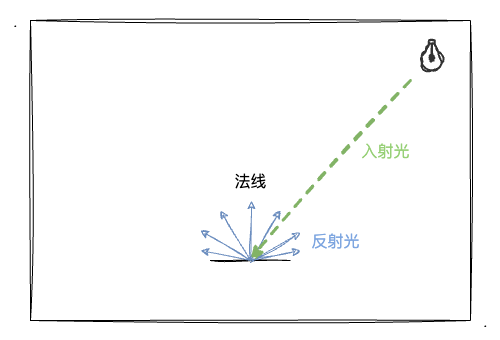
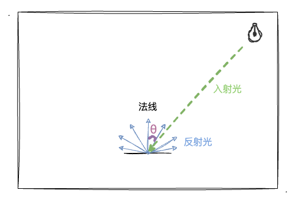
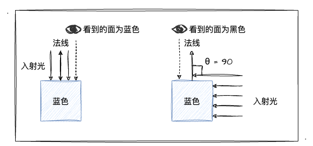
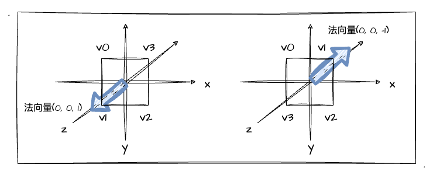
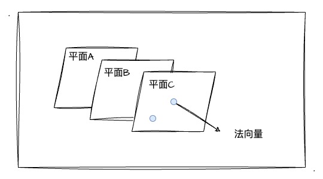

# 1. 初识光照

经过前一章节的学习，相信大家跟我一样已经初入3D的大门了，也对MVP变换有所了解了。这一章，我们开始进入跟3D图形效果息息相关的另一个知识点—— **光照** 的学习。

就我个人感觉而言，光照对3D效果的表现是非常重要的一环。回想小时候自己琢磨素描画的时候，都会通过给物体涂绘一些**阴影**效果，以此来凸显物体的**立体感**！比如我们看下图，通过对圆以及周边环境进行深浅不一的阴影处理后，一个立体的球形引入眼帘。


## 光照的本质

前文"素描画"的图中，可以发现图中既有球体的"影子"，也有各种深浅不一的**明暗面**，这些都是由于"光照"产生的效果。球的左上角因为有光照所以会比较"明亮"，而背面没有受到光照的地方相比之下便会显得暗淡无光。

当然对于这种明暗面、影子等自然现象我们是再熟悉不过的，因为这些现象充斥着我们的生活。但是不知道你是否有想象过，怎么才能把"光照"的特性代入到 WebGL 世界，让图形的 3D 效果更加逼真呢？

回顾一路上对 WebGL 的学习历程，顶点**着色器**、片元**着色器**永远是提到最多的"代名词"，或者说所有图形的绘制都逃不出shader。而我们细想"光照"带来的效果：明暗面、影子，无非都是对图形不同位置的**颜色**做一些变化和控制。讲到这里，你很容易就联想到一个东西——**片元着色器**。

没错，之前我们就知道逐片元操作正是在图形装配、光栅化后，对每一个像素绘制上颜色的过程，而"光照"带来的效果也是在"逐片元"的过程中得到的体现。所以，光照效果归根结底就是对图像每个部位颜色的控制、调节，而最终展示到屏幕上的颜色则是通过**入射光颜色、角度、和物体表面颜色**等参数**共同计算**出来的！ 所以事不宜迟，马上展开对它们的学习吧！

## 光源类型

基本光源类型可以氛围三种，如图所示：


其中，我们都可以通过不同的**参数**来定义不同光源的光照效果。
1. **平行光**。光线之间相互平行，可以用**方向**和**颜色**来定义平行光。
2. **点光源**。由点向周围发散的光（如灯泡），可以用**光源位置**和**颜色**来定义点光源。
3. **环境光**。从各光源发出后被反射到物体表面的光（周边物体反射过来的光），仅指定**颜色**即可定义环境光。

## 反射类型

当然，仅有光源是不能确定物体最终绘制的颜色，我们还需要考虑物体表面的颜色，和光的反射方向、颜色。于是，这里引入两种物体表面反射光的方式：
1. **漫反射**。反射光在**各个方向上都是均匀**的（一种理想反射模型）
2. **环境反射**。其反射光其实就是**环境入射光的反方向**

这一节，我们先重点学习**漫反射**的知识，环境反射相关内容将放在下一篇文章中讲解。

### 漫反射

相信学理科的同学对漫反射应该不陌生。物理课中我们一定学习过漫反射和镜面反射～其中，黑板就是漫反射。它跟镜面反射最大的区别就是，它的表面的不光滑的，可以将光向四面八方进行反射。而产生镜面反射的表面是光滑的，它会使光沿着同一个方向反射出去，如果入射光是一段平行光，那它反射后依然是一段平行光。



上图即为物体表面被光源照射后，产生漫反射的反射光。当反射光进入眼睛，我们便可以看见物体，并且知道它的颜色。那**漫反射光的颜色**是怎么样的呢？有以下三点：
1. **入射光颜色**。前面有提到的，定义光源参数中都有颜色参数。
2. **物体表面颜色**。物体原色，即最初片元着色器中 `gl_FragColor` 接收的颜色值。
3. **入射光与表面的夹角`θ`**。入射角为**入射光线**与**物体表面的法线**的夹角（如下图所示）。



有了以上信息，我们可以根据公式计算出**漫反射光的颜色**：

```
漫反射光颜色 = 入射光颜色 x 物体表面颜色 x cosθ
```

上述算式中，颜色乘法的计算为**各矢量之间分别相乘**，如有`RGB1`和`RGB2`，他们之间相乘的计算为： `(R1 x R2, G1 x G2, B1 x B2)`各分量相乘。

根据上述的算式，我们不难发现以下**两点特性**：
1. 当`θ`为`0°`时，入射光与表面**垂直**，`cosθ` 的**值为`1`**，此时入射光正射表面。 如果入射光为白光，那么此时我们看到的受光面为**物体的原色**。
2. 当`θ`为`90°`时，入射光与表面**平行**，`cosθ` 的值为`0`，没有入射光照射到物体表面，此时应该为**黑色**。

为了让大家更清晰的理解上述两点特性，我再通过图例和实数代入计算推导一次上述特性。首先我们看两种入射光情况的图：



简单总结上图的重点：当入射光**垂直**照射眼睛看着的面时，我们可以看到的面应该为**蓝色**；当入射光**平行**照射眼睛看着的面时（没有照射到面，`0`为`90°`），我们看到的面应该为**黑色**。这种现象其实也是符合常识的，紧接着，我们将实数代入上述公式中再次证实这种现象。

首先回顾高中学习过的 `cos` 的特殊三角函数值：

| 角度 | 0°  | 30°     | 45°     | 60°   | 90° |
|------|-----|---------|---------|-------|-----|
| cos  | `1` | `√3/2` | `√2/2` | `1/2` | `0` |

目前假设有入射光为白光 `RGB(1, 1, 1)`，物体表面为蓝色 `RGB(0, 0, 1)`。并且假设此时入射角为`0°`，也就是入射光**垂直照射**物体表面，我们可以将所有数据代入上述公式来计算反射光的`RGB`，以`R`为例：

```
R反射光 = R入射光 x R物体表演颜色 x cos0° = 1 * 0 * 1
```

显然，上述计算结果为`0`，以此类推，我们可以得知最终所有的`RGB`值为`(0, 0, 1)`，依然是物体表面原色**蓝色**。所以我们可以推导出上述的结论：入射光直射物体表面时，反射光为物体表面的原色。

于是我们还可以顺理推出，如果入射光与物体表面**平行**，此时入射角为`90°`，`cos`的值为`0`，所以入射光平行物体表面时，物体表面的反射光是**黑色**的。并且我们还可以推出，当入射光于物体表面**存在一定角度时**，反射光的颜色依然是原色，只是**相比垂直入射时会暗一些**。

### 计算入射角`θ`

这一小节，我们将一起探讨如何计算入射角`θ`。为什么说要计算入射角呢？我们不妨先回顾前文光源小节的学习，我们定义光源基本上就是定义光的**颜色、方向**或者说是**光源的位置**，并没有定义入射角`θ`相关的数据，因此这就是我们要计算出入射角`θ`的原因。

当然，这一点其实并不太难，而且之前我们也学习过，其中的核心点即是：通过矢量的**点积**计算 `cosθ`。回顾以下点积的计算公式如下图：


基于上述数学基础，我们如何计算`cosθ`呢？首先，我们假设上述的`向量a、b`是光源的入射光、物体平面的法线向量。然后，我们需要**对光源方向、法向量做归一化处理**。归一化所带来的效果就是保持向量的方向不变，将其**模长变成`1`**。在 GLSL ES 中，我们可以调用内置函数 [normalize](https://registry.khronos.org/OpenGL-Refpages/gl4/html/normalize.xhtml) 获得。（详细可以点击外链了解用法）

如此一来，因为入射光、法线都做了**归一化**处理，所以他们的**模长都为`1`**，于是可以把上述的点积计算公式简化成以下算式（以符号`·`代表点积）：

```
cosθ = 光线方向 · 法线方向
```

所以，`cosθ`就是**归一化后的光线方向和法线的点积**。于是，漫反射光颜色的计算公式为：

```
漫反射光颜色 = 入射光颜色 x 表面颜色 x (光线方向 · 法线方向)
```

## 法线

法线方向即为物体表面的朝向，**垂直于物体表面**。那么对于法线这小节的学习，我们需要掌握的关键知识点有以下：
1. 如何确定表面的法向量
2. **法向量和位置无关**，一个平面只有一个法向量。


其中第`1`点，我们根据日常的经验不难发现一个平面其实是有**两个方向**的法向量的，更直接的说应该是一个面的**正反面**。所以，我们需要确定这个面的"正反"关系以确定我们所需要的法向量。



如上图所示，一个面的正反面之分在于它的顶点绘制顺序，正面的顶点顺序为顺时针，背面看的时候为逆时针。当然，我们要确认一个面的法向量，可以直接通过"**右手法则**"来确定（四指顺着顶点的绘制顺序握拳，此时大拇指伸直的方向即为法向量）。

接着，我们来看看第`2`点，其实也很好理解，我们直接看下图：



三个**平行**的平面A、B、C和平面C中的两个不同位置的点，他们都共有**同一个法向量**。

## 实战平行光的漫反射效果

:::demo
sixth/1_1
:::

## 总结