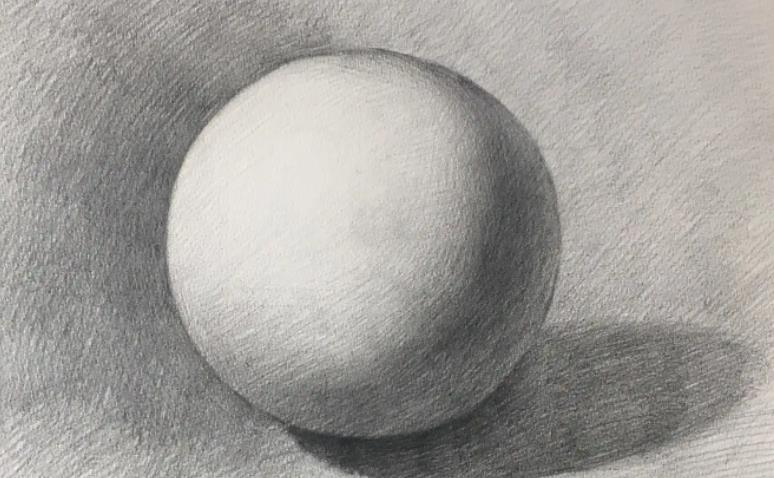
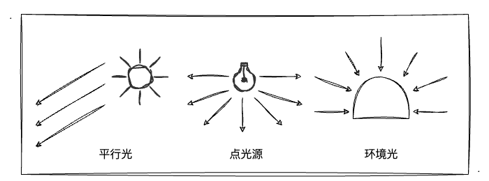
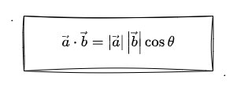

# 1. 初识光照

经过前一章节的学习，相信大家跟我一样已经初入3D的大门了，也对MVP变换有所了解了。这一章，我们开始进入跟3D图形效果息息相关的另一个知识点—— **光照** 的学习。

就我个人感觉而言，光照对3D效果的表现是非常重要的一环。回想小时候自己琢磨素描画的时候，都会通过给物体涂绘一些**阴影**效果，以此来凸显物体的**立体感**！比如我们看下图，通过对圆以及周边环境进行深浅不一的阴影处理后，一个立体的球形引入眼帘。

## 光照的本质

前文"素描画"的图中，可以发现图中既有球体的"影子"，也有各种深浅不一的**明暗面**，这些都是由于"光照"产生的效果。球的左上角因为有光照所以会比较"明亮"，而背面没有受到光照的地方相比之下便会显得暗淡无光。

当然对于这种明暗面、影子等自然现象我们是再熟悉不过的，因为这些现象充斥着我们的生活。但是不知道你是否有想象过，怎么才能把"光照"的特性代入到 WebGL 世界，让图形的 3D 效果更加逼真呢？

回顾一路上对 WebGL 的学习历程，顶点**着色器**、片元**着色器**永远是提到最多的"代名词"，或者说所有图形的绘制都逃不出shader。而我们细想"光照"带来的效果：明暗面、影子，无非都是对图形不同位置的**颜色**做一些变化和控制。讲到这里，你很容易就联想到一个东西——**片元着色器**。

没错，之前我们就知道逐片元操作正是在图形装配、光栅化后，对每一个像素绘制上颜色的过程，而"光照"带来的效果也是在"逐片元"的过程中得到的体现。所以，光照效果归根结底就是对图像每个部位颜色的控制、调节，而最终展示到屏幕上的颜色则是通过**入射光颜色、角度、和物体表面颜色**等参数**共同计算**出来的！ 所以事不宜迟，马上展开对它们的学习吧！

## 光源

基本光源类型可以氛围三种，如图所示：

其中，我们都可以通过不同的**参数**来定义不同光源的光照效果。
1. **平行光**。光线之间相互平行，可以用**方向**和**颜色**来定义平行光。
2. **点光源**。由点向周围发散的光（如灯泡），可以用**光源位置**和**颜色**来定义点光源。
3. **环境光**。从各光源发出后被反射到物体表面的光（周边物体反射过来的光），仅指定**颜色**即可定义环境光。

## 反射类型

当然，仅有光源是不能确定物体最终绘制的颜色，我们还需要考虑物体表面的颜色，和光的反射方向、颜色。于是，这里引入两种物体表面反射光的方式：
1. **漫反射**。反射光在**各个方向上都是均匀**的（一种理想反射模型）
2. **环境反射**。其反射光其实就是**环境入射光的反方向**

这一节，我们先重点学习**漫反射**的知识，环境反射相关内容将放在下一篇文章中讲解。

### 漫反射

相信学理科的同学对漫反射应该不陌生。物理课中我们一定学习过漫反射和镜面反射～其中，黑板就是漫反射。它跟镜面反射最大的区别就是，它的表面的不光滑的，可以将光向四面八方进行反射。而产生镜面反射的表面是光滑的，它会使光沿着同一个方向反射出去，如果入射光是一段平行光，那它反射后依然是一段平行光。

漫反射光颜色取决：
1. 入射光颜色
2. 物体表面颜色
3. 入射光与表面的夹角`θ`。入射角为**入射光线**与**物体表面的法线**的夹角。

漫反射颜色 = 入射光颜色 x 表面颜色 x `cosθ`（颜色相乘为各矢量之间相乘）

当`θ`为0度时，入射光与表面**垂直**，`cosθ` 的值为`1`，正射表面。
当`θ`为90度时，入射光与表面**平行**，`cosθ` 的值为`0`，没有照射到物体表面，为黑色（符合常识）。

### 环境反射

环境反射的入射光，可以看作是漫**反射光方向的反方向**。环境光照射物体各方向均匀，强度相等。

环境反射光 = 入射光颜色 x 表面基底色

同时存在漫反射和环境反射，物体的最终表现颜色为二者之和。

表面反射光颜色 = 漫反射颜色 + 环境反射颜色

### 计算入射角`θ`

核心：通过矢量的点积计算 `cosθ`。如下点积的计算公式：

cosθ = 光线方向 · 法线方向

漫反射颜色公式变换：
漫反射颜色 = 入射光颜色 x 表面颜色 x (光线方向 · 法线方向)

注意点：
1. 光线方向矢量、法线方向矢量需要**归一化**处理。
2. 光线的方向为入射方向的**反方向**。

## 法线方向

法线方向即为物体表面的朝向。

**法向量和位置无关**。比如一个平面的所有点的法向量都是同一个。

:::demo
sixth/1_1
:::

## 总结