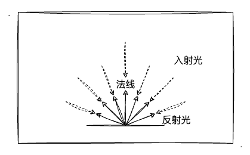

# 2. 环境光的漫反射

上一节的学习中，我们初步认识了光照并实战了平行光的漫反射效果，并且在文章的最后我也留下了一个疑问：现实中即使光线直射垂直`X`的面，但其余的面应该不至于是纯黑色的吧？所以这一节，我们就一起来探讨一下这个问题，看看环境光的漫反射如何让我们的立方体更加贴近现实。


## 环境反射

在上一节的学习中，我只提到了漫反射（针对平行光、点光源），但其实环境反射也是光照反射类型的一种。环境反射，由于没有特定的入射光源，所以直接就可以认为环境反射的反射光为入射光的反方向。如下图所示：



再回顾上一节学过的**环境光**的定义，**只需要定义颜色即可**，所以相比平行光来说要简单一些。我们看一下环境光如何计算求出：

```
环境反射光颜色 = 入射光颜色 x 物体表面颜色
```

上述等式即为求出环境反射光的公式了，相比平行光的漫反射光计算也是简化了不少。我们只需要知道**入射光颜色**，也就是我们定义的**环境光颜色**就可以了，接着就是跟物体原色之间的`RGB`的乘法了。

如果说一场景同时存在漫反射和环境反射，那物体最终被眼睛看到的反射光颜色呢只需要将**两种类型的反射光颜色相加**即可。公式如下：

```
反射光颜色 = 漫反射光颜色 + 环境反射光颜色
```

所以，当我们给上一节的示例程序添加多一种反射类型，会不会有不一样的效果呢？特别是当**光线垂直照射垂直`X`轴的平面时**，另外的两个面还是不是纯黑色呢？我们接着往下进入实战环节。

## 实战漫反射和环境反射


