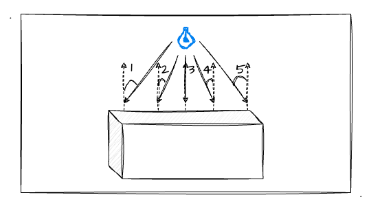
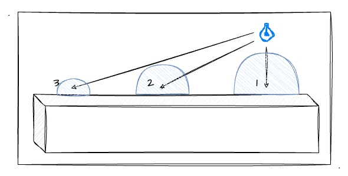
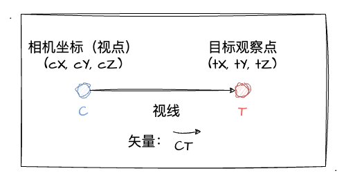
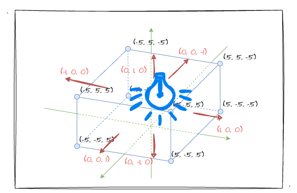

# 3. 初识点光源

前面两节，我们学习并实战了平行光、环境光的光照效果，了解了计算漫反射光、环境反射光的公式，这一节我们来学习另外一种光源类型——**点光源**，并且实战点光源的光照效果。let's go！

## 点光源

简单回顾下之前对点光源的介绍："**点光源**。是由点向周围发散的光（如灯泡），可以用**光源位置**和**颜色**来定义点光源。"没错，在点光源的定义中，跟另外两种光源也不一样，它的特别之处在于**光源位置**的定义。

因为点光源是**从一个位置发散开**的，所以它照射到物体表面的时候，**入射角都是不唯一的**，这也是跟平行光最大的区别。比如我们看下图：



途中比较明显的是入射角`1-5`都不完全相同，随着**光的发散**，点光源照射到物体表面的**入射角是越来越大**的。那么基于之前对于**反射光颜色**的计算公式跟**入射角**的关系，我们可以分析出随着光源的发散，物体表面的颜色会逐渐暗淡。

因此可以得出结论：**漫反射光的强度随着入射角的增大而减小**。其实这样符合生活常识，当我们开灯的时候，离灯光越远的物体就越暗。为了加深对结论的理解，我把上述的图稍微改造一下：



上图中，蓝色的半圆代表反射光的强度，**半圆越大，反射光越强**，也就是说我们看到的物体也就越明亮。`点3`距离灯泡最远，所以它的入射角越大，反射光的强度也就越小，所以它也是三个点中光线最暗的，还是比较符合现实场景的。

## 实战点光源的漫反射

回顾之前学习过的平行光的漫反射，很容易就联想到漫反射光的计算公式：

```
漫反射光颜色 = 入射光颜色 x 表面颜色 x (光线方向 · 法线方向)
```

根据上述公式，我们便实现了平行光照下物体的各个表面的光照表现。此时我们分析一下，上述公式中的相关要素，在点光源中都是具备的，除了**光线方向**。我们定义平行光的时候会定义光线的防线，但是回到点光源上，我们并未**直接定义**光线方向，但是我们拥有点光源的位置坐标。

所以，我们只要能得到点光源照射到不同平面点上的光线方向，就可以计算出对应的漫反射光颜色了！于是我们首先看一下，如何确定**点光源的光线方向**？其实这一点我们并不陌生，回顾之前我们**推导视图矩阵**的时候，我们是如何计算视线（Z轴）的？



如上图所示，之前的视图矩阵中，我们已知两个点：相机位置点和观察目标点，于是我们便可以通过后者减去前者求出**视线向量**，这也就是**两点所在直线**的一个**方向向量**。同理，在点光源中，我们有已知的物体**顶点坐标**和**坐标点光源**，因此我们可以以同样的方式求出光线的方向向量。

分析完如何求得点光源不同方向光照的光线方向后就可以进入实战环节了。这里，我们依然以之前的 demo 为基础进行一定的修改，主要跟大家看一看顶点着色器上的一些改动，相同的部分就不再赘述了。

```GLSL
attribute vec4 a_Position;
attribute vec4 a_Color;
attribute vec3 a_Normal;
varying vec4 v_Color;
uniform mat4 u_MvpMatrix;
uniform vec4 u_LightColor; // 入射光颜色
uniform vec3 u_LightPosition; // 点光源位置
uniform vec4 u_AmbientColor; // 环境光颜色

void main () {
gl_Position = u_MvpMatrix * a_Position;
vec3 normal = normalize(a_Normal);
    // 求出当前顶点对应的光线方向（两向量相减）
    vec3 lightDirection = normalize(u_LightPosition - vec3(a_Position));
    // 求光线、法向量点积
    float dotProduct = dot(normal, lightDirection);
    vec4 ambient = a_Color * u_AmbientColor;
    // 带入漫反射光的颜色计算公式求出反射光颜色
    vec3 colorRes = vec3(u_LightColor) * vec3(a_Color) * dotProduct;
    v_Color= vec4(colorRes, a_Color.a) + ambient;
}  
```

如上代码块，大部分代码应该都比较熟悉了，跟之前有所不同的是这里没有直接定义光线方向了，取而代之的是 `u_LightPosition` 变量，它是用来存放点光源位置的。并且在 `main` 函数中，通过两矢量相减求出当前顶点对应的光线方向（详细参考上述代码块）。最后依然是通过漫射光的计算公式求出漫反射光颜色并传递给片元着色器。

其他的基本跟之前的一样，并且我们还是以同样的相机位置（处于立方体的右前上角）对立方体进行观察。并且，我打算把光源的初始位置设置在立方体的右前上角，如下图所示：



如上图，我们大概可以猜测到大致的光照效果。离灯泡近的（立方体的右前上角）会是最明亮的，逐渐远离灯泡的地方会逐渐暗淡。接来下，我们就直接通过示例程序来验证一下我们猜想的光照效果吧：

:::demo
sixth/3_1
:::

如上示例程序，确实是立方体的一个角更明亮，其余地方逐渐变得暗淡（为了让**图形观感更立体**，初始值`x、y、z`我特意设置了一点差距，大家可以自行将他们都设置成`1`看看效果）。这里，我们可以拿之前的平行光照下的示例程序效果来对比一下。


好吧，还是跟之前一样，大家可以通过拖动滑块来改变灯泡的位置以观察不同的光照效果。

最后，我留下一个疑问点，不知道大家有没有注意到，本文对于**点光源的颜色计算我们是放在顶点着色器的**。这样会有什么样的问题吗？仔细回想一下之前我们学 `varying` 变量；学习**内插**的过程；甚至是实战第一个立方体的时候；你是否突然感觉到**用顶点着色器来处理点光源是有点不足**的呢？

对立方体的每个表面来说，用不同的顶点跟点光源位置计算出来的**光线方向是不同**的。换句话说，立方体每个面的**四个点颜色不完全一致**，最终在片元着色器**逐片元操作时，会存在"内插"的处理**，这样会导致立方体的表面存在"系统"行为的渐变处理过程，它并不完全是光照效果带来的。简单点说，就是效果不够逼真、贴切！

当然，你暂时感受不到这一点也没关系，我会在后续的更文中更详细的说明这一块的相关内容。

## 总结

本文的最后，跟大家一起回顾本文的主要内容：
1. 点光源的**漫反射光的强度**随着入射角的增大而减小。也可以说距离越远就越暗。
2. 使用**两矢量坐标相减**求出每个顶点上的入射光方向。
3. 同样使用**漫反射光计算公式**求出点光源的漫反射光颜色。
4. 使用**顶点着色器处理点光源的光照效果**会在逐片元过程出现"内插"处理，光照表现效果并不是最佳的。
