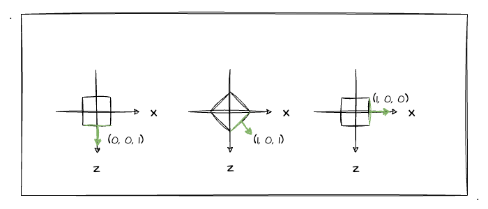

# 4. 光照与旋转

经过前面三节的学习与实战，相信大家对光照已经有所了解了，并且也知道平行光、环境光、点光源的一些光照效果了。但是不知道在之前的学习中你有没有想过一个**法向量相关**的问题，法向量在不断变化中的光照效果应该如何处理？

大家都知道，求点光源、平行光的**反射光颜色都跟法向量**有关（求入射光的夹角），但是之前的物体都是静止的。如果说现在有一个物体会有一个**自转**的动画，这个时候还按照之前的方式求反射光颜色还是我们预期的效果吗？

## 物体发生旋转会怎么样

其实我们大概可以猜出，当物体旋转时（以立方体为例），其中的某几个面的法向量是一直都在发生改变的。这样一来，再按照之前的反射光计算公式直接计算的话，可能就不是我们预期的效果了。

光说是不行的，我们直接通过一个实际的案例来看看效果会怎么样吧。这里我接着沿用上一节的实战案例——点光源的光照效果，并且在其基础上，给物体新增一个旋转的动画效果。

关于变换效果大家应该都很熟悉了，原理就是将**顶点坐标左乘旋转矩阵**即可，并且在当前这么多库的基础上，我们直接调`api`就行了。简单地看看实现代码：

```js
const animation = () => {
  // 设置绕 y 轴旋转，每次旋转 1 度
  baseMvpMatrix.rotate(1, 0, 1, 0)
  // 将新计算的 mvp 矩阵传入缓冲区
  gl.uniformMatrix4fv(u_MvpMatrix, false, baseMvpMatrix.elements)
  // 清除缓冲区数据
  gl.clear(gl.COLOR_BUFFER_BIT | gl.DEPTH_BUFFER_BIT)
  // 重新绘制
  gl.drawElements(gl.TRIANGLES, indices.length, gl.UNSIGNED_BYTE, 0)
  animationId = requestAnimationFrame(animation)
}
```

其实代码并不复杂，写了了一个基于 `requestAnimationFrame` 的运动函数，每次执行的时候会绕`y`轴顺时针旋转`1`度。直接通过示例程序看看效果吧：

:::demo
sixth/4_1
:::

当我们开启旋转动画时，可以发现这个点光源的光照效果会有些奇怪。明明光源的位置没有发生改变，但是**当立方体的背面转到点光源处时依然处于黑暗状态**。如下 gif 所示：


对于这一点我们也许并不意外，因为我们知道当前的反射光颜色是按照立方体初始化时候的法向量来计算的，所以只要我们的法向量没有随着旋转做相应的变化，立方体的表面颜色也不会发生变化。（感兴趣的同学可以套反射光计算公式自行推导一下）

## 旋转物体光照的正确打开方式

由前文的 demo 我们知道，若不根据物体变换后的位置**重新计算法向量**，此时立方体的光照效果是很奇怪的。所以这一小节，我们来看看如何让物体在旋转中依然有正常的光照效果。

首先，我画了个立方体的俯视图，以此来跟大家一起分析一下立方体在旋转后法向量的变化：



很显然，立方体在每次的旋转中，某几个面的法向量都在发生变换。如图中标了绿色的面，他的法向量随着旋转角度的变化也在不停的变化。
