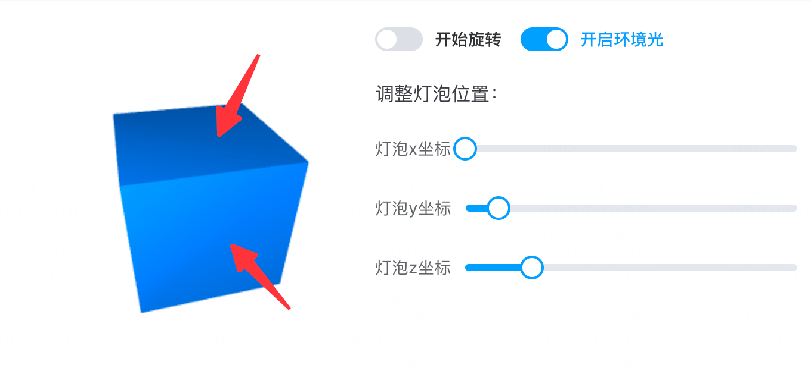
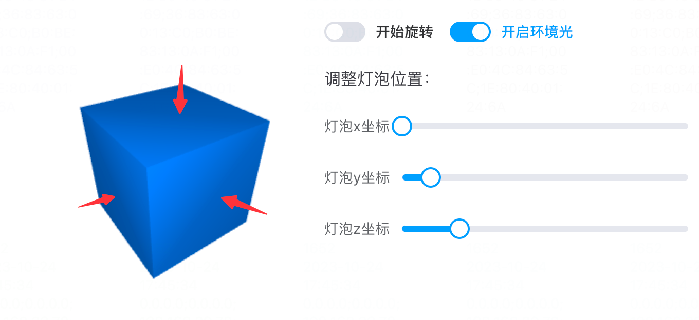
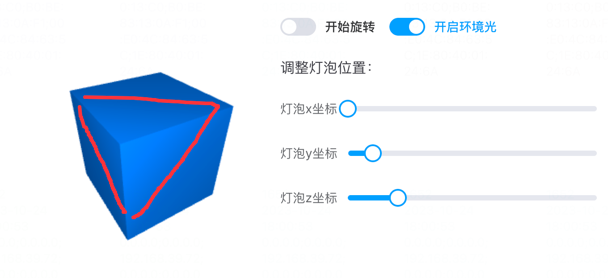
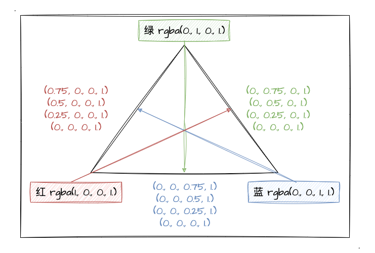
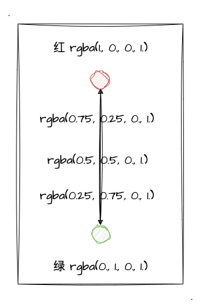

# 5. 逐片元的点光源

前面我们已经对点光源的光照效果进行初步学习和实战了，也亲自体验了一番点光照效果！但是你是否还记得之前我留下的一个问题——**用顶点着色器来处理点光源是有点不足**呢？没错，这一节我们就从这一问题出发，深入理解它的不足，并且想办法通过更优的方式来实现点光源的光照效果。

## 逐顶点的不足

之前的 [初识点光源](/content/六、WebGL光照/3.%20初识点光源.html) 中，我在文章结尾部分大概分析了一下逐顶点实现点光源的不足，一句话概括就是：**"内插"的作用下的点光源光照效果并不自然**。不过仅仅一句话很难让初学者get到它的点，所以这里，我决定通过上一节的示例程序来让大家深刻体验一下逐顶点实现的点光源光照效果的不足。

:::demo
sixth/4_2
:::

可能拥有想素颜的你早已发现，点光源关照效果的**直线**感会很强。如上的示例程序，你认真看关照效果**从亮到暗过度的地方其实是比较生硬的直线**。当立方体旋转起来的时候，依然可以看到比较生硬的光亮面和暗面的衔接效果，比如下图：

如果说此时的你没有发现有什么直线的过度区域，不要紧，因为我是要给你做对比的。当然啦，上图已经有一些直线感了...就是在我用箭头指向的地方。接着我们再看看当立方体的旋转角度再增加了一点的时候，如下图所示：

这样看是不是就比较明显了呢？我直接把生硬的部分划出来，可能就更清晰了：

看到这里，如果你再回去仔细地观察示例程序，在旋转到某些角度时，你一定会发现生硬的过度效果，因为真的有点明显！产生这种生硬过度效果的原因便是内插过程，因为不同顶点有不同的颜色值，所以最终绘制出来的平面的颜色，是各顶点之间内插后的效果。

想详细了解内插行为的可以看我之前写的文章——[为什么会出现颜色渐变](/content/三、WebGL颜色和纹理/2.%20为什么会出现颜色渐变.html)，该文章较为深入的讲解了内插的产生和效果。这里我附上两张图，帮即将遗忘内插的同学做一个快速回顾～

## 实战逐片元光照

其实我们之前有大概了解过图形的渲染流程，如下图所示：

由上图可知，片元着色器会对把光栅化后的每一个像素点进行着色，这也给我们提供了**对每一个像素点进行光照效果计算**的可能。详细了解依旧可以戳 [为什么会出现颜色渐变](/content/三、WebGL颜色和纹理/2.%20为什么会出现颜色渐变.html) 这篇文章。

所以对于逐片元的光照效果，我们需要把之前对光照的计算**从顶点着色转移到片元着色器**中来，这是最关键的一步。由此一来，顶点着色器需要向片元着色器传递诸如法向量、`varying`坐标等数据，这样片元着色器就具备计算光照颜色的条件了。

:::demo
sixth/5_1
:::
