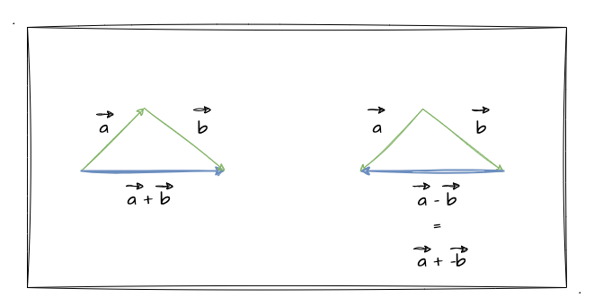
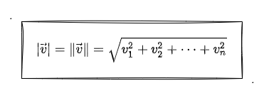
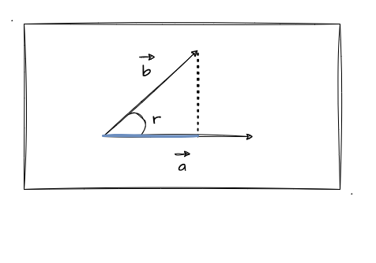
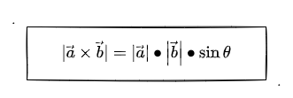
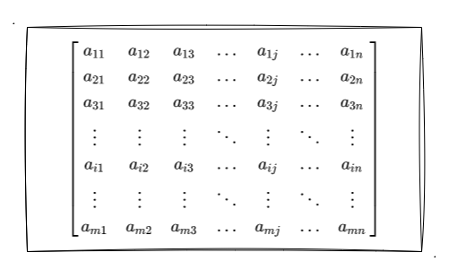
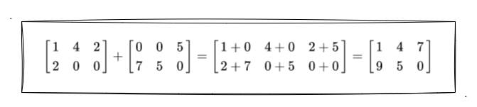
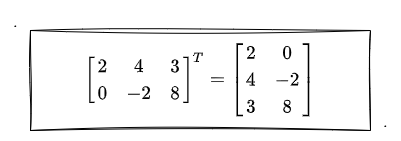
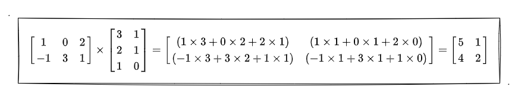
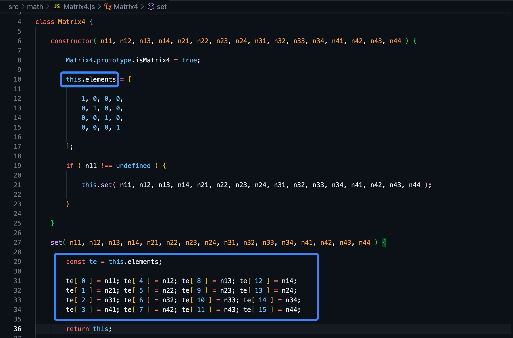

# 2. 图形学的数学基础

上一小节我们初步接触了图形的二维变换，实现了三角形的平移、缩放、旋转。但不知道大家有没有发现，每实现一种图形变换我们都需要**重新实现一次对应的顶点着色器**，简单来说就是 **`gl_Position` 的赋值等式都在变化**，一时加、一时乘、一时三角函数公式...

其实这一切不同的计算等式，我们都可以借助 **矩阵** 来帮我们进行简化！那矩阵是什么呢？怎么用，怎么简化我们的着色器代码呢？好，带着这些疑问，这一节我们暂时放下 WebGL 的学习，先来补一补在图形学当中也非常重要的一些数学基础知识——矢量、矩阵。

> 当然本文的内容比较干...可能会让大家觉得枯燥和难理解。如果是这样，那么我建议大家可以**结合下一小节的内容**进行学习，或者直接学习下一小节的内容，碰到相关的数学知识再返回本文进行补充学习。

## 认识矢量

在 [维基百科](https://zh.wikipedia.org/wiki/%E5%90%91%E9%87%8F) 中是这么介绍矢量的：

> 向量（英语：**vector**），物理、工程等也称作**矢量** 、欧几里得向量（Euclidean vector），是数学、物理学和工程科学等多个自然科学中的基本概念。指一个**同时具有大小和方向**，且满足平行四边形法则的几何对象。

这里我们顺便注意一下一个英文单词——**vector**，是不是有点像我们见过的 `vec4` 的类型呢？其实对于概念这东西，大致了解就好，我们更主要的是知道怎么把矢量应用到开发工作中，并且要了解关于矢量的一些运算法则～

### 回顾矢量在 WebGL 中的应用

说到这一点，我们并不陌生。回顾之前在编写着色器代码时用过的 `gl_Position`、`gl_FragColor` 等，他们都是 `vec4` 类型的内置变量。这里回顾一下 `vec4` 类型，它表示由 `4` 个浮点数组成的**矢量**！（忘了的赶紧回到 [第二章-顶点着色器](/content/二、WebGL基础/2.%20WebGL绘制点.html#_1-顶点着色器) 温习一下）

这个矢量对于 `gl_Position` 来说，它代表了三维空间中的坐标点的信息；对于 `gl_FragColor` 来说它代表了颜色的 `RGBA` 值。

对于坐标、或者颜色等这类的矢量值，我们在 GLSL 中可以通过 **点操作符 `.` 配合 `key` 值来访问到对应分量的值**。这一点之前没有正式介绍过，不过有看过一些示例程序代码的你可能早就已经发现了！比如在讲锯齿消除实战的文章中有用到 `gl_FragCoord.x` 来获取片元着色器中当前片元的 `x` 值；上一小节实战三角形旋转的时候也通过 `a_Position.x` 来获取对应的顶点坐标值。

讲到这里，你已经对 WebGL 中矢量的应用有一定的了解了，那接下来我们就开始了解一些关于**矢量的运算法则**，毕竟这个在我们以后的开发过程中是会经常碰到的！就好比上一节中实战的三角形平移，就用到了**矢量之间的加法运算**；实战三角形缩放，就用到了**矢量和标量的乘积**......

## 1. 矢量加减法

其实对于矢量的加减法我们应该并不陌生，只是大家可能已经忘得差不多了。我们通过下图来看看矢量在空间中的加减法的表示：



上图是不是非常熟悉，以前绝对见到过！可以看到当 `矢量a` + `矢量b` 可以得到一个新的矢量；当 `矢量a` - `矢量b` 时，同等于 `矢量a` 加上了一个**反方向**的 `矢量b`。

那么其实在算数层面，矢量的加减法则跟标量的是一样的。之前的文章也有使用过**矢量的加减法来实现图形的平移效果**，直接看等式吧：

```C
// vec3 类型相加
vec3(x1, y1, z1) + vec4(x2, y2, z2) = vec3(x1 + x2, y1 + y2, z1 + z2)
// vec4 类型相加
vec4(x1, y1, z1, w1) + vec4(x2, y2, z2, w2) = vec4(x1 + x2, y1 + y2, z1 + z2, w1 + w2)
```

上述代码块看到了熟悉的坐标矢量相加，但注意我特地例举了 `vec3` 、`vec4` **两种类型之间相加**，所以这里我们要注意的一点就是：矢量的加减法要在**同类型的矢量**中运算。那么矢量的减法我就不在这里演示了，就如上文提到的，把减去的矢量**取个反方向**，再相加就是矢量之间的减法了。

当然，矢量加法也满足以下定律：
- 交换律： `矢量a` + `矢量b` = `矢量b` + `矢量a`
- 结合律： (`矢量a` + `矢量b`) + `矢量c` = `矢量a` + (`矢量b` + `矢量c`)

## 2. 矢量乘法

### 单位矢量

单位矢量是大小为**单位长度**的矢量，并且它就是这个方向上的**单位矢量**。

上面提到 **单位长度** ，我们先简单过一下**矢量长度**怎么算。其实他的计算公式跟勾股定理很像的（两条直角边的平方相加 = 斜边的平方），但是它不要求是直角三角形这个硬条件而已！公式如下：



在三维坐标系中，`i(1, 0, 0)`、`j(0, 1, 0)`、`k(0, 0, 1)` 分别为 `x`、`y`、`z` 轴上的单位矢量。

### 标量乘矢量

标量乘矢量我们并不陌生，其实在实现三角形缩放的时候我们已经用过了！其实就是把标量跟矢量中的每个分量相乘，得到一个方向相同或者相反，大小是 n 倍的矢量。

他们的等式如下：
```C
n * vec4(x, y, z, w) = vec4(nx, ny, nz, nw)
```

### 数量积（点积）

在讲数量积之前，先前置一个知识点：数量积和矢量积（下问会讲到）的根本区别是**数量积的结果是普通的标量；矢量积的结果仍然是矢量**。哈哈哈，其实通过他们的命名就能猜到了是吧？

数量积也叫 [点积](https://zh.wikipedia.org/wiki/%E7%82%B9%E7%A7%AF) ，是**两矢量相乘后得到一个标量结果的乘法**。那他们的 [等式关系](https://zh.wikipedia.org/wiki/%E5%90%91%E9%87%8F) 为（推荐大家戳维基百科看公式）：


看公式很容易懵，我再通过画图来加深大家对数量积的理解和记忆：



如图所示，`矢量a` 和 `矢量b` 的夹角为 `θ`。根据数量积公式可以推出：`矢量b的长度 * cos(θ)` 这个的值就等于图中标**蓝色线**的长度。因为 `cos` 是**邻边比斜边**，刚好乘上 `矢量b的长度` 可以抵消分母，最后剩余**邻边的长度**。

所以基于此我们可以推出上述数量积公式即为求：
- `矢量b` 在 `矢量a` 上的 **投影长度** 与 **`矢量a`长度** 的 **乘积**（即蓝色线段长度 * `矢量a`的长度）

我们也可以推导出，如果 `矢量b` **垂直于** `矢量a`，那么结果就是 `0`！

### 矢量积（叉积）

矢量积又称 [叉积](https://zh.wikipedia.org/wiki/%E5%8F%89%E7%A7%AF) ，是向量跟向量之间的乘积，但它的**结果依然是矢量**（前面也有提到）。并且两个矢量的乘积跟这两个矢量所在的平面**垂直**。如下图所示：


这个时候有同学就会问了，你是怎么判断垂直的方向呢？如上图所示，正面朝上是垂直，那朝下不也是垂直吗？所以，当我们要在三维空间中决定叉积的朝向时，需要根据当前所采用的坐标系法则来判断。

比如上图中，我们采用的是右手坐标系，此时我们伸出右手，当右手的四指从`a向量`以**不超过180度**（图中的`θ`角度）的转角转向`b向量`时，大拇指的方向为叉积向量的方向。同理，左手坐标系也是以此方式来推理。

那么**叉积的长度**和以这两个向量为边长的**平行四边形面积**相等。由此可以推出以下等式：



并且由此我们可以推出，当两矢量之间是垂直的，也就是 **`θ` 为 `90` 度角**，那叉积的长度其实就等于**长方形的面积**，也就是两矢量长度的乘积。

## 认识矩阵

其实**矩阵**对于图形学来说是很重要的一个**数学工具**。我们看看维基百科是如何介绍 [矩阵](https://zh.wikipedia.org/wiki/%E7%9F%A9%E9%98%B5) 的：

> 数学上，一个 _m x n_ 的矩阵是一个有 _m_ 行（row） _n_ 列（column）元素的矩形阵列。矩阵里的元素可以是数字或符号甚至是函数。

我们可以通过下图看看矩阵到底长啥样：



如上图所示，矩阵其实很像一个二维数组，比如一个三行三列的二维矩阵如下所示：
```js
const array = [
  [1, 2, 3],
  [4, 5, 6],
  [7, 8, 9]
]
```

## 1. 矩阵基本运算

### 矩阵的加减法

简单认识了矩阵之后，我们来看看矩阵的加法。其实矩阵的加减法非常简单，就是每个位置的元素之间进行加减法操作即可。所以，矩阵的加减法有一个前提条件： **大小相同（行数列数都相同）的矩阵之间可以相互加减**。

比如这里我们看 [百度百科](https://baike.baidu.com/item/%E7%9F%A9%E9%98%B5/18069#3_1) 中一个矩阵加法的示例：



就如介绍中所说的那样，每个位置的元素之间进行相加就可以了。减法亦是如此，就不再展开了。

### 矩阵的转置

转置即为将一个 `矩阵A` 的**行列互换**后得到一个新的矩阵，这个矩阵就是 `矩阵A` 的转置矩阵。



如上图所示，将原矩阵行列互换后得到它的转置矩阵。

## 2. 矩阵乘法

关于本文的其他内容你都可以随便看看，但是这一小节就得**认真一点**了。因为矩阵乘法是在后续实战**二维图形复合变换**中就要用到的知识点！也是我在文章开头就有提到的，我们通过矩阵来代替上一节实现三角形二维变换的数学公式来简化着色器中的计算操作。

先看看百度百科对 [矩阵乘法](https://baike.baidu.com/item/%E7%9F%A9%E9%98%B5/18069#4) 的描述：

> 两个矩阵的乘法仅当第一个矩阵A的列数和另一个矩阵B的行数相等时才能定义。如A是m×n矩阵和B是n×p矩阵，它们的乘积C是一个m×p矩阵

具体表现如下图所示（沿用百度百科的案例）：



案例中，**矩阵1（`3`行`2`列）** 和 **矩阵2（`2`行`3`列）** 相乘后得到一个 **矩阵3（`2`行`2`列）**。关于这个计算公式，一定要理解好了，因为后面的图形符合变换的实战就会用到！

接着我们再了解一些关于矩阵乘法的特性：
- 结合律：`(AB)C = A(BC)`
- 分配律：`C(A + B) = CA + CB`

注意，矩阵乘法**不满足交换律**。

## WebGL中的矢量和矩阵

从数学层面大致了解了 矢量 和 矩阵 后，我们回到 WebGL 中，稍微了解下他们在 WebGL 中应用。

其实 GLSL ES 支持多种**矢量**类型。比如我们曾相当熟悉的顶点坐标 `gl_Position` 、片元颜色 `gl_FragColor` ，他们的值都是 **`vec4`** 类型，也就是一个具有 4 个浮点数元素的**矢量**。那其实还有诸如 `ivec[2-4]`、`bvec[2-4]` 类型的矢量，他们分别代表具有 [2-4] 个 整型、布尔值 的矢量。

目前位置，对于 GLSL 中的**矩阵**我们应该是比较陌生的，因为我们还没有正式的使用过它。在 GLSL 中，有 `mat[2-4]` 几种类型矩阵（可以跟 `vec[2-4]` 类型来联合理解），分别代表 `2x2`、`3x3`、`4x4` 的矩阵。

### 内置构造函数

在 GLSL 中，我们可以通过**内置函数** `vec*` 和 `mat*` 来创建**矢量**和**矩阵**。比如我们创建一个 **`vec4`** 类型的顶点坐标我们可以：
```C
vec4 a_Position = vec4(1., 1., 1., 1.)
```

比如我想构造一个 `2x2` 的**单位矩阵**我可以这样写：
```C
mat2 m2 = mat2(
  1., 0.,
  0., 1.
)
```

我们通过在**矩阵**中传入**矢量**，那么将创造一个**列主序**的矩阵：
```C
// c1 代表第一列
vec2 v2_c1 = vec2(1., 2.)
// c2 代表第二列
vec2 v2_c2 = vec2(3., 4.)
// 创造矩阵
mat2 m2 = mat2(v2_c1, v2_c2)
/*
    1., 3.
    2., 4.
*/
```

### js中的矩阵及运算

可能有的同学会想到，我有可能通过 js 来创建、执行相关矩阵运算后再将值传递给到 GLSL ，那在 js 中要怎么实现呢？

其实对于大前端来说，业界最不缺的就是**第三方库**了！关于在 js 中创建、操作矩阵，我们可以不用想得那么复杂，找一个第三方库来用就好了，剩下的工作无非就是调调 api。

比如我们来看看 WebGL 的学习标杆库 [`three.js` 中的源码](https://github.dev/mrdoob/three.js)，可以找到它内部自己实现了 `Matrix4` 的类（路径：src/math/Matrix3/4.js）。简单的看看 `constructor` 的源码：



构造函数可以用传入自身中的 16 个数字参数，创建一个 `4x4` 的矩阵并放到 `this.elements` 中。当然这些我们也可以自己实现，只需要根据相关的数学公式，在 js 中对一些矩阵的运算（矩阵乘法、转置...）进行封装，就可以了。不过就简化我们开发中需要用到的矩阵运算的一些工作量而言，使用外界封装好的库是最便捷高效的。

我之所以要提一嘴这个，只是为了**降低大家的心智负担**，不需要把 WebGL 中数学知识这一块看得太难，很多时候开发过程中我们可以通过一些库来帮我们简化开发工作。所以我们理解好一些基础的数学知识就可以了，不用有太大的心智负担。

## 总结

那么本文我们初步的认识（或者说回顾）了矢量和矩阵，了解了一些关于他们的基本运算方面的知识。但其实这类数学知识很难通过一篇文章就能将其介绍得明明白白，而且光学他们我们也很容易让人感觉到疲劳，毕竟真的很抽象和枯燥。

我个人感觉还是先以**了解基础概念为准则**即可，后续在**相关场景**要用到他们的时候，再往**需要用到的地方进行深入学习、研究**。比如说在实战三角形**平移**的时候，我们就有必要去深入了解到**矢量之间的加减法**；在实战三角形**缩放**的时候有必要了解**标量跟矢量的乘法**。当我们知道这些数学知识的应用场景后，再深入学习，往往会有更好的理解和更深刻的印象！
