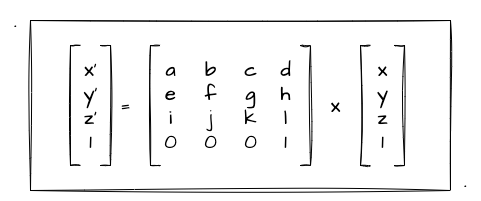

# 3. 用矩阵实战图形变换

上一小节我们初步接触了数学相关的矢量、矩阵的基础知识，但是我们并不清楚学了有什么用，特别是矩阵！现在学 WebGL 也有一段时间了，期间好歹接触过矢量的应用，但矩阵是真的一次都没有！那么这一节，我们就来探索一下图形变换和矩阵之间的巧妙联系吧！

## 为什么要用矩阵？

回顾前一小节，我们的三角形平移、旋转是怎么做的？简单概括其本质就是通过**一定的计算公式**来**改变顶点坐标**的位置，然后再重新绘制图形来实现的。比如我们来看看**平移**的核心代码实现：

```js
const vertexCode = `
  attribute vec4 a_Position;
  attribute vec4 a_Color;
  varying vec4 v_Color;
  uniform vec4 u_Position;

  void main () {
    // 通过两矢量相加实现平移
    gl_Position = a_Position + u_Position;
    v_Color= a_Color;
  }
`
```

上述 vertex 代码中，我们通过两个 `vec4` 类型的数据相加来实现三角形的平移。那么经过上一节的学习，我们已经清楚的知道它的本质就是两个矢量相加，得到一个新的顶点坐标来实现的平移效果。

紧接着我们看看**旋转**的 vertex 核心代码实现：

```js
const vertexCode = `
  attribute vec4 a_Position;
  attribute vec4 a_Color;
  varying vec4 v_Color;
  uniform float u_Rotate;

  void main () {
    // 套用转轴公式计算旋转一定角度后的顶点坐标
    gl_Position = vec4(
      a_Position.x * cos(u_Rotate) - a_Position.y * sin(u_Rotate), 
      a_Position.x * sin(u_Rotate) + a_Position.y * cos(u_Rotate), 
      0., 
      1.
    );
    v_Color= a_Color;
  }
`
```

这一段代码的计算公式比起平移算是复杂了一点，不过还是可以看出，这里我通过转轴公式来计算旋转后的 `x`、`y` 值。

上面两段 vertex 代码**分别**实现了平移、旋转的二维变换，那如果此时又要实现一次缩放的变换效果，那我又得再写一次 shader！不过你可能也会觉得，基本变换就那几个，平移缩放旋转，统统都实现一个 shader 也不是不可以接受！但你有没想过，目前我们旋转只是绕 `z` 轴实现的，如果要实现一个绕 `y` 轴的旋转，也就是**翻转效果**，那又得再写一个...

而且上述的场景仅仅只涉及到**单一的二维变换**，如果我们需要实现一个**既旋转又平移**的效果呢？总不能把所有**组合的变换效果**都实现一遍吧！那有没有办法能简化这一步呢？比如我们就实现**一种着色器代码**，通过**传入一些不同的参数**来实现不同的变换效果，甚至是复合变换呢？

答案是可以的，这个时候我们就需要我们陌生又熟悉的数学工具—— **矩阵** 来帮助我们了。这也是为什么说矩阵很适合图形学，我们接着往下一探究竟吧～

## 矩阵的应用推导

我们这一小节的重点，就是要明白如何使用**矩阵**来**代替**我们的**数学公式**实现图形的二维变换。我们用最简单的**图形平移**来作为推导分析的切入点。假设现在要用矩阵来实现平移效果...

我们先来了解一下**矩阵和矢量的乘法**。当然这里大家不用担心怎么又多了个矩阵和矢量相乘的知识点，因为上一节我们已经了解过**矩阵的乘法**了，规则是相通的。

我们先看下图：


图中最右边是我们的原始的顶点 `(x, y, z, w)` 齐次坐标。那么现在我用一个 `4x4` 的矩阵乘上这个顶点坐标后，得到了一个新的矢量值 `(x', y', z', w')`。上述的乘法，满足**矩阵的列数等于矢量的行数**。这里我们不妨回顾下上一下内容中的 [矩阵乘法](/content/四、WebGL二维动画/2.%20图形学的数学基础.html#_2-矩阵乘法) 的条件：

> 两个矩阵的乘法仅当第一个矩阵A的列数和另一个矩阵B的行数相等时才能定义。如A是m×n矩阵和B是n×p矩阵，它们的乘积C是一个m×p矩阵

对应上图中，第一个矩阵有 `4` 列，矢量中有 `4` 行，相乘后是可以得出一个 `4` 行 `1` 列的新矩阵（矢量）的。那么我们根据上一节讲过的矩阵乘法，可以将上图中的矩阵乘法换算成如下等式：

```
x' = ax + by + cz + dw
y' = ex + fy + gz + hw
z' = ix + jy + kz + lw
w' = mx + ny + oz + pw
```

面对上面的换算等式，不知道你是否会有一种想法，就是去把它进行换算，让他们适配我们的平移需求。具体怎么说呢，我们可以从最简单的开始着手。比如说我们在齐次坐标中表示三维坐标点，一般都会控制最后一个 `w` 的值为 `1`，也就是说我们要促成下面这个等式成立才能进一步通过矩阵来实现平移。

```
1 = w' = mx + ny + oz + pw
```

根据我们前一小节的实战经验，我们实现二维变换的时候**要维持着 `w` 的值一直为 `1`**。（忘记的回顾下 [三角形平移](/content/四、WebGL二维动画/1.%20会动的三角形.html#平移) ）基于这一点的要求，我们的 **`w` 和运算后的 `w'` 的值都应该为 `1`**，基于这一点，我们可以进一步推导出如下等式关系：

```
1 = mx + ny + oz + p
```

对于上述的这个等式，我们可以很轻易的想道**把 `m`、`n`、`o` 置为 `0`，`p` 置为 `1`**，因为这样设值，我们不管 `x`、`y`、`z` 的值如何变化，都能保证这条等式的值为 `1`。这个时候我们可以将上述图中**实现平移的矩阵乘矢量**推导成如下的关系：



上图我们把齐次坐标的 `w` 的值运算带入到了矩阵乘矢量中了。那接下来，我们接着替换其他的坐标值。

回顾平移的基本原理，无非就是在**对应的坐标值**上加减对应的**平移距离**！我们以 `x` 轴为例，尝试将 `x` 到 `x'` 的计算进行平移的关系转换。从平移的基本原理得出，`x` 到` x'` 的变化只需要关心 `x` 轴中产生的平移距离即可，也就是我们仅需要求：`x' = x + translateX`。（**因为后续要将 `translateX` 放到矩阵中，为了矩阵展示规整，后面都用 `tX` 来代替**）

经过我们把 `w` 的值进行换算后，`x'` 的计算公式可以从 `x' = ax + by + cz + dw` 变成 `x' = ax + by + cz + d`，因为 `w` 的值为 `1`！现在我们就最新的 `x'` 等式进行推导：

```
// 当前等式
x' = ax + by + cz + d
// 目标的等式 = 原坐标点x + 位移值tX
x' = x + tX
```

经过上述的等式推导，我们不难得出 `a` 的值为 `1`，`b`、`c` 的值为 `0`，而 `d` 的值就等于平移的距离值 `tX`。举一反三，我们通过同样的方式对 `y'`、`z'` 进行推导即可，我就不再一一演示了。最后，我们一定可以推导出如下的矩阵乘法算是来代表平移：


经过上图，我们推导除了一个对角线为 `1` 的 `4x4` 的矩阵，我们按照这个矩阵可以换算出所有坐标值最终的平移计算公式：
```
x' = x + tX
y' = y + tY
z' = z + tZ
w' = 1
```

好了，那么推导到这里你大概可以猜想到：
1. 为什么矩阵可以简化我们的数学等式？
   - 因为二维变换最终都可以转化成矩阵乘矢量
2. 为什么用的是矩阵的乘法而不是加减法？
   - 因为矩阵乘法转换后的等式可以帮助我们实现各种坐标点的变换
3. 为什么是是矩阵乘矢量而不是矢量乘矩阵？
   - 因为矩阵乘法的条件限制（行列条件）。且 **4行4列的矩阵** 乘 **4行1列的矢量** 可以求回 **4行1列的矢量** 结果

## 矩阵实战平移

那么经过上一小节的相关推导，我们得出了一个结论就是可以通过 矩阵x矢量 来表示坐标点的平移效果。那么光推导肯定是不行的，我们还得实战！

首先我们需要改造的是着色器代码，这个好办直接搞成这样即可：

```js
const vertexCode = `
  attribute vec4 a_Position;
  attribute vec4 a_Color;
  varying vec4 v_Color;
  uniform mat4 u_translateMatrix;

  void main () {
    // 直接改成：矩阵 x 矢量
    gl_Position = u_translateMatrix * a_Position;
    v_Color= a_Color;
  }
`
```

上述代码中，我们不再使用 `gl_Position = a_Position + u_Position;` 这种**两矢量相加**的方式来实现平移，取而代之的是**矩阵乘矢量**。那么接下来，我们要实现三角形的平移，只需要通过不断传入**最新变换位置的矩阵数据**给到 `u_translateMatrix` 变量就可以了！

:::demo
fourth/2_1
:::
