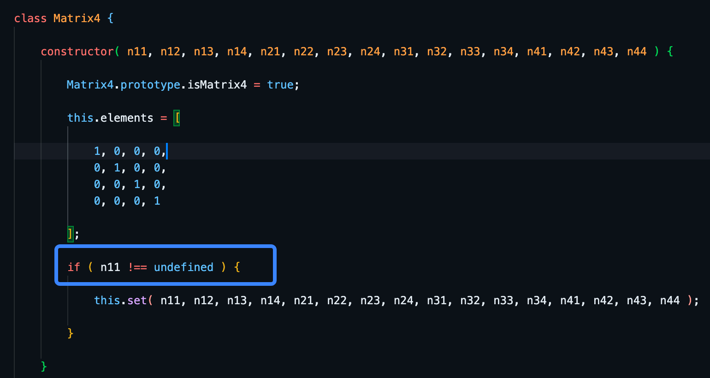
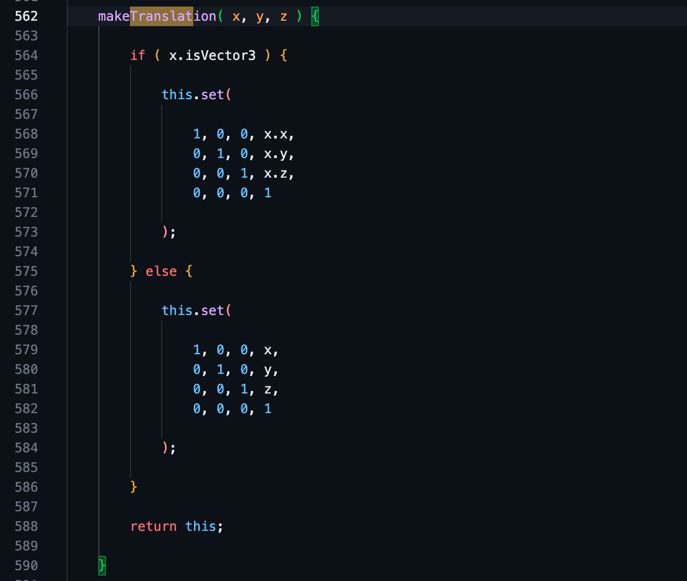
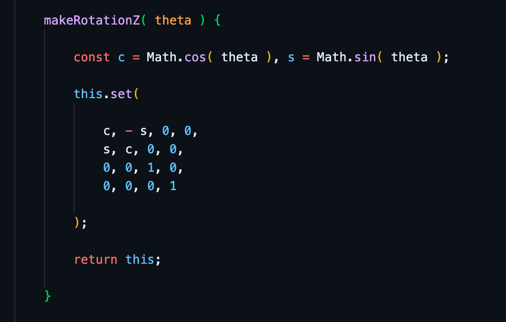
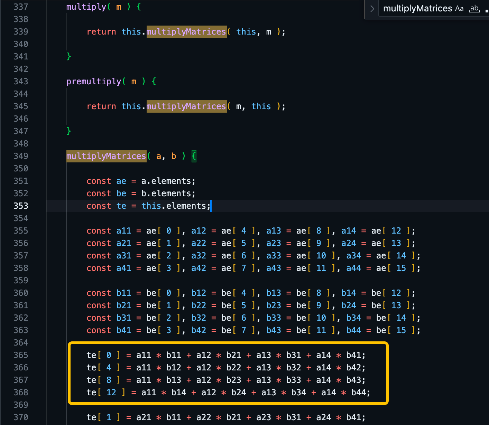
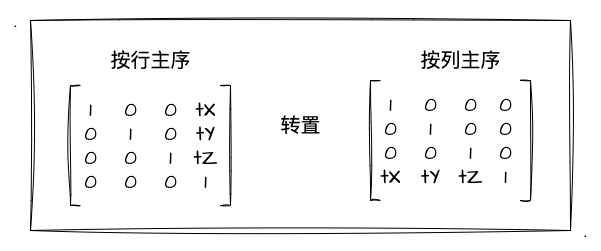
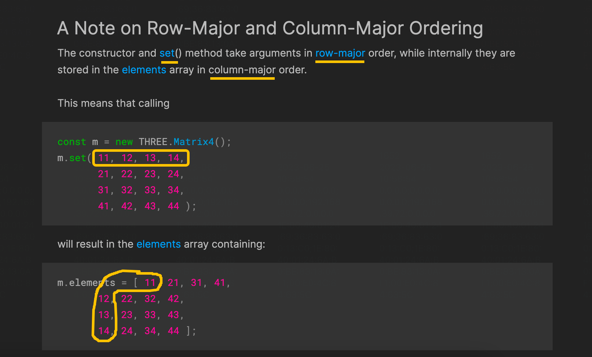

# 4. 图形的复合变换

上一小节我们通过对矩阵乘矢量的自行推导，实战了矩阵在 WebGL 中的应用，成功实现了图形的平移效果。那么这一节，我们继续深入矩阵在 WebGL 中的应用，实战图形**平移+旋转**的复合变换效果。

## 复合变换和矩阵

相信现在的你对于矩阵在 WebGL 中的妙用已经稍有体会了，毕竟平移、缩放、旋转都可以通过矩阵乘法来实现，并且其极大的简化我们着色器中的公式应用，实现一种着色器代码走天下的效果～那你又知不知道**矩阵在复合变换中同样适用**呢？

首先我们抛开矩阵，看看直接写表达式要怎么实现**平移+旋转**的复合变换。

```js
const vertexCode = `
  attribute vec4 a_Position;
  attribute vec4 a_Color;
  varying vec4 v_Color;
  uniform float u_Rotate;
  uniform vec4 u_Position;

  void main () {
    // 两矢量相加
    gl_Position = vec4(
      a_Position.x * cos(u_Rotate) - a_Position.y * sin(u_Rotate), 
      a_Position.x * sin(u_Rotate) + a_Position.y * cos(u_Rotate), 
      0., 
      1.
    ) + u_Position;
    v_Color= a_Color;
  }
`
```

那么根据 [本章第 1 节](/content/四、WebGL二维动画/1.%20会动的三角形.html) 的等式，我们大概可以推出**平移+旋转**的着色器代码如上。这里我们把两个矢量进行相加，一个是计算旋转后的 `vec4` 坐标点，一个是平移产生的位移值 `u_Position`。

还是上一节说过的，通过数学等式的组合并不是不可以实现复合变换，只是针对每种变换我们都得实现一个对应的 shader，所以我们依然坚定地把目光转向矩阵！看看这个神奇的数学工具在复合变换中的应用！

既然是要实现平移+旋转的复合变换，那我们依然可以将其一一拆开来做一定的推导！回顾我们上一节用矩阵实战**平移**的核心着色器代码如下：

```C
// 平移矩阵 x 顶点坐标
gl_Position = u_TranslateMatrix * a_Position;
```

那其实对于**旋转**的变换，我们依然可以使用上述的矩阵乘法矢量的等式来实现，只是需要**传入的矩阵跟平移的矩阵不一样**而已。所以旋转的着色器核心实现依然是一样的等式：

```C
// 旋转矩阵 x 顶点坐标
gl_Position = u_RotateMatrix * a_Position;
```

虽然我们现在需要复合平移和旋转两种变换效果，但是从分解后来看，无非就是**先平移**一个顶点坐标然后**再将其进行一定角度的旋转**就可以实现了。那换算到上述的等式中，我们其实可以这样写：

```C
// 旋转矩阵 x 平移后的坐标矢量
gl_Position = u_RotateMatrix * (u_TranslateMatrix * a_Position);
```

那么回顾 [矩阵乘法](/content/四、WebGL二维动画/2.%20图形学的数学基础.html#_2-矩阵乘法) 小节，我们知道矩阵乘法遵循结合律。也就是上述等式我们可以换算成：

```C
// (旋转矩阵 x 平移矩阵) x 顶点坐标
gl_Position = (u_RotateMatrix * u_TranslateMatrix) * a_Position;
```

根据矩阵乘法的规则，我们两个 `4x4` 矩阵相乘的结果**依然是一个 `4x4` 矩阵**。所以上述等式可以再进一步推导回最初**矩阵乘矢量**的模式：

```C
// 模型矩阵 x 顶点坐标
gl_Position = u_ModelMatrix * a_Position;
```

上述代码中的 `u_ModelMatrix` 为 **模型矩阵**，这个模型矩阵是通过**多个变换矩阵的结合**得到的（本例中是平移和旋转矩阵的复合）。经历过一次次地推导，我们又回到了最初的起点——**矩阵乘矢量**。所以，现在你应该更深刻地体会到矩阵对于 WebGL 的意义了吧？

## JavaScript与矩阵

经过上述推导，我们得到了最新的复合变换等式：
- `gl_Position = u_ModelMatrix * a_Position`

这个等式跟上一节我们实现图形平移是一样的，只是 `u_ModelMatrix` 是通过复合多个变换后得到的矩阵而已。

这也就意味着，我们在 JavaScript 中计算好 `平移矩阵 x 旋转矩阵` 的值后，再传递给到着色器就可以实现图形的复合变换了。但是，JavaScript 并不像 GLSL 那样原生支持矩阵、矩阵乘法，要是再像上一小节那样手动写矩阵，然后还要运算他们的乘法就很蛋疼了...

所以这个时候，我不由自主的打开了 Google，找个**库**用去！（大前端最不缺的就是库！各种轮子要啥有啥）诶等等，上一节不是在 [three.js](https://github.dev/mrdoob/three.js) 库中看到了 `Matrix4` 的类吗？那，那还找毛啊，直接用啊！

### 初探`THREE.Matrix4`源码

因为它源码里面的命名（各种英文直接搜）都比较好理解，所以我们完全可以看源码来操作！这里贴上对应的 [官方文档-Matrix4](https://threejs.org/docs/#api/en/math/Matrix4) ，有需要的同学可以去看文档来使用。

ok，现在我们先来简单地看看这玩意的源码吧。比如上一节我截了它**构造器**的实现：



可以看到，当我们什么都不传直接 `new` 的时候，可以得到一个 **单位矩阵** 在 `elements` 这个属性里！因为我们要实现平移和旋转，所以接下来我们着重看看有没有跟 `translate` 和 `rotate` 相关的代码！



果不其然，很快我就找到了 `makeTranslation` 函数。从图中一看我们发现实现其实很简单，就是根据参数帮我们把 `x、y、z` 放到对应的**平移变换矩阵**的位置中！这个矩阵我们非常熟悉了，毕竟在上一节我们是亲自推导出来的，忘记的可以回顾一下：


接着我们继续寻找旋转相关的，找到如下截图：



源码也是非常简单了，用 `Math.cos` 和 `Math.sin` 计算好余弦正弦值再放到**旋转的变换矩阵**中。忘记为什么要求 sin、cos 的可以看看下图[旋转公式](/content/四、WebGL二维动画/1.%20会动的三角形.html#旋转)：


那最后，我们仅需要把 **平移矩阵**、**旋转矩阵** 相乘，就能得到我们想要的 **模型矩阵** 了！所以我们接着找到如下：



我们看到截图圈了一块黄圈，就是一个行列相乘的计算式。忘记的可以回顾一下 [矩阵乘法](/content/四、WebGL二维动画/2.%20图形学的数学基础.html#_2-矩阵乘法) ：


讲到这，我想再次强调一下**行列主序**的问题。上一节也有强调，怕你们忘了所以再次强调一下：**WebGL 的矩阵是列主序**的：



所以，在使用库的时候，我们需要注意什么呢？首先我们要看一下库里面有没有帮我们**处理行列主序**的问题，如果没有，我们再找找设置**矩阵转置**的接口，在传递给 WebGL 前调用一下即可。那回到 `three.js` 中，我们可以看到它内置**帮我们做了行列矩阵的转换**了，其文档也有提到：



如上图所示，我们用**行主序的方式将数据传入构造器、或者使用其原型上的 `set` 方法**，矩阵数据最终会以**列主序**的方式存在 `elements` 属性中。

好了，相信大家对于在 JavaScript 中完成矩阵创建、变换、相乘已经有一定了解了，那接下来就可以进入到实战环节了！

## 三角形的平移&旋转

实战的第一环节首先是我们的**顶点着色器**代码。当然，经过了本文第一小节的推导，我们的着色器代码跟之前的并无变化，还是可以直接写成**矩阵乘矢量**：

```js
const vertexCode = `
  attribute vec4 a_Position;
  attribute vec4 a_Color;
  varying vec4 v_Color;
  // 模型矩阵（代表平移矩阵和旋转矩阵的积）
  uniform mat4 u_ModelMatrix;

  void main () {
    gl_Position = u_ModelMatrix * a_Position;
    v_Color= a_Color;
  }
`
```

着色器核心的代码依然是矩阵乘矢量的模式，那么实现复合变换的关键就是 `u_ModelMatrix` 的值了。前文铺垫了这么多，我们很明白**模型矩阵是平移矩阵和旋转矩阵的乘积**，所以我们需要的是在 JavaScript 中计算出这个模型矩阵再传到 WebGL 里就行了！

那在第三方库 `THREE.Matrix4` 类的帮助下，我们的工作变得非常轻松。我们首先创建**旋转矩阵**：

```js
// new 一个 matrix4 实例
const rotateMatrix = new Matrix4()
// 计算弧度值（rotateVal是滑块的位置）
const radian = rotateVal * Math.PI / 180
// 传入弧度值设置旋转矩阵
rotateMatrix.makeRotationZ(radian)
```

简单分析下：
1. 通过 `new Matrix4()` 创建了一个 `matrix4` 实例。因为没有传参，此时的 `elements` 是个**单位矩阵**
2. 根据 `rotateVal` 角度计算弧度值，它的值在示例程序中由滑块的位置控制（弧度计算公式之前都有讲过）
3. 通过 `makeRotationZ` 方法设置旋转矩阵。此时的 `elements` 就是旋转矩阵了

那么我们还需要创建一个**平移矩阵**如下：

```js
// new 一个 matrix4 实例
const translateMatrix = new Matrix4()
// 计算位移值（rotateVal跟上面旋转角度用的同一个值）
const translateX = rotateVal / 360.0
// 设置平移矩阵
translateMatrix.makeTranslation(translateX, 0., 0.)
```

上述代码大家可以发现其实跟**旋转矩阵的创建是差不多的**，所以我就不一一分析了。那此时得到平移矩阵后，我们还需要将其和**旋转矩阵相乘**就可以得到我们的**模型矩阵**了。所以！我们继续调 `api` ：

```js
// 平移矩阵 x 旋转矩阵
translateMatrix.multiply(rotateMatrix)
```

那么此时，`translateMatrix.elements` 已经是一个模型矩阵了。这时候，我们再把这个值通过 `uniformMatrix4fv` 给到 WebGL，再重新绘制三角形就能实现复合变换的三角形了！

```js
gl.uniformMatrix4fv(u_ModelMatrix, false, translateMatrix.elements)
```

提醒大家要注意的是，`THREE.Matrix4` 的矩阵值是放在 `.elements` 属性中的，所以通过 `uniformMatrix4fv` 传递给 WebGL 的时候要用 `xxx.elements`。剩下的就没什么好说了，我们直接看看示例程序的效果吧：

:::demo
fourth/4_1
:::

可以看到，示例程序中，当我们拖动滑块，三角形不仅在平移，而且还会旋转！（这里注意一点，矩阵乘法不满足交换律，所以平移矩阵、旋转矩阵相乘的先后顺序不同会有不同的变换效果～）

## 总结

那么本文我们通过实战图形复合变换，更加明白了矩阵在图形学中重要了，最后简单地总结一下：
1. **模型矩阵**：多个变换矩阵相乘的结果，是复合多种变换的矩阵。在推导模型矩阵的过程中，顺便也复习了一下矩阵的乘法。
2. 在 JavaScript 中借助 `Matrix4` 的类库进行矩阵运算，极大简化我们的矩阵操作、运算成本。
3. 矩阵乘法一般不满足交换律，变换矩阵的相乘顺序不同可能会有不同的复合变换效果。
