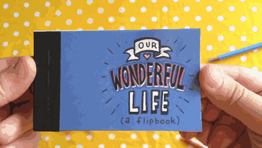
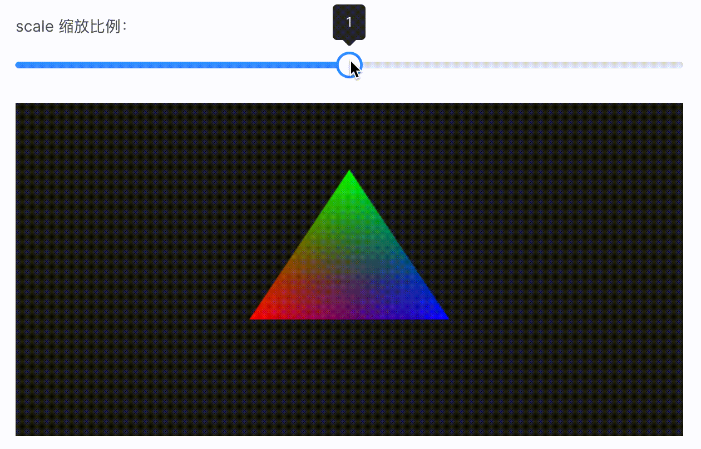

# 5. 图形的2D动画

经过上两个小节的学习，我们基本掌握了矩阵在 WebGL 中的应用，2D的图形变换实现也不在话下了。那么这一小节，我们接着以上学习的变换效果，来实战图形动画，让图形可以自己动起来～

## 什么是动画？

手翻书相信大家在小的时候都有玩过，就是那种**快速翻页浏览**就会产生**动画效果**的小册子，那这里我也在一个 [网站](https://www.paellacreativa.com.ar/2015/02/13/este-artista-crea-un-flipbook-animado-para-proponer-casamiento/) 中找了个手翻书的 `gif` 图，帮助大家回味回味手翻书。看看下图有没有一瞬间让你找回以前第一次看到手翻书的那种感觉？



那么，通过手翻书的效果，我们很容易联想到**动画的原理**——连续且快速地切换一张张静态图片（每一帧）。其实手翻书中的每一页都可以视为一张"静态图片"，当我们快速翻动书页时，便会看到类似"动画"的效果。这是由于人眼的**视觉残项**而产生的图形动画**错觉**。

想了解动画产生的更多细节，欢迎大家自行搜索相关资料，比如 [维基百科中对动画现象的解释](https://zh.wikipedia.org/wiki/%E5%8A%A8%E7%94%BB) 等等，我就不在本文深入介绍了。


## WebGL实现动画

我们知道动画的基本原理后，很容易可以想到如何在 WebGL 中实现动画效果。回顾之前实战的图形二维变换效果，当我们一直拖动滑块不也产生了动画的效果吗？



看完上图的效果，其实动画对我们来说基本上是没什么难度的，经过本章前几节内容的学习，现在的我们可以轻松应对各种图形的二维变换，所以我们仅需要在之前的基础上让图形自己"动"起来就好了。

既然是放在浏览器中动起来的...说白了，不就是用 JavaScript 实现动画效果吗？这...相信在座的各位大前端同学们都比我熟悉了，我也就不赘述关于 js 动画的实现了（不在各位大佬面前献丑），所以直接进入实战过程吧。

好像"平移"效果在最近的 demo 中出现得比较频繁了，所以！我就偏不做平移相关的动画了，那就做个**缩放和旋转**的**复合**变换动画吧。

### 缩放&旋转

关于缩放&旋转复合变换的**模型矩阵**我就不再细细推导了（详细推导可以翻看 [上一小节](/content/四、WebGL二维动画/4.%20图形的复合变换.html) 的内容），我们知道再复杂的复合变换都可以通过矩阵的复合来简单表述，所以我们的**顶点着色器**的代码不用改动，依然是：

```js
const vertexCode = `
  attribute vec4 a_Position;
  attribute vec4 a_Color;
  varying vec4 v_Color;
  uniform mat4 u_ModelMatrix;

  void main () {
    gl_Position = u_ModelMatrix * a_Position;
    v_Color= a_Color;
  }
`
```

哈哈哈，简单来说除了缩放矩阵的创建不同，缩放和旋转的复合变换的实现跟上一节基本一致。那对于 JavaScript 中矩阵的运算，我继续使用 `three.js` 中的 `Matrix4` 来帮我简化开发工作，所以我们再一次不厌其烦的打开 `Matrix4` 的源码找找缩放相关的 `api` 吧。


于是找到了 `makeScale` 这个方法，我们通过这个 `api` 来建立我们的缩放矩阵：

```js
const scaleMatrix = new Matrix4()
scaleMatrix.makeScale(sX, sY, sZ)
```

然后只需要再通过乘上旋转矩阵就能得到我们复合变换的**模型矩阵**了（跟上一节的一样就不赘述额）。于是我基于上一节的例子，实现了如下 缩放&旋转 的复合变换效果：

:::demo
fourth/5_1
:::

### 自动播放

文章开头就有讲过，连续且快速地切换一张张静态图片就能产生动画效果，并且通过示例程序我们不难发现，只要我们持续拖动滑块就是一个动画效果了。所以本小节我们的任务就是让这个动画效果自动播放就ok了。

当然，说到自动播放就跟 WebGL 的关系不是很大了，因为这需要回归到我们熟悉的 JavaScript 了。比如我们熟悉的 `setTimeout`、`setInterval`、`requestAnimationFrame`...这哥三不管我们用哪个都行，不就让图形自己动起来就好了吗！相信对于这三者之间的优缺点、区别啥的，大家都比我熟悉多了，我就不再这里展开介绍了，反正这里我用 `requestAnimationFrame` 这个来实现动画。

该说不说，还是先上个 [MDN-requestAnimationFrame](https://developer.mozilla.org/en-US/docs/Web/API/window/requestAnimationFrame) 吧（还不是很熟悉的可以先去看看）。啊！作者不是说了不展开介绍吗，怎么还来贴文档外链...哈哈哈，因为动画**有播放就有暂停**，我主要是怕大家忘记了 `cancelAnimationFrame` 这个用来停掉动画的 `api` 了！

那我们基于这个 `api` 的特性，通过**递归调用重新绘制图形的方法**那就基本上是实现自动播放了：

```js
// 递归调用实现自动播放
const animation = () => {
  returnValue = requestAnimationFrame(animation)
}
// 停止动画
cancelAnimationFrame(returnValue)
```

然后我们需要让图形"动"起来，那就在每次绘制的时候改变一丢丢图形的顶点坐标信息就行了。这样一来，每次 WebGL 绘制的图形都跟前一次的稍有不同，当我们重复不断得调用绘制函数，就能产生缩放&旋转的动画效果了！

因为连着画了好多期的红绿蓝渐变三角形，大家也都看吐了，所以我这里就随便画个矩型吧，颜色也随便换一换。其实**换个基础图形实现动画**也是顺便让大家感受一下：不管我们绘制怎么样的基础图形，只要依着**矩阵乘矢量（顶点坐标）来改变原坐标点以最终实现图形变换**这个原理，我们都可以顺利的实现该基础图形的变换效果！（后面学3D绘制的时候会有更深刻的感触）

:::demo
fourth/5_2
:::

如上示例程序，当点击播放时可以看到图形的缩放&旋转的动画效果。其中关键点就是我在每次的 `animation` 函数执行时**不断改变了旋转角度和缩放比例**：

```js
// 每次执行都加 6 度
rotateVal = (rotateVal + 6) % 360

bigger
  ? scaleVal += 0.03 // 放大时每次缩放比例加 0.03
  : scaleVal -= 0.03 // 缩小时每次缩放比例减 0.03
```

最后再将上述求得的变化值放到对应的矩阵中，再将缩放矩阵和旋转矩阵相乘得到**模型矩阵**，然后将模型矩阵传递到 WebGL 中，再进行图形的重新绘制即可实现如上的动画效果～

## 总结

那么本文我们通过实战图形的 2D 动画，更加深入地了解了矩阵、模型矩阵对于图形二维变换的重要性，并且知道了我们可以用 JavaScript 配合 WebGL 来实现网页动画！其实经过这一章内容的学习，我们已经具备了进阶 **WebGL 3D** 图形绘制的所有基础了，so！接下来，让我们一起探讨奇妙的 3D 世界吧！
